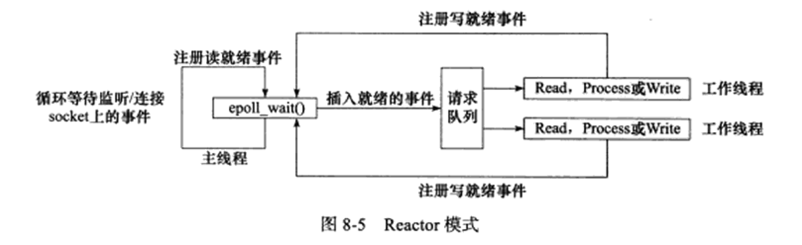

# 第六章、高级I/O函数

 ## pipe 函数

 用于创建一个管道，以实现==进程==间通信。定义如下

 ```c
 #include <unistd.h
 int pipe( int fd[2] );
 ```

 `pipe()` 函数的参数是一个包含两个 `int` 型整数的数组指针。该函数成功时返回 0 ，并将对弈打开的文件描述符值填入其参数所指向的数组。失败返回 -1 并设置 errno。

 `pipe()` 函数创建的两个文件描述符 `fd[0]` 和 `fd[1]` 分别构成管道的两端，往 `fd[1]` 写入的数据可以从 `fd[0]` 。并且， `fd[0]` 只能用于从管道读出数据， `fd[1]` 则只能用于往管道写入数据，而不能反过来使用。如果要实现双向的数据传输，就应该使用两个管道。

 `socket` 的基础 API 中有一个 `socketpair` 函数。能够方便地创建双向管道。其定义如下：

 ```c
 #include <sys/types.h
 #include <sys/socket.h
 int socketpair( int domain, int type, int protocol, int fd[2] );
 ```

 `socketpair` 钱三个参数地含义与 `socket` 系统调用地三个参数完全相同，但 `domain` 只能使用 `UNIX` 本地域协议族 `AF_UNIX`, 因为我们仅能再本地使用这个双向管道。最后一个参数和 `pipe` 系统调用的参数一样，只不过 `socketpair` 创建的这对文件描述符都是既可读又可写的。`socketpair` 成功时返回 0 ， 失败时返回 -1 并这是 errno。

readv 函数和 writev 函数

 `readv` 函数将数据从文件描述符读到分散的内存块中，即分散度；`writev` 函数则将多块分散的内存数据一并写入文件描述符中，即集中写。定义如下：

 ```c
 #include <sys/uio.h
 ssize_t readv( int fd, const struct iovec* vector, int count );
 ssize_t writev( int fd, const struct iovec* vector, int count );
 ```

 ## sendfile 函数

 `sendfile` 函数在两个文件描述符之间直接传递数据 ( 完全在内核中操作 )，从而避免了内核缓冲区和用户缓冲区之间的数据拷贝，效率很高，这被称为零拷贝。 `sendfile` 函数定义如下：

 ```Cpp
 #include <sys/sendfile.h
 ssize_t sendfile( int out_fd, int in_fd, off_t* offset, size_t count );
 ```

 - `in_fd` 是待读出内容的文件操作符
 - `out_fd` 是待写入内容的文件描述符
 - `offset` 指定从读入文件流的哪个位置开始读，如果为空，则使用读入文件流的默认起始位置。
 - `count` 指定文件描述符 `in_fd` 和 `out_fd` 之间传输的字节数

 `sendfile` 成功时返回传输的字节数，失败返回 -1 并设置 errno。

 注意：`in_fd` 必须是一个支持类似 `mmap` 函数的文件描述符，即它必须指向真实的文件，不能是 `socket` 和管道；而 `out_fd` 则必须是一个` socket`。

 **sendfile_function.c**

 使用方式：

 ```bash
 gcc -o sendfile_function sendfile_function.c
 ./sendfile_function (host_ip number) (port number) (file_name, 测试建议用.txt)
 ```

   在客户端机 `telnet (host_ip number) (port number)`并回车得到以下信息

   Trying 192.168.136.43...
   Connected to 192.168.136.43.
   Escape character is '^]'.
   testfile
   file tranfer (这两行是我的 .txt 文档里的内容)
   Connection closed by foreign host.

 ## mmap 函数和 munmap 函数

 `mmap` 函数用于申请一段内存空间。可以将这段内存作为进程间通信的==共享内存==，也可以将文件直接映射到其中。`munmap` 函数则释放由 `mmap` 创建的这段内存空间。定义如下：

 ```c
 #include <sys/mman.h
 void* map( void* start, size_t length, int prot, int flags, int fd, off_t offset );
 int munmap( void* start, size_t length )
 ```

 - `start` 允许用户使用某个特定的地址作为这段内存的起始地址。如果它被设置成 `NULL`, 则系统自动分配一个地址。
 - `length` 指定内存段的长度
 - `prot` 用来设置内存段的访问权限
   - `PROT_READ`	内存段可读
   - `PROT_WRITE`  内存段可写
   - `PROT_EXEC`    内存段可执行
   - `PROT_NONE`    内存段不能被访问
 - `flag` 控制内存段内容被修改后程序的行为
 - `fd` 参数是被映射文件对应的文件描述符。它一般通过 `open` 系统调用获得
 - `offset` 设置从文件何处开始映射( 对于不需要读入整个文件的情况 )

 `mmap` 函数成功时返回指向目标内存区域的指针， `munmap` 成功时返回 0，失败返回 -1 并设置 errno

 ## splice 函数

 `splice` 函数用于在两个文件描述符之间==移动数据==，也是零拷贝操作。定义如下

 ```C
 #include <fcntl.h
 ssize_t splice( int fd_in, loff_t* off_in, int fd_out, loff_t* off_out, size_t len, unsigned int flags );
 ```

 - `fd_in` 是代输入数据的文件描述符，如果 `fd_in` 是一个普通管道文件描述符，那么 `off_in` 必须被设置为 `NULL`。如果不是一个管道文件描述符，( 如 sockdet ), 那么 `off_in` 表示从输入数据流的何处开始读取数据。此时， 若 `off_in` 被设置为 `NULL`, 则表示从输入流的当前偏移位置读入；若不为 `NULL`, 则它将指出具体的便宜位置。
 - `fd_out/off_out` 含义与 `fd_in/off_in` 相同，不过用于输出数据流
 - `len` 指定移动数据的长度
 - `flag` 控制数据如何移动。

 使用 `splice` 函数， `fd_in`, `fd_out` 必须至少有一个是管道文件描述符。调用成功返回移动字节的数量，返回 0 ，表示没有数据需要移动。

 零拷贝回射服务实现：

 **splice.c**

 使用方式：

 ```bash
 gcc -o splice splice.c
 ./splice (host_ip number) (port number)
 ```

 我们通过 `splice` 函数将客户端的内容读入到 `pipefd[1]` 中，然后再使用 `splice` 函数从 `pipefd[0]` 中读出改内容到客户端，从而实现了简单高效的回射服务。整个过程未执行 `recv / send ` 操作，因此也未设计用户空间和内核空间之间的数据拷贝。

 ## tee 函数

 `tee` 函数在两个管道文件描述符之间==复制数据==，也是零拷贝操作。它不消耗数据，因此源文件描述符上的数据仍然可以用于后续的读操作。`tee` 函数原型如下：

 ```c
 #include <fcntl.h
 ssize_t tee( int fd_in, int fd_out, size_t len, unsigned int flags )
 ```

 含义与 `splice` 相同 ( 但 `fd_in` 和 `fd_out` 必须都是管道文件描述符) 。

 **tee.cpp** 代码实现了 `Linux` 下 `tee` 程序(同时输出数据到终端和文件的程序)的基本功能

 使用方式如下：

 ```bash
 g++ -o tee tee.cpp
 ./tee test.txt
 功能实现
 ```

## fcntl 函数

`fcntl` (file control), 提供了对文件描述符的各种控制操作。另一个常见的控制文件描述符和行为的系统调用是 `ioctl`, 而且 `ioctl` 比 `fcntl` 能够执行更多的控制。定义如下：

```C
#include <fcntl.h>
int fcntl( int fd, int cmd, ... );
```

- `fd` 被操作的文件描述符
- `cmd` 指定执行何种类型的操作。根据操作类型的不同，该函数可能还需要第三个可选参数 `arg`

在网络变成中， `fcntl` 函数通常用来将一个文件描述符设置为非阻塞的。

```C
int setnonblocking( int fd ){
    int old_option = fcntl( fd, F_GETFL );		/* 获取文件描述符旧的状态标志 */
    int new_option = old_option | O_NONBLOCK;	/* 设置为非阻塞状态 */
    fcntl( fd, F_SETFL, new_option );
    return old_option;						  /* 返回文件描述符旧的状态标志，以便日后回复该状态标志 */
}
```

## 第7章 Linux 服务器程序规范

本章综述了以下关于 linux 的进程，用户，组之类的概念。

下面的代码 **daemonize()** 表示了如何在代码中让一个进程以守护进程的方式运行。

```c
bool daemonize(){
    /* 创建子进程，关闭父进程， 这样可以使程序在后台运行 */
    pid_t pid = fork();
    if( pid < 0 ) return false;
    else if( pid > 0 ) exit();
    /* 设置文件权限掩码。当进程创建新文件 (使用 open( const char* pathname, int flags, mode_t mode ) 系统调用) 时，
    文件的权限将是 mode & 0777 */
    umask( 0 );
    /* 创建新的会话，设置本进程为进程组的首领 */
    pid_t sid = setsid();
    if ( sid < 0 ) return false;
    /* 切换工作目录 */
    if ( ( chdir( "/" ) ) > 0 ) return false;
    /* 关闭标准输入设备、标准输出设备和标准错误输出设备 */
    close( STDIN_FILENO );
    close( STDOUT_FILENO );
    close( STDERR_FILENO );
    /* 关闭其他已经打开的文件描述符，代码省略 */
    /* 将标准输入、标准输出和标准错误输出都定向到 /dev/null 文件 */
    open( "/dev/null", O_RDONLY );
    open( "/dev/null", O_RDWR );
    open( "/dev/null", O_RDWR );
    return true;
}
```

第八章为全书核心，本章将介绍如下三个主要模块：

- I/O 处理单元。将介绍 I/O 处理单元的四种 I/O 模型和两种高效时间处理模式
- 逻辑单元。将介绍逻辑单元的两种高效并发模式，以及高效的逻辑处理方式----有限状态机
- 存储单元。服务器程序的可选模块，内容与网络编程本身无关

# 第八章、 高性能服务器程序框架

## 服务器模型

### C/S 模型

C/S 模型的 TCP 服务器和 TCP 客户端工作流程如图


C/S 模型逻辑很简单。服务器启动后，收件创建一个 (或多个) 监听 `socket`, 并调用 `bind` 函数将其绑定到服务器感兴趣的端口上，然后调用 `listen` 函数等待客户连接。服务器稳定运行之后，客户端就可以调用 `connect` 函数向服务器发起连接了。由于客户连接请求是随机到达的 ==异步== 时间，服务器需要使用某种 I/O 模型来监听这一事件。I/O 模型有多种，上图服务器使用的是 I/O 复用计数之一的 `select` 系统调用。当监听到连接请求后，服务器就调用 `accept` 函数接受它，并分配一个逻辑单元为新的连接服务。逻辑单元可以是新创建的子进程、子线程或者其他。上图中，服务器给客户端分配的逻辑单元是由 `fork` 系统调用创建的子进程。逻辑单元读取客户请求，处理该请求，然后将处理结果返回给客户端。客户端接收到服务器反馈的结果之后，可以继续向服务器发送请求，也可以立即主动关闭连接。如果客户端主动关闭连接，则服务器执行被动关闭。至此，双方的通信结束。需要注意的是，服务器在处理一个客户请求的同时还会继续监听其他客户请求，否则就变成效率低下的穿行服务器了(必须先处理完前一个客户的请求，才能继续处理下一个客户的请求)。途中服务器同时监听多个客户请求是通过 `select` 系统调用实现的。

### p2p模型

`Peer to Peer`点对点，比 C/S 模型更符合网络通信的实际情况。


P2P 使得每台服务器在小号服务的同时也在给别人提供服务，这样资源能够充分、自由地共享。云计算群可以看成 P2P 模型的一个典范，但缺点是：当用户之间的传输请求过多时，网络的负载将加重。

左(a)图存在一个显著的问题，即主机之间很难互相发现。所以实际使用的 P2P 模型通常带有一个专门的发现服务器，右(b)图。这个发现服务器通常还停工查找服务(甚至内容服务)，使每个客户都能尽快地找到自己需要的资源

P2P编程角度上可以是 C/S 模型的扩展：每台主机既是客户端，又是服务器。

## 服务器编程框架


该图既能用来描述一台服务器，也能用来描述一个服务器机群。

|     模块     |       单个服务器程序       |          服务器机群          |
| :----------: | :------------------------: | :--------------------------: |
| I/O处理单元  | 处理客户链接，读写网络数据 | 作为连接服务器，实现负载均衡 |
|   逻辑单元   |       业务进程或线程       |          逻辑服务器          |
| 网络存储单元 |   本地数据库、文件或缓存   |         数据库服务器         |
|   请求队列   |    各单元之间的通信方式    | 各服务器之间的永久 TCP 连接  |

- I/O 处理单元是服务器管理客户连接的模块。完成连接和接收客户连接，数据，发送数据等工作。但手法不一定在 I/O 处理单元中执行，也可能在逻辑单元中执行
- 一个逻辑单元通常是一个进程或者线程。一个逻辑单元本身就是一台逻辑服务器。服务器通常拥有多个逻辑单元，以实现对多个客户任务的并行处理
- 网络存储单元可以是数据库、缓存和文件，甚至是一台独立的服务器
- 请求队列是各单元之间通信方式的抽象。

## I /O 模型

`socket` 在创建的时候默认是阻塞的。可以通过 `socket` 系统调用的第 2 个参数传递 `SOCK_NONBLOCK` 标志，或者通过 `fcntl` 系统调用的 `F_SETFL` 命令，将其设置为非阻塞的。

针对阻塞 I/O 执行的系统调用可能因为无法立即完成而被操作系统挂起，知道等待的事件发生为止。比如，客户端通过 `connect` 向服务器发起连接时，`connect` 将首先发送同步报文段给服务器，然后等待服务器返回确认报文段。如果服务器的确认报文段没有立即到达客户端，则 `connect` 调用将被挂起，知道客户端收到确认报文段并唤醒 `connect` 调用。`socket` 的基础 API 中，可能被阻塞的系统调用包括 `accept、send、recv`和`connect`.

针对非阻塞 I/O 执行的系统调用则总时立即返回，而不管事件是否已经发生。如果事件没有立即发生，这些系统调用就返回 -1，和出错的情况一样。此时我们必须根据 `errno` 来区分这两种情况。对 `accept、send、recv`而言，事件未发生时 `errno` 通常被设置为`EAGAIN`(意为“再来一次”)或者 `EWOULDBLOCK` (意为“期望阻塞”)；对 `connect` 而言，`errno` 则被设置成 `EINPROGRESS` 意为“在处理中”。

因此，用非阻塞 I/O 来提高程序效率需要和其他 I/O 通知集制一起使用，比如 I/O 复用和 SIGIO 信号。

-  I/O复用 应用程序通过 I/O 复用函数向内核注册一组事件，内核通过 I/O 复用函数把其中就绪的事件通知给应用程序。`Linux` 上常用的 I/O 复用函数是 `select、poll` 和 `epoll_wait`。需要指出的是， `I/O` 复用函数本身是阻塞的，他们能提高程序效率的原因在于它们具有同时监听多个 I/O 事件的能力。
- SIGIO 为一个目标文件描述符指定宿主进程，那么宿主进程将捕获到 SIGIO 信号。当目标文件描述符上由事件发生时， SIGIO 信号的信号处理函数将被出发。

理论上，阻塞 I/O 、I/O 复用和信号驱动 I/O 都是同步 I/O 模型。对于异步 I/O 而言，用户可以直接对 I/O 执行读写操作，这些操作告诉内核用户读写缓冲区的位置，以及 I/O 操作完成之后内核通知应用程序的方式。异步 I/O 的读写操作总时立即返回，而不论 I/O 是否是阻塞的，因为真正的读写操作已经由内核接管。也就是说，同步 I/O 模型要求用户代码自行执行 I/O 操作(将数据从内核缓冲区读入用户缓冲区，或将数据从用户缓冲区写入内核缓冲区)，而异步 I/O 机制则是由内核来执行。

| I/O模型   | 读写操作和阻塞阶段                                           |
| --------- | ------------------------------------------------------------ |
| 阻塞 I/O  | 程序阻塞于读写函数                                           |
| I/O复用   | 程序阻塞于I/O复用系统调用，但可同时监听多个 I/O 事件。对 I/O 本身的读写操作是非阻塞的 |
| SIGIO信号 | 信号触发读写就绪事件，用户程序执行读写操作。程序没有阻塞阶段 |
| 异步I/O   | 内核执行读写操作并触发读写完成事件。程序没有阻塞阶段         |

查看资料后，上表三个都属于同步，其实都会阻塞到一个地方

blocking IO 会一直阻塞用户进程知道操作完成

non-blocking IO 在 `kernel`还准备数据的情况下立刻返回，执行别得操作，直到 `kernel` 给出得数据已准备好得信号，再执行这个操作。

同步IO和异步IO的区别在于：

同步IO在做IO操作的时候将 `process` 阻塞

异步不一样，当进程发起 I/O 操作后，就不管了，直到 `kernel` 发送一个信号，告诉进程说 I/O 完成。在这整个过程中，进程完全没有被阻塞

[资料来源]: https://www.cnblogs.com/renpingsheng/p/7221116.html

## 两种高效的事件处理模式

服务器程序通常需要处理三类事件： I/O 事件、信号及定时事件。这一节主要介绍：

- Reactor
- Proactor

同步用于实现 `Reactor` 模式，异步用于实现 `Proactor` 模式。

### Reactor模式

要求主线程 ( I/O 处理单元 ) 只负责监听文件描述上是否由事件发生，有的话就立即将该事件通知工作线程 ( 逻辑单元 )。除此之外，主线程不做任何其他实时性的工作。读写数据，接收新的连接，以及处理客户请求均在工作线程中完成。

使用同步 I/O 模型(以 epoll_wait 为例)实现的 Reactor 模式的工作流程是：

1. 主线程往 `epoll` 内核事件表中注册 socket 上的读就绪事件
2. 主线程调用 `epoll_wait` 等待 `socket` 上有数据可读
3. 当 `socket` 上有数据可读时，`epoll_wait` 通知主线程。主线程则将 `socket` 可读事件放入请求队列
4. 睡眠在请求队列上的某个工作线程被唤醒，它从 `socket` 读取数据，并处理客户请求，然后往 `epoll` 内核事件表中注册该 `socket` 写就绪事件。
5. 主线程调用`epoll_wait`等待`socket`可写
6. 当`socket`可写时，`epoll_wait`通知主线程。主线程将`socket` 可写事件放入请求队列
7. 睡眠在请求队列上的某个工作线程被唤醒，它往`socket`上写入服务器处理客户请求的结果



如上图，工作线程从请求队列中取出事件后，将根据事件的类型来决定如何处理它：对于可读事件，执行读数据和处理请求的操作；对于可写事件，执行写数据的操作。因此，如图所示的`Reactor`模式中，没必要区分所谓的“读工作线程”和“写工作线程”

### Proactor模式