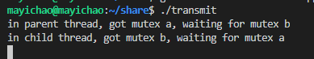

# 第六章、高级I/O函数

 ## pipe 函数

 用于创建一个管道，以实现进程间通信。定义如下

 ```c
 #include <unistd.h
 int pipe( int fd[2] );
 ```

 `pipe()` 函数的参数是一个包含两个 `int` 型整数的数组指针。该函数成功时返回 0 ，并将对弈打开的文件描述符值填入其参数所指向的数组。失败返回 -1 并设置 errno。

 `pipe()` 函数创建的两个文件描述符 `fd[0]` 和 `fd[1]` 分别构成管道的两端，往 `fd[1]` 写入的数据可以从 `fd[0]` 。并且， `fd[0]` 只能用于从管道读出数据， `fd[1]` 则只能用于往管道写入数据，而不能反过来使用。如果要实现双向的数据传输，就应该使用两个管道。

 `socket` 的基础 API 中有一个 `socketpair` 函数。能够方便地创建双向管道。其定义如下：

 ```c
 #include <sys/types.h
 #include <sys/socket.h
 int socketpair( int domain, int type, int protocol, int fd[2] );
 ```

 `socketpair` 钱三个参数地含义与 `socket` 系统调用地三个参数完全相同，但 `domain` 只能使用 `UNIX` 本地域协议族 `AF_UNIX`, 因为我们仅能再本地使用这个双向管道。最后一个参数和 `pipe` 系统调用的参数一样，只不过 `socketpair` 创建的这对文件描述符都是既可读又可写的。`socketpair` 成功时返回 0 ， 失败时返回 -1 并这是 errno。

readv 函数和 writev 函数

 `readv` 函数将数据从文件描述符读到分散的内存块中，即分散度；`writev` 函数则将多块分散的内存数据一并写入文件描述符中，即集中写。定义如下：

 ```c
 #include <sys/uio.h
 ssize_t readv( int fd, const struct iovec* vector, int count );
 ssize_t writev( int fd, const struct iovec* vector, int count );
 ```

 ## sendfile 函数

 `sendfile` 函数在两个文件描述符之间直接传递数据 ( 完全在内核中操作 )，从而避免了内核缓冲区和用户缓冲区之间的数据拷贝，效率很高，这被称为零拷贝。 `sendfile` 函数定义如下：

 ```Cpp
 #include <sys/sendfile.h
 ssize_t sendfile( int out_fd, int in_fd, off_t* offset, size_t count );
 ```

 - `in_fd` 是待读出内容的文件操作符
 - `out_fd` 是待写入内容的文件描述符
 - `offset` 指定从读入文件流的哪个位置开始读，如果为空，则使用读入文件流的默认起始位置。
 - `count` 指定文件描述符 `in_fd` 和 `out_fd` 之间传输的字节数

 `sendfile` 成功时返回传输的字节数，失败返回 -1 并设置 errno。

 注意：`in_fd` 必须是一个支持类似 `mmap` 函数的文件描述符，即它必须指向真实的文件，不能是 `socket` 和管道；而 `out_fd` 则必须是一个` socket`。

 **sendfile_function.c**

 使用方式：

 ```bash
 gcc -o sendfile_function sendfile_function.c
 ./sendfile_function (host_ip number) (port number) (file_name, 测试建议用.txt)
 ```

   在客户端机 `telnet (host_ip number) (port number)`并回车得到以下信息

   Trying 192.168.136.43...
   Connected to 192.168.136.43.
   Escape character is '^]'.
   testfile
   file tranfer (这两行是我的 .txt 文档里的内容)
   Connection closed by foreign host.

 ## mmap 函数和 munmap 函数

 `mmap` 函数用于申请一段内存空间。可以将这段内存作为进程间通信的共享内存，也可以将文件直接映射到其中。`munmap` 函数则释放由 `mmap` 创建的这段内存空间。定义如下：

 ```c
 #include <sys/mman.h
 void* map( void* start, size_t length, int prot, int flags, int fd, off_t offset );
 int munmap( void* start, size_t length )
 ```

 - `start` 允许用户使用某个特定的地址作为这段内存的起始地址。如果它被设置成 `NULL`, 则系统自动分配一个地址。
 - `length` 指定内存段的长度
 - `prot` 用来设置内存段的访问权限
   - `PROT_READ`	内存段可读
   - `PROT_WRITE`  内存段可写
   - `PROT_EXEC`    内存段可执行
   - `PROT_NONE`    内存段不能被访问
 - `flag` 控制内存段内容被修改后程序的行为
 - `fd` 参数是被映射文件对应的文件描述符。它一般通过 `open` 系统调用获得
 - `offset` 设置从文件何处开始映射( 对于不需要读入整个文件的情况 )

 `mmap` 函数成功时返回指向目标内存区域的指针， `munmap` 成功时返回 0，失败返回 -1 并设置 errno

 ## splice 函数

 `splice` 函数用于在两个文件描述符之间移动数据，也是零拷贝操作。定义如下

 ```C
 #include <fcntl.h
 ssize_t splice( int fd_in, loff_t* off_in, int fd_out, loff_t* off_out, size_t len, unsigned int flags );
 ```

 - `fd_in` 是代输入数据的文件描述符，如果 `fd_in` 是一个普通管道文件描述符，那么 `off_in` 必须被设置为 `NULL`。如果不是一个管道文件描述符，( 如 sockdet ), 那么 `off_in` 表示从输入数据流的何处开始读取数据。此时， 若 `off_in` 被设置为 `NULL`, 则表示从输入流的当前偏移位置读入；若不为 `NULL`, 则它将指出具体的便宜位置。
 - `fd_out/off_out` 含义与 `fd_in/off_in` 相同，不过用于输出数据流
 - `len` 指定移动数据的长度
 - `flag` 控制数据如何移动。

 使用 `splice` 函数， `fd_in`, `fd_out` 必须至少有一个是管道文件描述符。调用成功返回移动字节的数量，返回 0 ，表示没有数据需要移动。

 零拷贝回射服务实现：

 **splice.c**

 使用方式：

 ```bash
 gcc -o splice splice.c
 ./splice (host_ip number) (port number)
 ```

 我们通过 `splice` 函数将客户端的内容读入到 `pipefd[1]` 中，然后再使用 `splice` 函数从 `pipefd[0]` 中读出改内容到客户端，从而实现了简单高效的回射服务。整个过程未执行 `recv / send ` 操作，因此也未设计用户空间和内核空间之间的数据拷贝。

 ## tee 函数

 `tee` 函数在两个管道文件描述符之间复制数据，也是零拷贝操作。它不消耗数据，因此源文件描述符上的数据仍然可以用于后续的读操作。`tee` 函数原型如下：

 ```c
 #include <fcntl.h
 ssize_t tee( int fd_in, int fd_out, size_t len, unsigned int flags )
 ```

 含义与 `splice` 相同 ( 但 `fd_in` 和 `fd_out` 必须都是管道文件描述符) 。

 **tee.cpp** 代码实现了 `Linux` 下 `tee` 程序(同时输出数据到终端和文件的程序)的基本功能

 使用方式如下：

 ```bash
 g++ -o tee tee.cpp
 ./tee test.txt
 功能实现
 ```

## fcntl 函数

`fcntl` (file control), 提供了对文件描述符的各种控制操作。另一个常见的控制文件描述符和行为的系统调用是 `ioctl`, 而且 `ioctl` 比 `fcntl` 能够执行更多的控制。定义如下：

```C
#include <fcntl.h>
int fcntl( int fd, int cmd, ... );
```

- `fd` 被操作的文件描述符
- `cmd` 指定执行何种类型的操作。根据操作类型的不同，该函数可能还需要第三个可选参数 `arg`

在网络变成中， `fcntl` 函数通常用来将一个文件描述符设置为非阻塞的。

```C
int setnonblocking( int fd ){
    int old_option = fcntl( fd, F_GETFL );		/* 获取文件描述符旧的状态标志 */
    int new_option = old_option | O_NONBLOCK;	/* 设置为非阻塞状态 */
    fcntl( fd, F_SETFL, new_option );
    return old_option;						  /* 返回文件描述符旧的状态标志，以便日后回复该状态标志 */
}
```

## 第7章 Linux 服务器程序规范

本章综述了以下关于 linux 的进程，用户，组之类的概念。

下面的代码 **daemonize()** 表示了如何在代码中让一个进程以守护进程的方式运行。

```c
bool daemonize(){
    /* 创建子进程，关闭父进程， 这样可以使程序在后台运行 */
    pid_t pid = fork();
    if( pid < 0 ) return false;
    else if( pid > 0 ) exit();
    /* 设置文件权限掩码。当进程创建新文件 (使用 open( const char* pathname, int flags, mode_t mode ) 系统调用) 时，
    文件的权限将是 mode & 0777 */
    umask( 0 );
    /* 创建新的会话，设置本进程为进程组的首领 */
    pid_t sid = setsid();
    if ( sid < 0 ) return false;
    /* 切换工作目录 */
    if ( ( chdir( "/" ) ) > 0 ) return false;
    /* 关闭标准输入设备、标准输出设备和标准错误输出设备 */
    close( STDIN_FILENO );
    close( STDOUT_FILENO );
    close( STDERR_FILENO );
    /* 关闭其他已经打开的文件描述符，代码省略 */
    /* 将标准输入、标准输出和标准错误输出都定向到 /dev/null 文件 */
    open( "/dev/null", O_RDONLY );
    open( "/dev/null", O_RDWR );
    open( "/dev/null", O_RDWR );
    return true;
}
```

# 第八章、 高性能服务器程序框架

第八章为全书核心，本章将介绍如下三个主要模块：

- I/O 处理单元。将介绍 I/O 处理单元的四种 I/O 模型和两种高效时间处理模式
- 逻辑单元。将介绍逻辑单元的两种高效并发模式，以及高效的逻辑处理方式----有限状态机
- 存储单元。服务器程序的可选模块，内容与网络编程本身无关

## 服务器模型

### C/S 模型

C/S 模型的 TCP 服务器和 TCP 客户端工作流程如图


C/S 模型逻辑很简单。服务器启动后，收件创建一个 (或多个) 监听 `socket`, 并调用 `bind` 函数将其绑定到服务器感兴趣的端口上，然后调用 `listen` 函数等待客户连接。服务器稳定运行之后，客户端就可以调用 `connect` 函数向服务器发起连接了。由于客户连接请求是随机到达的 异步 时间，服务器需要使用某种 I/O 模型来监听这一事件。I/O 模型有多种，上图服务器使用的是 I/O 复用计数之一的 `select` 系统调用。当监听到连接请求后，服务器就调用 `accept` 函数接受它，并分配一个逻辑单元为新的连接服务。逻辑单元可以是新创建的子进程、子线程或者其他。上图中，服务器给客户端分配的逻辑单元是由 `fork` 系统调用创建的子进程。逻辑单元读取客户请求，处理该请求，然后将处理结果返回给客户端。客户端接收到服务器反馈的结果之后，可以继续向服务器发送请求，也可以立即主动关闭连接。如果客户端主动关闭连接，则服务器执行被动关闭。至此，双方的通信结束。需要注意的是，服务器在处理一个客户请求的同时还会继续监听其他客户请求，否则就变成效率低下的穿行服务器了(必须先处理完前一个客户的请求，才能继续处理下一个客户的请求)。途中服务器同时监听多个客户请求是通过 `select` 系统调用实现的。

### p2p模型

`Peer to Peer`点对点，比 C/S 模型更符合网络通信的实际情况。


P2P 使得每台服务器在小号服务的同时也在给别人提供服务，这样资源能够充分、自由地共享。云计算群可以看成 P2P 模型的一个典范，但缺点是：当用户之间的传输请求过多时，网络的负载将加重。

左(a)图存在一个显著的问题，即主机之间很难互相发现。所以实际使用的 P2P 模型通常带有一个专门的发现服务器，右(b)图。这个发现服务器通常还停工查找服务(甚至内容服务)，使每个客户都能尽快地找到自己需要的资源

P2P编程角度上可以是 C/S 模型的扩展：每台主机既是客户端，又是服务器。

## 服务器编程框架


该图既能用来描述一台服务器，也能用来描述一个服务器机群。

|     模块     |       单个服务器程序       |          服务器机群          |
| :----------: | :------------------------: | :--------------------------: |
| I/O处理单元  | 处理客户链接，读写网络数据 | 作为连接服务器，实现负载均衡 |
|   逻辑单元   |       业务进程或线程       |          逻辑服务器          |
| 网络存储单元 |   本地数据库、文件或缓存   |         数据库服务器         |
|   请求队列   |    各单元之间的通信方式    | 各服务器之间的永久 TCP 连接  |

- I/O 处理单元是服务器管理客户连接的模块。完成连接和接收客户连接，数据，发送数据等工作。但手法不一定在 I/O 处理单元中执行，也可能在逻辑单元中执行
- 一个逻辑单元通常是一个进程或者线程。一个逻辑单元本身就是一台逻辑服务器。服务器通常拥有多个逻辑单元，以实现对多个客户任务的并行处理
- 网络存储单元可以是数据库、缓存和文件，甚至是一台独立的服务器
- 请求队列是各单元之间通信方式的抽象。

## I /O 模型

`socket` 在创建的时候默认是阻塞的。可以通过 `socket` 系统调用的第 2 个参数传递 `SOCK_NONBLOCK` 标志，或者通过 `fcntl` 系统调用的 `F_SETFL` 命令，将其设置为非阻塞的。

针对阻塞 I/O 执行的系统调用可能因为无法立即完成而被操作系统挂起，知道等待的事件发生为止。比如，客户端通过 `connect` 向服务器发起连接时，`connect` 将首先发送同步报文段给服务器，然后等待服务器返回确认报文段。如果服务器的确认报文段没有立即到达客户端，则 `connect` 调用将被挂起，知道客户端收到确认报文段并唤醒 `connect` 调用。`socket` 的基础 API 中，可能被阻塞的系统调用包括 `accept、send、recv`和`connect`.

针对非阻塞 I/O 执行的系统调用则总时立即返回，而不管事件是否已经发生。如果事件没有立即发生，这些系统调用就返回 -1，和出错的情况一样。此时我们必须根据 `errno` 来区分这两种情况。对 `accept、send、recv`而言，事件未发生时 `errno` 通常被设置为`EAGAIN`(意为“再来一次”)或者 `EWOULDBLOCK` (意为“期望阻塞”)；对 `connect` 而言，`errno` 则被设置成 `EINPROGRESS` 意为“在处理中”。

因此，用非阻塞 I/O 来提高程序效率需要和其他 I/O 通知集制一起使用，比如 I/O 复用和 SIGIO 信号。

-  I/O复用 应用程序通过 I/O 复用函数向内核注册一组事件，内核通过 I/O 复用函数把其中就绪的事件通知给应用程序。`Linux` 上常用的 I/O 复用函数是 `select、poll` 和 `epoll_wait`。需要指出的是， `I/O` 复用函数本身是阻塞的，他们能提高程序效率的原因在于它们具有同时监听多个 I/O 事件的能力。
- SIGIO 为一个目标文件描述符指定宿主进程，那么宿主进程将捕获到 SIGIO 信号。当目标文件描述符上由事件发生时， SIGIO 信号的信号处理函数将被出发。

理论上，阻塞 I/O 、I/O 复用和信号驱动 I/O 都是同步 I/O 模型。对于异步 I/O 而言，用户可以直接对 I/O 执行读写操作，这些操作告诉内核用户读写缓冲区的位置，以及 I/O 操作完成之后内核通知应用程序的方式。异步 I/O 的读写操作总时立即返回，而不论 I/O 是否是阻塞的，因为真正的读写操作已经由内核接管。也就是说，同步 I/O 模型要求用户代码自行执行 I/O 操作(将数据从内核缓冲区读入用户缓冲区，或将数据从用户缓冲区写入内核缓冲区)，而异步 I/O 机制则是由内核来执行。

| I/O模型   | 读写操作和阻塞阶段                                           |
| --------- | ------------------------------------------------------------ |
| 阻塞 I/O  | 程序阻塞于读写函数                                           |
| I/O复用   | 程序阻塞于I/O复用系统调用，但可同时监听多个 I/O 事件。对 I/O 本身的读写操作是非阻塞的 |
| SIGIO信号 | 信号触发读写就绪事件，用户程序执行读写操作。程序没有阻塞阶段 |
| 异步I/O   | 内核执行读写操作并触发读写完成事件。程序没有阻塞阶段         |

查看资料后，上表三个都属于同步，其实都会阻塞到一个地方

blocking IO 会一直阻塞用户进程知道操作完成

non-blocking IO 在 `kernel`还准备数据的情况下立刻返回，执行别得操作，直到 `kernel` 给出得数据已准备好得信号，再执行这个操作。

同步IO和异步IO的区别在于：

同步IO在做IO操作的时候将 `process` 阻塞

异步不一样，当进程发起 I/O 操作后，就不管了，直到 `kernel` 发送一个信号，告诉进程说 I/O 完成。在这整个过程中，进程完全没有被阻塞

## 两种高效的事件处理模式

服务器程序通常需要处理三类事件： I/O 事件、信号及定时事件。这一节主要介绍：

- Reactor
- Proactor

同步用于实现 `Reactor` 模式，异步用于实现 `Proactor` 模式。

### Reactor模式

要求主线程 ( I/O 处理单元 ) 只负责监听文件描述上是否由事件发生，有的话就立即将该事件通知工作线程 ( 逻辑单元 )。除此之外，主线程不做任何其他实时性的工作。读写数据，接收新的连接，以及处理客户请求均在工作线程中完成。

使用同步 I/O 模型(以 epoll_wait 为例)实现的 Reactor 模式的工作流程是：

1. 主线程往 `epoll` 内核事件表中注册 socket 上的读就绪事件
2. 主线程调用 `epoll_wait` 等待 `socket` 上有数据可读
3. 当 `socket` 上有数据可读时，`epoll_wait` 通知主线程。主线程则将 `socket` 可读事件放入请求队列
4. 睡眠在请求队列上的某个工作线程被唤醒，它从 `socket` 读取数据，并处理客户请求，然后往 `epoll` 内核事件表中注册该 `socket` 写就绪事件。
5. 主线程调用`epoll_wait`等待`socket`可写
6. 当`socket`可写时，`epoll_wait`通知主线程。主线程将`socket` 可写事件放入请求队列
7. 睡眠在请求队列上的某个工作线程被唤醒，它往`socket`上写入服务器处理客户请求的结果


如上图，工作线程从请求队列中取出事件后，将根据事件的类型来决定如何处理它：对于可读事件，执行读数据和处理请求的操作；对于可写事件，执行写数据的操作。因此，如图所示的`Reactor`模式中，没必要区分所谓的“读工作线程”和“写工作线程”

### Proactor模式

​		与 Reactor 模式不同， Proactor 模式将所有的 I/O 操作都交给主线程和内核来处理，工作线程仅仅负责业务逻辑。因此， Proactor 模式更符合图 8-4 所描述的服务器编程框架。

​		使用异步 I/O 模型 ( 以 `aio_read`和`aio_write`为例 ) 实现的 Proactor 模式的工作流程是：

1. 主线程调用 `aio_read`函数向内核注册`socket`上的读完成事件，并告诉内核用户读缓冲区的位置，以及读操作完成时如何通知应用程序
2. 主线程继续处理其他的逻辑
3. 当`socket`上的数据被读入用户缓冲区后，内核将向引用程序发送一个信号，以通知应用程序数据已经可用
4. 应用程序预先定义好的信号处理函数选择一个工作线程来处理客户请求。工作线程处理完客户请求之后，调用`aio_write`函数向内核注册`socket`上的写完成事件，并告诉内核用户写缓冲区的位置，以及写操作完成时如何通知应用程序
5. 主线程继续处理其他逻辑
6. 当用户缓冲区被写入`socket`之后，内核将向应用程序发送一个信号，以通知应用程序的数据已经发送完毕
7. 应用程序预先定义好的信号处理函数选择一个工作线程来做善后处理，比如决定是否关闭`socket`


如图，连接`socket`上的读写事件是通过`aio_read/aio_write`向内核注册的，因此内核将通过信号来向应用程序报告连接`socket`上的读写事件。所以，主线程中的`epoll_wait`调用仅能用来检测监听`socket`上的连接请求时间，而不能用来检测连接`socket`上的读写事件

### 模拟 Proactor 模式

​		用同步 I/O 方式模拟出 Proactor 模式的一种方法的原理便是：主线程执行数据读写操作，读写完成后，主线程想工作线程通知这一”完成时间“。那么从工作线程的角度来看，它们就直接获得了数据读写的结果，接下来要做的只是对读写的结果进行逻辑处理。

​		使用同步 I/O 模型 ( 仍以 `epoll_wait`为例 ) 模拟出的 Proactor 模式的工作流程如下：

1. 主线程往`epoll`内核事件表中注册`socket`上的读就绪事件
2. 主线程调用`epoll_wait`等待`socket`上有数据可读
3. 当`socket`上有数据可读时，`epoll_wait`通知主线程。主线程从`socket`循环读取数据，知道没有更多数据可读，然后将读取到的数据封装成一个请求对象并插入请求队列
4. 睡眠在请求队列上的某个工作线程被唤醒。它获得请求对象并处理客户请求，然后往`epoll`内核时间表中注册`socket`上的写就绪事件
5. 主线程调用`epoll_wait`等待`socket`可写
6. 当`socket`可写时，`epoll_wait`通知主线程。主线程往`socket`上写入服务器处理客户请求的结果


粗浅的理解：这里的模拟差不多是让主线程在监听的同时要I/O把事件完成，让工作线程认为已经得到了数据读写结果，只需要对读写结果进行处理，让内核完成的事件找主线程完成。

## 两种高效的并发模式

​		如果程序是计算密集型(CPU密集)的，并发编程并没有优势，反而由于任务的切换使得效率降低。但如果程序是 I/O 密集的，比如经常读写文件，访问数据库等，则情况就不同了。如果程序有多个执行线程，则当前被 I/O操作所阻塞的执行线程可主动放弃 CPU ( 或由操作系统来调度 )，并将执行权转移到其他线程。

​		从实现上来说，并发编程主要由多进程和多进程两种模式。这一节先讨论并发模式

### 半同步/半异步模式

​		这里的”同步“和”异步“与之前讨论的 I/O 中同步异步的概念完全不同。在 I/O 模型中同步异步区分的是内核向应用程序通知的是就绪时间还是完成时间的 I/O 事件，以及该有谁来完成 I/O 读写（是应用程序还是内核）。在==并发模式==中，”同步“指的是程序==完全按照代码序列的顺序执行==；”异步“指的是程序的执行需要由系统时间来驱动。常见的系统时间包括中断、信号等。


​		按照同步方式运行的线程称为同步线程，按照异步方式运行的线程称为异步线程。

在服务器程序中，半同步/半异步模型存在多种变体，其中一种被称为半同步/半反应堆(half-sync/half-reactive)模式


​		上图中，异步线程只有一个，由主线程来当。它负责监听所有`socket`上的事件。如果监听`socket`上有可读事件发生，即有新的连接请求到来，主线程就接受得到新的连接`socket`，然后往`epoll`内核事件表中注册该`socket`上的读写事件。如果连接`socket`上有读写事件发生，主线程将该连接`socket`插入到请求队列中。所有工作线程都睡眠在请求队列上，当有任务到来时，它们将通过竞争获得任务管理权。该模式采用的事件处理模式是 Reactor 模式：要求工作线程自己从`socket`上读取客户请求和往`socket`写入服务器应答。

​		该模式存在如下缺点：

- 主线程和工作线程共享请求队列。主线程往请求队列中添加任务，或者工作线程从请求队列中取出任务，都需要对请求队列加锁保护，从而白白耗费CPU事件
- 每个工作线程在同一时间只能处理一个客户请求。如果客户数量较多，而工作线程较少，则请求队列中将堆积很多任务对象，客户端的相应速度将越来越慢。如果通过增加工作线程来解决这一问题，则工作线程的切换也将耗费大量的 CPU 时间


​		上图中是更高效的半同步/半异步模式，他的每个线程都能同时处理多个客户连接

​		主线程只管监听`socket`，连接`socekt`由工作线程来管理。当有新的连接到来时，主线程就接受并将新返回的连接`socket`派发给某个工作线程，此后该新`socket`上任何 I/O 操作都由被选中的工作线程来处理，直到客户关闭连接。

​		上图中，每个线程都维持自己的事件循环，它们各自独立地监听不同地时间。

### 领导者/追随者模式

多个工作线程轮流获得事件源集合，轮流监听，轮流称为领导者、分发并处理事件。

领导者/追随者模式包含如下几个组件：句柄集(HandleSet)、线程集(ThreadSet)、事件处理器(EventHandler)和具体地事件处理器(ConcreteEventHandler)。如下图


1. 句柄集

   句柄 ( Handle ) 用于表示 I/O 资源，在 Linux 下通常就是一个文件描述符。句柄集管理众多句柄，它使用 `wait_for_event`方法来监听这些句柄上的 I/O 事件，并将其中的就绪事件通知给领导者线程。领导者则调用绑定到 `Handle`上的事件处理器来处理事件。领导者将`Handle`和事件处理器绑定是通过调用句柄集中的`register_handle`方法实现的。

2. 线程集

   这个组件时所有工作线程（包括领导者线程和追随者线程）的管理者。它负责各线程之间的同步，以及新领导者线程的推选。线程集中的线程在任一时间必处于如下三种状态之一：

   - Leader 线程当前处理领导者身份，负责等待句柄集上的 I/O 事件
   - Processing 线程正在处理事件。领导者检测到事件后，可以转移到 Processing 状态来处理该事件，并调用 `promote_new_leader` 方法推选新的领导者；也可以指定其他追随者来处理事件( Event Handoff), 此时领导者的地位不变。
   - Follower 线程当前处于追随者身份，通过调用线程集的 `join` 方法等待成为新的领导者，也可能被当前的领导者指定来处理新的任务

   

3. 事件处理器和具体的事件处理器

   事件处理器通常包含一个或多个回调函数 `handle_event`，用来处理时间对应业务逻辑。

由于领导者线程自己监听 I/O 并处理客户请求，因而领导者/追随者模式不需要再线程之间传递任何额外的数据，也无须像半同步/版反应堆模式那样在线程之间同步对请求队列的访问。但该模式一个明显的缺点时仅支持一个事件源集合，因此无法让每个工作线程独立地管理多个客户连接。

## 有限状态机

本节将讨论逻辑单元内部的一种高效变成方法：有限状态机(finite state machine)

有的应用层协议头部包含数据包类型字段，每种类型可以映射位逻辑单元的一种执行状态，服务器可以根据它来编写相应的处理逻辑。

```c
STATE_MACHINE( Package _pack ){
    PackageType _type = _pack.GetType();
    switch( _type )
    {
        case type_A:
            process_package_A( _pack );
            break;
        case type_B:
            process_package_B( _pack );
            break;
    }
}
```

上诉代码的状态机每个状态都是相互独立的，状态之间没有相互转移。状态之间的转移是需要状态机内部驱动的。

```C
STATE_MACHINE( Package _pack ){
    State cur_State = type_A;
    switch( cur_State != type_C )
    {
        Package _pack = getNewPackage();
        case type_A:
            process_package_A( _pack );
            cur_State = type_B;
            break;
        case type_B:
            process_package_B( _pack );
            cur_State = type_C;
            break;
    }
}
```

应用实例:HTTP请求的读取和分析。很多网络协议，包括 TCP 协议和 IP 协议，都在其头部中提供头部长度字段。程序根据该字段的值就可以知道是否接收到一个完整的协议头部。但 HTTP 协议并未提供这样的头部长度字段，并且其头部长度变化也很大，可以只有十几字节，也可以有上百字节。

**http_read_anlysis.c**

该代码中的两个有限状态机分别为主状态机和次(从)状态机，这体现了它们之间的关系：主状态机在内部调用次状态机。

- parse_line 函数，从`buffer`中解析出一个行。如图

  

这个状态机的初始状态是 `LINE_OK`， 其原始驱动力来自于 `buffer` 中新到达的客户数据。在`mian`函数中，我们循环调用`recv`函数往`buffer`中读入客户数据。每次成功读取数据后，我们就调用`parse_content`函数来分析新读入的数据

- parse_content 函数首先要做的就是调用 `parse_line` 函数来获取一个行。现在假设服务器经过一次`recv`调用之后，`buffer`的内容以及部分变量的值如图所示

  

- `parse_line` 函数处理之后如图所示，它挨个检查上图所示的 `buffer` 中 `checked_index` 到（`read_index - 1`）之间的字节，判断是否存在行结束符，并更新`checked_index`的值。当前`buffer`中不存在行结束符，所以`parse_line`返回 `LINE_OPEN`。

  

- 接下来，程序继续调用`recv`以读取更多客户数据，这次读操作后`buffer`中的内容以及部分变量的值如下图所示

  

- 然后 `parse_line` 函数又开始处理这部分新到来的数据，如下图所示。这次它读到了一个完整的行，即`"HOST:localhost\r\n"`。此时。`parse_line`函数就可以将这行内容递交给`parse_content`函数中的主状态机来处理了

  

上面四张图分别代表

1. 调用 `recv` 后，`buffer` 里的初始内容和部分变量的值
2. `parse_line` 函数处理 `buffer` 后的结果
3. 再次调用`recv`后的记过
4. `parse_line`函数再次处理`buffer`后的结果

主状态机使用`checkstate`变量来记录当前的状态。如果当前的状态机是 `CHECK_STATE_REQUESTLINE`，则表示`parse_line`函数解析出的行是请求行，于是主状态机调用`parse_requestline`来分析请求行；如果当前的状态是`CHECK_STATE_HEADER`, 则表示 `parse_line`函数解析出的是头部字段，于是主状态机调用`parse_headers`来分析头部字段。`checkstate`变量的初始值是`CHECK_STATE_REQUESTLINE`,`parse_requestline`函数在成功地分析完请求行之后将其设置为`CHECK_STATE_HEADER`,从而实现状态转移。

## 提高服务器性能的其他建议

### 池

如果服务器硬件资源“充裕”，那么提高服务器性能的一个很直接的方法就是以空间换时间。即“池(poll)”的概念。当服务器处理完一个客户连接后，可以把相关的资源放回池中，无须执行系统调用来释放资源。从最终的效果来看，池相当于服务器管理系统资源的应用层设置，它避免了服务器堆内核的频繁访问。

根据不同资源类型，池可分为很多种，常见的有

- 内存池

  通常用于 `socket` 的连接缓存和发送缓存。对于某些长度有限得客户请求，比如 HTTP 请求，预先分配一个大小足够(比如 5000 字节) 的接收缓存区是很合理的。当客户请求的长度超过接收缓冲区的大小时，我们可以选择丢弃请求或者动态扩大接收缓冲区

- 线程池和进程池

  都是并发编程常用的方法。当需要一个工作进程或者工作线程来处理新到来的客户请求时，我们可以直接从进程池或者线程池中取一个执行实体，而无需动态地调用 `fork` 或 `pthread_create` 等函数来创建进程和线程

- 连接池

  长用于服务器或者服务器机群的内部永久连接。

### 上下文切换和锁

并发程序必须考虑上下文切换（context switch）的问题，即进程切换或者线程切换导致的系统开销。

并发程序需要考虑的另一个问题时共享资源的加锁保护。锁通常被认为是导致服务器效率低下的一个因素，因为由它引入的代码不仅不处理任何业务逻辑，而且需要访问内核资源。

如果服务器必须使用“锁”，则可以考虑减小锁的粒度，比如使用读写锁。当所有工作线程都制度一块共享内存的内容时，读写锁不会增加系统的额外考校。只有当其中某一个工作线程需要写这块内存时，系统才必须去锁住这块区域。

# 第九章 I/O 复用

I/O复用使程序能同时监听多个文件描述符，这对提高程序的性能至关重要。通常，网络程序在下列情况下需要使用 I/O 复用计数

- 客户端程序要同时处理多个 `socket`。 比如接下来将要讨论的非阻塞`connect`技术
- 客户端程序要同时处理用户输入和网络连接。比如聊天室程序
- TCP 服务器要同时处理监听 `socket` 和连接 `socket`。这是 I/O 复用使用最多的场合。
- 服务器要同时处理 TCP 和 UDP 请求。比如回射服务器
- 服务器要同时监听多个端口，或者处理多种服务，比如 `xinetd` 服务器

## 9.1 select 系统调用

`select` ：在一段指定时间内，监听用户感兴趣的文件描述符上的可读、可写和异常等时间。

### 9.1.1 select API

原型：

```c
#include <sys/select.h>
int select( int nfds, fd_set* readfds, fd_set* writefds, fd_set* exceptfds, struct timeval* timeout );
```

- `nfds` 指定被监听的文件描述符的总数。它通常被设置为 `select` 监听的所有文件描述符中的最大值加 1 ，因为文件描述符是从 0 开始计数的。

- `readfds, writefds` 和 `exceptfds` 分别指向可读、可写和异常等事件对应的文件描述符集合。这三个参数是 `fd_set` 结构指针类型。`fd_set` 结构体定义如下

  ```c
  #include <typesizes.h>
  #define __FD_SETSIZE 1024
  
  #include <sys/select.h>
  #define FD_SETSIZE __FD_SETSIZE
  typedef long int __fd_mask;
  #undef __NFDBITS
  #define __NFDBITS ( 8 * (int) sizeof (__fd_mask ) )
  typedef struct
  {
  #ifdef __USE_XOPEN
      __fd_mask fds_bits[ __FD_SETSIZE / __NFDBITS ];
  #define __FDS_BITS(set) ((set)->fds_bits)
  #else
      __fd_mask __fds_bits[ __FD_SETSIZE / __NFDBITS ];
  #define __FDS_BITS(set) ((set)->__fds_bits)
  #endif
  } fd_set;
  ```

  `fd_set`结构体仅包含一个整型数组，该数组的每个元素的每一位(bit)标记一个文件描述符。我们使用下面的一系列宏来访问 `fd_set` 结构体中的位：

  ```c
  #include <sys/select.h>
  FD_ZERT( fd_set* fdset); 				/* 清除 fdset 的所有位 */
  FD_SET( int fd, fd_set* fdset ); 		 /* 设置 fdset 的位 fd */
  FD_CLR( int fd, fd_set* fdset );		 /* 清除 fdset 的位 fd */
  int FD_ISSET( int fd, fd_set* fdset );	  /* 测试 fdset 的位 fd 是否被设置 */
  ```

- `timeout` 设置 `select` 的超时时间。是一个 `timeval` 结构类型的指针。`timeval` 结构体的定义如下：

  ```c
  struct timeval{
      long tv_sec;	/* 秒数 */
      long tv_usec;	/* 微秒数 */
  }
  ```

  如果给 `timeout` 变量的两个成员都传递 0， 则 `select` 将立即返回。如果给 `timeout` 传递 `NULL` ,则 `select` 将一直阻塞，直到某个文件描述符就绪。

  ### 9.1.3 处理带外数据

  `socket`上接收到普通数据和带外数据都将使`select`返回，但`socket`处于不同的就绪状态：前者处于可读状态，后者处于异常状态。
  
  **select.c**

## 9.2 poll 系统调用

`poll` 系统调用和 `select` 类似，也是在指定时间内轮询一定数量的文件描述符，以测试其中是否有就绪者。原型如下：

```c
#include <poll.h>
int poll ( struct pollfd* fds, nfds_t nfds, int timeout );
```

- `fds` 是一个 `pollfd` 结构类型的数组，它指定所有我们感兴趣的文件描述符上发生的可读、可写和异常事件。定义如下：

  ```c
  struct pollfd{
      int fd;				/* 文件描述符 */
      short events;		 /* 注册的事件 */
      short revents;		 /* 实际发生的事件，由内核填充 */
  }
  ```

  其中，`fd` 成员指定文件描述符：`events` 成员告诉 `poll` 监听 `fd` 上的哪些事件，它是一系列事件的按位或；`revents` 成员由内核修改，以通知应用程序 `fd` 上实际发生了哪些事件。`poll` 支持的事件类型如下表所示：

  | 事件       | 描述                                                        | 是否可作为输入 | 是否可作为输出 |
  | ---------- | ----------------------------------------------------------- | -------------- | -------------- |
  | POLLIN     | 数据(包括普通数据和优先数据)可读                            | 是             | 是             |
  | POLLRDNORM | 普通数据可读                                                | 是             | 是             |
  | POLLRDBAND | 优先级带数据可读(Linux不支持)                               | 是             | 是             |
  | POLLPRI    | 高优先级数据可读，比如 TCP 带外数据                         | 是             | 是             |
  | POLLOUT    | 数据(包括普通数据和优先数据)可写                            | 是             | 是             |
  | POLLWRNORM | 普通数据可写                                                | 是             | 是             |
  | POLLWRBAND | 优先级带数据可写                                            | 是             | 是             |
  | POLLRDHUP  | TCP连接被对方关闭，或者对方关闭了写操作，它由GNU引入        | 是             | 是             |
  | POLLERR    | 错误                                                        | 否             | 是             |
  | POLLHUP    | 挂起。比如管道的写端被关闭后，读端操作符上将收到POLLHUP事件 | 否             | 是             |
  | POLLNVAL   | 文件描述符没有打开                                          | 否             | 是             |

  上表中, `POLLRDNORM、POLLRDBAND、POLLWRNORM、POLLWRBAND` 由 `XOPEN` 规范定义。

- `nfds` 指定被监听事件集合 `fds` 的大小。类型定义如下

  ```c
  typedef unsigned long int nfds_t;
  ```

- `timeout` 指定 `poll` 的超时值，单位是毫秒。当 `timeout == -1` 时，`poll` 调用将永远阻塞，直到某个时间发生；当 `timeout == 0` 时，poll 调用将立即返回

  poll 系统调用的返回值的含义与 `select` 相同

## 9.3 epoll 系列系统调用

**注意：** `listen fd`, 有连接请求会触发 `EPOLLIN`。

### 9.3.1 内核事件表

`epoll` 是 `Linux` 特有的 I/O 复用函数。在实现上和 `select、poll` 有很大差异。`epoll` 是一组函数而不是单个函数来完成任务。其次，`epoll`把用户关心的文件描述符上的事件放在内核里的一个事件表中，从而无须像`select`和`poll`拿要每次调用都要重复传入文件描述符或事件集。但 `epoll` 需要使用一个额外的文件描述符，来唯一标识内核中的这个事件表。这个文件描述符使用如下 `epoll_create` 函数创建：

```c
#include <sys/epoll.h>
int epoll_create( int size )
```

`size` 现在并不起作用，只是给内核一个提示，告诉它事件表需要多大。该函数返回的文件描述符将用作其他所有 `epoll` 系统调用的第一个参数，以指定要访问的内核事件表，用以下函数来操作 `epoll` 的内核事件表

```c
#include <sys/epoll.h>
int epoll_ctl( int epfd, int op, int fd, struct epoll_event* event)
```

- `fd` 是要操作的文件文件描述符

- `op` 指定操作类型。操作类型有如下 3 种：

  - `EPOLL_CTL_ADD` 往事件表中注册 `fd` 上的事件
  - `EPOLL_CTL_MOD` 修改 `fd` 上的注册事件
  - `EPOLL_CTL_DEL` 删除 `fd` 上的注册事件

- `event` 指定事件，它是 `epoll_event` 结构指针类型。定义如下

  ```C
  struct epoll_event{
      __uint32_t events;	/* epoll事件 */
      epoll_data_t data;	/* 用户数据 */
  };
  ```

  其中 `events` 成员描述事件类型。`data` 成员用于存储用户数据，其类型 `epoll_data_t` 定义如下：

  ```c
  typedef union epoll_data{
      void* ptr;
      int fd;
      unit32_t u32;
      uint64_t u64;
  } epoll_data_t;
  ```

  `epoll_data_t` 是一个联合体，其 4 个成员中使用最多的是 `fd`, 它指定事件所从属的目标文件描述符。

  `ptr` 可用来指定与 `fd` 相关的用户数据。由于联合体的特性，`ptr` 和 `fd` 成员不能同时使用，解决办法之一是:放弃 `fd` 成员，而在 `ptr` 指向的用户数据中包含 `fd`。

### 9.3.2 epoll_wait 函数

`epoll` 系列系统调用的主要接口是 `epoll_wait` 函数。它在一段超时事件内等待一组文件描述符上的事件，原型如下：

```c
#include <sys/epoll.h>
int epoll_wait( int epfd, struct epoll_event* events, int maxevents, int timeout );
```

该函数成功时返回就绪的文件描述符的个数。`maxevents` 指定最多监听多少个事件，必须大于 0 。

`epoll_wait` 函数如果检测到事件，就将所有就绪的事件从内核事件表 ( 由 `epfd` 参数指定 ) 中复制到它的第二个参数 `events` 指向的数组中。这个数组只用于输出 `epoll_wait` 检测到的就绪事件，而不像 `select` 和 `poll` 的数组参数那样既用于传入用户注册的事件，又用于输出内核检测到的就绪事件。

`poll & epoll --- difference`

```cpp
/* 如何索引 epoll 返回的就绪文件描述符 */
int ret = poll( fds, MAX_EVENT_NUMBER, -1 );
/* 必须遍历所有已注册文件描述符并找到其中的就绪者(可以利用 ret 稍作优化) */
for( int i = 0; i < MAX_EVENT_NUMBER; ++i){
    if( fds[i].revents & POLLIN )	/* 判断第 i 个文件描述符是否就绪 */
    {
        int sockfd = fds[i].fd;
        /* 处理 sockfd */
    }
}

/* 如何索引 epoll 返回的就绪文件描述符 */
int ret = epoll_wait( epollfd, events, MAX_EVENT_NUMBER, -1 );
/* 仅遍历就绪的 ret 个文件描述符 */
for( int i = 0; i < ret; i++ ){
    int sockfd = events[i].data.fd;
    /* sockfd 肯定就绪，直接处理 */
}
```

### 9.3.3  LT 和 ET 模式

`epoll` 对文件描述符的操作有两种模式： `LT (Level Trigger, 电平触发)` 模式和 `ET( Edge Trigger, 边沿触发)` 模式。`LT` 是默认的工作模式，这种模式下 `epoll` 相当于一个效率较高的 `poll`。当往 `epoll` 内核事件表中注册一个文件描述符上的 `EPOLLET` 事件时，`epoll` 将以 `ET` 模式来操作该文件描述符。

对于 `LT` ，当 `epoll_wait` 检测到有事件发生并将此事件通知应用程序后，应用程序可以不立即处理该事件。而对于 `ET` , 当 `epoll_wait` 检测到有事件发生并通知后，应用程序必须理解处理该事件，因为后续的 `epoll_wait` 调用不再向应用程序通知这一事件。由此可见 `ET` 比 `LT` 效率要高

**注意:** 每个 `ET` 模式的文件描述符都应该是非阻塞的。如果文件描述符时阻塞的，那么读或写操作将会因为没有后续的事件而一直处于阻塞状态(饥渴状态)

**LTandET.cpp**

```
g++ -o LTandET LTandET.cpp
./LTandET 192.***.***.*** 8088
```

`addfd( epollfd, listenfd, true) //将 listenfd 这个监听文件符也加进了事件表，所以当新的连接要求加入时，也在触发 EPOLLIN 事件`

### 9.3.4 EPOLLONESHOT 事件

在使用 `ET` 时，一个线程或进程在读取完某个 `socket` 上的数据后开始处理数据，而在这个过程中该 `socket` 上又有新数据可读(EPOLLIN再次触发)，此时另外一个线程被唤醒来读取这些新的数据。于是就出现了两个线程同时操作一个 `socket` 的局面。所以，可以通过  `epoll` 的 `EPOLLONESHOT` 事件来实现

对于注册了 `EPOLLONESHOT` 事件的文件描述符，操作系统最多触发其上注册的一个可读、可写或者异常事件，且支出法一次，除非我们使用 `epoll_ctl` 函数重置该文件描述符上注册的 `EPOLLONESHOT` 事件。所以，当该 `socket` 被某个线程处理完毕，就应该立即重置 `EPOLLONESHOT` 事件。

**EPOLLONESHOT.cpp**

```
g++ -o EPOLLONESHOT EPOLLONESHOT.cpp
./EPOLLONESHOT 192.***.***.*** 8088
```

## 9.4 三组 I/O 复用函数的比较

`select、poll、epoll` 3 组函数都通过某种结构体变量来告诉内核监听哪些文件描述符上的哪些事件，并使用该结构体类型的参数来获取内核处理的结果。`select` 的函数类型 `fd_set` 没有将文件描述符和事件绑定，它仅仅是一个文件描述符集合，因此 `select` 需要提供 3 个这种类型的参数来分别传入和输出可读、可写及集合的在线修改，应用程序下次调用 `select` 前不得不重置这 3 个 `fd_set` 集合。`poll` 参数类型 `pollfd` 把文件描述符和事件都定义其中，任何时间都被统一处理，从而使得编程结构简介得多。并且内核每次修改的时 `epollfd` 结构体的 `revents` 成员，而 `event` 成员保持不变，因此下次调用 `poll` 时应用程序无须重置 `pollfd` 类型的事件集参数。每次 `select` 和 `poll` 调用都返回整个用户注册的事件集和，复杂度高。`epoll` 则采用与 `select` 和 `poll` 完全不同的方式来管理用户注册的事件。在内核中维护一个事件表，并提供一个独立的系统调用 `epoll_ctl` 来控制往其中添加、删除、修改事件。这样，无须反复从用户空间读入这些事件。`epoll_wait` 系统调用的 `events` 参数仅用来返回就绪的事件，这使得应用程序所以就绪文件描述符的时间复杂度达到 O(1)。

`select` 和 `poll` 都只能工作在相对低效的 LT 模式，而 `epoll` 可以高效 ET 模式，并支持 EPOLLONESHOT 事件，进一步减少可读、可写和异常等事件被触发的次数。

和 `select、poll` 采用轮询方式的原理不同，`epoll_wait` 采用回调的方式。内核检测到就绪的文件描述符时，将触发回调函数，回调函数就将该文件描述符上对应的事件插入内核就绪事件队列。

但是，当活动连接比较多的时候， `epoll_wait` 的效率未必比 `select` 和 `poll` 高，因为此时回调函数被触发得过于频繁。所以 `poll_wait` 适用于连接数量多，但活动连接较少的情况。

|                系统调用                |                            select                            |                             poll                             |                            epoll                             |
| :------------------------------------: | :----------------------------------------------------------: | :----------------------------------------------------------: | :----------------------------------------------------------: |
|                事件集合                | 用户通过 3 个参数分别传入感兴趣的可读、可写及异常等事件，内核通过对这些参数的在线修改来反馈其中的就绪事件。这使得用户每次调用 select 都要重置这 3 个参数 | 同一处理所有事件类型，因此只需要一个事件集参数。用户通过 pollfd.events 传入感兴趣的事件，内核通过修改 pollfd.revents 反馈其中就绪的事件 | 内核通过一个事件表直接管理用户感兴趣的所有事件。因此每次调用 epoll_wait 时，无须反复传入用户感兴趣的事件。epoll_wait 系统调用的参数 events 仅用来反馈就绪的事件 |
| 应用程序索引就绪文件描述符的事件复杂度 |                             O(n)                             |                             O(n)                             |                             O(1)                             |
|          最大支持文件描述符数          |                       一般有最大值限制                       |                            65535                             |                            65535                             |
|                工作模式                |                              LT                              |                              LT                              |                       支持 ET 高效模式                       |
|           内核实现和工作效率           |      采用轮询方式来检测就绪事件，算法时间复杂度为 O(n)       |      采用轮询方式来检测就绪事件，算法时间复杂度为 O(n)       |      采用回调方式来检测就绪事件，算法时间复杂的为 O(1)       |

## 9.5 I/O复用的高级应用一：非阻塞 connect

`connect` 出错时有一种 errno 值：EINPROGRESS。这种错误发生在对非阻塞的 `socket` 调用 `connect` ，而连接又没有立即建立时。根据 `man` 文档的解释，在这种情况下，我们可以调用 `select、poll` 等函数来监听跟这个连接失败的 `socket` 上的可写事件。当 `select、poll` 等函数返回后，再利用 `getsockopt` 来读取错误码并清除该 `socket` 上的错误。

通过上面描述的非阻塞 `connect` 方式，就可以同时发起多个连接并一起等待。 

**connect.cpp**

然，这种方法存在几个移植性问题。首先，非阻塞的 `socket` 可能导致 `connect` 始终失败。其次， `select` 对处于 `EINPROGRESS` 状态下的 `socket` 可能不起作用。最后，对于出错的 `socket,getsockopt` 在有些系统( 比如 Linux ) 上返回 -1，而有些返回 0.

## 9.6  I/O复用的高级应用二：聊天室程序

### 9.6.1 客户端

客户端程序使用 `poll` 同时监听用户输入和网络连接，并利用 `splice` 函数将用户输入内容直接定向到网络连接上以发送之，从而实现数据零拷贝，提高了程序执行效率。

**client.cpp**

**server.cpp**

## 9.7 I/O 复用的高级应用三：同时处理 TCP 和 UDP 服务

在实际应用中，有不少服务器程序能同时监听多个端口，比如超级服务 `inetd` 和 `android` 的调试服务 `adbd`。

从 `bind` 系统调用的参数来看，一个 `socket` 只能与一个 `soscket` 地址绑定，即一个 `socket` 只能用来监听一个端口。因此，服务器如果要同时监听多个端口，就必须创建多个 `socket`, 并将他们分别绑定到各个端口上。这样一来，服务器程序就需要同时监听处理该端口上的 TCP 和 UDP 请求，则也需要创建两个不同的 `socket` ：一个是流 `socket` ，另一个是出举报 `socket` ，并将他们都绑定到该端口上。

**TCP_UDP.cpp**

##  9.8 超级服务 xinetd

`Linux` 因特网服务 `inetd` 是超级服务，它同时管理着多个子服务，即监听多个端口。现在 `Linux` 系统上使用 `inetd` 服务程序通常是其升级版本 `xinetd`。`xinetd` 程序的原理与 `inetd` 相同，但增加了一些控制选项，并提高了安全性。

### 9.8.1 xinetd 配置文件

`xinetd` 采用 `/etc/xinetd.conf` 主配置文件和 `etc/xinetd.d` 目录下的子配置文件来管理所有服务。主配置文件包含的是通用选项，这些选项将被所有子配置文件继承，并且可以被子配置文件覆盖。每个子配置文件用于设置一个自服务的参数。比如 `telnet` 子服务的配置文件 `/etc/xinetd.d/telnet` 的典型内容如下：

```cpp
# default: on
# description: The telnet server serves telnet sessions; it uses \
# unencrypted username/password pairs for oauthentication.
service telnet {
    flags                = REUSE
    socket_type          = stream
    wait                 = no
    user                 = root
    server               = /usr/sbin/in.telnetd
    log_on_failure       = USERID
    disable              = no
}
```

上面每一项的含义如下：

| 项目           | 含义                                                         |
| -------------- | ------------------------------------------------------------ |
| service        | 服务名                                                       |
| flags          | 设置连接的标志。REUSE 表示复用 telnet 连接的 socket 。该标志已经过时。每个连接都默认启用 REUSE 标志 |
| socket_types   | 服务类型                                                     |
| wait           | 服务采用单线程方式 ( wait = yes ) 还是多线程方式 ( wait = no )。单线程方式表示 xinetd 只 accept 第一次连接，此后将由子服务进程来 accept 新连接。多线程方式表示 xinetd 一直负责 accept 连接，而子服务进程仅处理连接 socket 上的数据读写 |
| user           | 子服务进程将以 user 指定的用户身份运行                       |
| server         | 子服务程序的完整路径                                         |
| log_on_failure | 定义当服务不能启动时输出日志的参数                           |
| disable        | 是否启动该子服务                                             |

### 9.8.3 xinetd 工作流程

`xinetd` 管理的子服务中有的是标准服务，比如时间日期服务 `daytime`, 回射服务 `echo` 和 丢弃服务 `discard`。`xinetd` 服务器在内部直接处理这些服务。还有的子服务则需要调用外部的服务器程序来处理。`xinetd` 通过调用 `fork` 和 `exec` 函数来加载运行这些服务器程序。比如 `telnet、ftp` 服务都是这种类型的子服务。

查看 `xinetd` 守护进程的 PID 

```bash
$ cat /var/run/xinetd.pid
4862
```


# 第 10 章 信号

信号是由用户、系统或者进程发送给目标进程的信息，以通知目标进程某个状态的改变或系统异常。`Linux` 信号可由如下条件产生：

- 对于前台进程，用户可以通过输入特殊的终端字符来给它发信号。比如输入 `Ctrl + C` 通常会给进程发送一个中断信号
- 系统异常。比如浮点异常和非法内存段访问
- 系统状态变化。比如 `alarm` 定时器到期将引起 `SIGALRM` 信号
- 运行 `kill` 命令或调用 `kill` 函数

服务器必须能处理(或至少忽略)一些常见的信号，以免异常终止

## 10.1 Linux 信号概述

### 10.1.1 发送信号

`Linux` 下，一个进程给其他进程发送信号的 `API` 是 `kill` 函数。其定义如下：

```cpp
#include <sys/types.h>
#include <signal.h>
int kill( pid_t pid, int sig );
```

该函数把信号 `sig` 发送给目标进程；目标进程由 `pid` 参数指定，其可能的取值及含义如下

| pid 参数 | 含义                                                         |
| -------- | ------------------------------------------------------------ |
| pid > 0  | 信号发送给 PID 为 pid 的进程                                 |
| pid = 0  | 信号发送给本地进程组内的其他进程                             |
| pid = -1 | 信号发送给除 init 进程外的所有进程，但发送者需要拥有对目标进程发送信号的权限 |
| pid < -1 | 信号发送给组 ID 为 -pid 的进程族中的所有成员                 |

`Linux` 定义的信号值都大于 0 .如果 `sig` 取值为 0， 则 `kill` 函数不发送任何信号。

### 10.1.2 信号处理方式

目标进程在收到信号时，需要定义一个接收函数来处理，原型如下：

```cpp
#include <bits/signum.h>
#define SIG_DEF ((__sighandler_t) 0)
#define SIG_IGN ((__sighandler_t) 1)
```

- SIG_IGN 表示忽略目标的信号

- SIG_DEF 表示使用信号的默认处理方式。

  信号的默认处理方式有如下几种：

  - 结束进程 ( Term )
  - 忽略信号 ( Ign )
  - 结束进程并生成核心转储文件 ( Core )
  - 暂停进程 ( Stop )
  - 继续进程 ( Cont )

### 10.1.3  Linux 信号

`Linux` 的可用信号都定义在 `bits/signum.h` 头文件中。

重点的几个信号

| 信号    | 起源    | 默认行为 | 含义                                         |
| ------- | ------- | -------- | -------------------------------------------- |
| SIGHUP  | POSIX   | Term     | 控制终端挂起                                 |
| SIGPIPE | POSIX   | Term     | 往读端被关闭的管道或者 socket 连接中写数据   |
| SIGURG  | 4.2 BSD | Ign      | socket 连接上接收到紧急数据                  |
| SIGALRM | POSIX   | Term     | 由 alarm 或 setitimer 设置的实时闹钟超时引起 |
| SIGCHLD | POSIX   | Ign      | 子进程状态发生变化 ( 退出或者暂停 )          |

### 10.1.4 中断系统调用

如果程序在执行处于阻塞状态的系统调用时接收到信号，并且我们为该信号设置了信号处理函数，则默认情况下系统调用将被中断，并且 `errno` 被色织为 `EINTR`。我们可以使用 `sigaction` 函数为信号设置 `SA_RESTART` 标志以自动重启被该信号中断的系统调用

对于默认欣慰时暂停进程的信号，如果我们没有为他们设置信号处理函数，则也可以中断某些系统调用( connect、epoll_wait )。

## 10.2 信号函数

### 10.2.1  signal 系统调用

要为一个信号设置处理函数，可以使用下面的 `signal` 系统调用：

```cpp
#include <signal.h>
_sighandler_t signal ( int sig, _sighandler_t _handler )
```

- `sig` 指出要捕获的信号类型。
- `_handler` `_sighandler_t` 类型的函数指针，用于指定信号 `sig` 的处理函数

`signal` 函数成功时返回一个函数指针，和第二个参数类型一样。这个返回值是前一次调用 `signal` 函数时传入的函数指针，或者时信号 `sig` 对应的默认处理函数指针 `SIG_DEF` ( 如果时第一次调用 `signal` 的话 )

`signal` 系统调用出错时返回 `SIG_ERR`

### 10.2.2 sigaction 系统调用

设置信号处理函数的更见状的接口是如下的系统调用：

```cpp
#inclide <signal.h>
int sigaction( int sig, const struct sigaction* act, struct sigaction* oact );
```

- `sig` 指出要捕获的信号类型
- `act` 指定新的信号处理防守
- `oact` 输出信号先前的处理方式 ( 如果不为 NULL )

`sigaction` 结构体描述了信号处理的细节，定义如下：

```cpp
struct sigaction
{
#ifdef __USE_POSIX199309
    union
    {
        _sighandler_t sa_handler;
        void (*sa_sigaction) ( int, siginfo_t*,  void* );
    }
    __sigaction_handler;
#define sa_handler        __sigaction_handler.sa_handler
#define sa_sigaction      __sigaction_handler.sa_sigaction
#else
    _sighandler_t sa_handler;
#endif
    _sigset_t sa_mask;
    int sa_flags;
    void (*sa_restorer) (void);
};
```

- `sa_hander` 成员指定信号处理函数

- `sa_mask` 成员设置进程的信号掩码，以指定哪些喜好不能发送给本进程

  `sa_mask` 是信号集 `sigset_t` 类型，该类型指定一组信号。

## 10.3 信号集

### 10.3.1 信号集函数

数据结构 `sigset_t` 定义如下：

```cpp
#include <bits/sigset.h>
#define _SIGSET_NWORDS (1024 / (8 * sizeof (unsigned long int)))
typedef struct{
    unsigned long int __val[_SIGSET_NWORDS];
} __sigset_t;
```

`Linux` 提供了如下一组函数来设置、修改、删除和查询信号集

```cpp
#include <signal.h>
int sigemptyset (sigset_t* _set)                                   /* 清空信号集 */
int sigfillset (sigset_t* _set)                                    /* 在信号集中设置所有信号 */
int sigaddset (sigset_t* _set, int _signo)                         /* 将信号 _signo 添加至信号集中*/
int sigdelset (sigset_t* _set, int _signo)                         /* 将信号 _signo 从信号集中删除 */
int sigismember (_const sigset_t* _set, int _signo)                /* 测试 _signo 是否在信号集中 */
```

### 10.3.2 进程信号掩码

我们可以利用 `sigaction` 结构体的 `sa_mask` 成员来设置进程的信号掩码。此外，如下函数也可以用于设置或查看进程的信号掩码

```cpp
#include <signal.h>
int sigprocmask( int _how, _const sigset_t* _set, sigset_t* _oset )
```

- `_set` 指定新的信号掩码
- `_oset` 输出原来的信号掩码

如果 `set` 不为 `NULL`, 则 `_how` 指定进程信号的掩码方式，可选值如表

| _how 参数   | 含义                                                         |
| ----------- | ------------------------------------------------------------ |
| SIG_BLOCK   | 新的进程信号掩码是其当前值和 _set 指定信号集的并集           |
| SIG_UNBLOCK | 新的进程信号掩码是其当前值和 ~_set 信号集的交集，因此 _set 指定的信号集将不屏蔽 |
| SIG_SETMASK | 直接将进程信号掩码设置为 _set                                |

如果 `set` 为 `NULL`, 则进程信号掩码不变，此时我们仍然可以利用 `_oset` 参数来获得进程当前的信号掩码

### 10.3.3 被挂起的信号

设置进程信号掩码后，被屏蔽的信号将不能被进程接收。否则操作系统将该信号设置为进程的一个被挂起的信号。如果取消对被挂起信号的屏蔽，则能立即被进程接收到。如下函数可以获得进程当前被挂起的信号集

```cpp
#include <signal.h>
int sigpending( sigset_t* set );
```

- `set` 保存被挂起的信号集。

在多进程、多线程环境中，要以进程、线程为单位来处理信号和信号掩码。不能设想新创建的进程、线程具有和父进程、主线程完全相同的信号特征。比如 `fork` 调用产生的子进程能继承父进程的信号掩码，但具有一个空的挂起信号集。

## 10.4 同一事件源
信号是一种异步事件，信号处理函数和程序的主循环是两条不同的执行路线。为了信号不被屏蔽太久，信号处理函数需要尽快执行完成(为了避免一些竞态条件，信号在处理期间，系统不会再次触发它)

> 竞态条件（Race Condition）：计算的正确性取决于多个线程的交替执行时序时，就会发生竞态条件。
>
> 最常见的竞态条件为：
>
> **先检测后执行。**
>
> > 执行依赖于检测的结果，而检测结果依赖于多个线程的执行时序，而多个线程的执行时序通常情况下是不固定、不可判断的，从而导致执行结果出现各种问题。

一种典型的解决方案是：把信号的主要处理逻辑放到程序的主循环中，当信号处理函数被触发时，它只是简单地通知主循环程序接收到信号，并把信号值传递给主循环，主循环再根据接收到地信号值执行目标信号对应的逻辑代码。信号处理函数通常使用管道读出该信号值。那么主循环怎么知道管道上何时有数据可读？-- 使用 I/O 复用系统调用来监听管道的读端文件描述符上的可读事件。

**event.cpp**

## 10.5 网络编程相关信号

### 10.5.1 SIGHUP

该信号在挂起进程的控制终端时被触发。而对于没有控制终端的网络后台程序，它们通常利用 `SIGHUP` 信号来强制服务器重读配置文件。

`xinetd` 程序在收到该信号后调用 `hard_reconfig` 函数。若某个正在运行的子服务的配置文件被修改以停止服务，则 `xinetd` 主进程将给该子服务进程发送 `SIGTERM` 信号以结束它。

### 10.5.2 SIGPIPE

默认情况下，往一个读端关闭的管道或 `socket` 连接中写数据将引发 `SIGPIPE` 信号。我们需要捕获并处理该信号，或者至少忽略它，因为程序接收到 `SIGPIPE` 信号的默认行为时结束进程。引起 `SIGPIPE` 信号的写操作将设置 `errno` 为 `EPIPE`

我们可以使用 `send` 函数的 `MSG_NOSIGNAL` 标志来禁止写操作触发 `SIGPIPE` 信号。在这种情况下，我们应使用 `send` 函数反馈的 `errno` 值来判断管道或者 `socket` 连接的读端是否已经关闭

我们也可以用 I/O 复用系统调用来检测管道和 `socket` 连接的读端是否关闭。以 `poll` 为例，当管道的读端关闭时，写端文件描述符上的 `POLLHUP` 事件将被触发；当 `socket` 连接被对方关闭时，`socket` 上的 `POLLRDHUP` 事件将被触发

### 10.5.3 SIGURG

在 `Linux` 环境下，内核通知应用程序带外数据到达主要有两种方法：

- I/O 复用计数， `select` 等系统调用在接收到带外数据时将返回，并向应用程序报告 `socket` 上的异常事件

  - **select.c** 第九章

- 使用 `SIGURG` 信号

  `SIGURG.cpp`

  可以通过第五章的 `client.c` 程序发送数据查看如何处理


# 第13章 多进程编程

本章主要讨论如下内容：

- 复制进程映像的 `fork` 系统调用和替换进程映像的 `exec` 系列系统调用
- 僵尸进程以及如何避免僵尸进程
- 进程间通信 ( Inter-Process Communication, IPC ) 最简单的方式：管道
- 3 中 System V 进程间通信方式：信号量、消息队列和共享内存。它们都是由 AT&T System V2 版本的 UNIX 引入的，所有同城为 System V IPC
- 在进程间传递文件描述符的通用方法：通过 UNIX 本地域 socket 传递特殊的辅助数据

## 13.1 fork 系统调用

`Linux` 下创建新进程的系统调用是 `fork`。定义如下：

```c
#include <sys/types.h>
#include <unistd.h>
pid_t fork( void );
```

该函数的每次调用都返回两次，在父进程中返回的是子进程的 PID，在子进程中则返回 0。该返回值是后续代码判断当前进程是父进程还是子进程的依据。

`fork` 函数赋值当前进程，在内核进程表中创建一个新的进程表项。新的进程标像有很多属性和原进程相同，比如堆指针、栈指针和标志寄存器的值。但也有许多属性被赋予了新的值，比如该进程的 `PPID` 被设置成原进程的 `PID`, 信号位图被清除( 原进程设置的信号处理函数不再对新进程起作用 )

子进程的代码与父进程完全相同，同时它还会赋值父进程的数据 ( 堆数据、栈数据和静态数据 )。数据的赋值采用的是所谓的写时复制（ copy on writte ），即只有在任一进程( 父进程或子进程 ) 对数据执行的写操作时，复制才会发生(先是缺页中断，然后操作哦系统给子进程分配内存并复制父进程的数据)。即使如此，如果我们在程序中分配了大量内存，那么使用 `fork` 时也应当十分谨慎，尽量避免没有毕要的内存分配和数据复制。

此外，创建子进程后，父进程中打开的文件描述符默认在子进程中也是打开的。且文件描述符的引用计数 +1 。不仅如此，父进程的用户根目录、当前工作目录等变量的引用计数均会 +1；

测试：

```c
#include <sys/types.h>
#include <unistd.h>
#include <stdlib.h>
#include <stdio.h>
using namespace std;

int main(){
    int a = 10;
    printf("%d ", &a);
    printf("%d ", a);
    fork();
    a += 1;
    printf("%d ", &a);
    printf("%d ", a);

    return 0;
}
/*
-1425197020 10 -1425197020 11 -1425197020 10 -1425197020 11
*/
```

写时复制，但是这里打印出来的地址是一样的，经过查阅，这里的地址应该是操作系统给我们的虚拟地址，实际应该有两个真实的物理地址。只是在这两个进程切换过程中，两个物理地址都映射到了这个给出的虚拟地址。

## 13.2 exec 系列系统调用

有时需要在子进程中执行其他程序，即替换当前进程映像，这就需要使用如下 `exec` 系列函数之一：

```c
#include <unistd.h>
extern char** environ;
int execl( const char* path, const char* arg, ... );
int execlp( const char* file, const cahr* arg, ... );
int execle( const char* path, const char* arg, ..., char* const envp[] );
int execv( const char* path, char* const argv[] );
int execvp( const char* file, char* const argv[] );
int execve( const char* path, char* const argv[], char* const envp[] );
```

- path 指定可执行文件的完整路径
- file 可以接收文件名，该文件的距离位置则在环境变量 PATH 中搜寻。
- arg 接收可变参数
- argv 接收参数数组，和上一个参数都会被传递给新程序( path 或 file 指定的程序) 的 main 函数
- envp 用于设置新程序的环境变量。如果未设置它，则新程序将使用由全局变量 `environ` 指定的环境变量

一般情况下，`exec` 函数是不返回的，除非出错，出错时返回 -1，并设置 `errno`。如果没出错，则源程序中 exec 调用之后的代码都不会执行，因为此时源程序已经被 `exec` 的参数指定的程序完全替换

`exec` 函数不会关闭源程序打开的文件描述符，除非该文件描述符被设置了类似 `SOCK_CLOEXEC` 的属性 (`int socket( int domain, int type, int protocol)` 里的 type 参数就可以设置)

## 13.3 处理僵尸进程

对应多进程程序而言，父进程一般需要跟粽子进程的退出状态。因此，当子进程结束运行时，内核不会立即释放该进程的进程表表项，以满足父进程后续对该子进程退出信息的查询( 如果父进程还在运行 )。在子进程结束运行之后，父进程读取其退出状态之前，我们称该子进程处于僵尸态。另外一种使子进程进入僵尸态的情况是：父进程结束或者异常终止。而子进程继续运行。此时子进程的 `PPID` 将被操作系统设置为 1，即 `init` 进程。`init` 进程接管了该子进程，并等待它结束。在父进程退出之后，自己成退出之前，该子进程处于僵尸态

由此，如果父进程没有正确地处理子进程的返回信息，子进程都将停留在僵尸态，并占据着内核资源。而着绝对不被允许，因为内核资源有限。下面这对函数在父进程中调用，以等待子进程的结束，并获取子进程的返回信息，从而避免了僵尸进程的产生，或者使子进程的僵尸态立即结束

```cpp
#include <sys/types.h>
#include <sys/wait.h>
pid_t wait( int* stat_loc );
pid_t waitpid( pid_t pid, int* stat_loc, int options );
```

`wait` 函数将阻塞进程，知道该进程的某个子进程结束运行为止。它返回结束运行的子进程的 `PID`，并将该子进程的退出状态信息存储于  `stat_loc` 参数指向的内存中。 `sys/wait.h` 头文件中定义了几个宏来帮助解释子进程的退出状态信息，如表

| 宏                      | 含义                                                        |
| ----------------------- | ----------------------------------------------------------- |
| WIFEXITED( stat_val )   | 如果子进程正常结束，它就返回一个非 0 值                     |
| WEXITSTATUS( stat_val ) | 如果 WIFEXITED 非 0 ，它返回子进程的退出码                  |
| WIFSIGNALED( stat_val ) | 如果子进程是因为一个未捕获的信号而重指，它就返回一个非 0 值 |
| WTERMSIG( stat_val )    | 如果 WIFSIGNALED 非 0 ，它返回一个信号值                    |
| WIFSTOPPED( stat_val )  | 如果子进程意外终止，它就返回一个 非 0 值                    |
| WSTOPSIG( stat_val )    | 如果 WIFSTOPPED 非 0，它返回一个信号值                      |

`wait` 函数的阻塞特性被 `waitpid` 函数解决了。`waitpid` 只等待由 `pid` 参数指定的子进程。如果 `pid` 取值为 -1，那么它就和 `wait` 含义相同，即等待任意一个子进程结束。`stat_loc` 参数含义与 `wait` 相同。`option` 参数可以控制 `waitpid` 函数行为。常用取值是 `WNOHANG`。当 `option` 的取值是 `WNOHANG` 时，`waitpid` 调用将是非阻塞的；如果 `pid` 指定的目标子进程还没有结束或意外终止，则 `waitpid` 立即返回 0；如果目标子进程确实正常退出了，则 `waitpid` 返回该进程的 `PID`。`waitpid` 调用失败时返回 -1 并设置 `errno`。

对于 `waitpid` 函数而言，最好在某个子进程退出之后再调用它。而父进程从何得知子进程已经退出了呢？ `SIGCHLD` 信号。我们再父进程中捕获 `SIGCHLD` 信号，并在信号处理函数中调用 `waitpid` 函数以“彻底结束”一个子进程。

```cpp
static void handle_child( int sig ){
    pid_t pid;
    int stat;
    while( ( pid == waitpid( -1, &stat, WNOHANG ) ) > 0 ){
		/* 对结束进程进行善后处理 */
    }
}
```

## 13.4 管道

管道能在父、子进程间传递数据，利用的是 `fork` 调用之后两个管道文件描述符 ( fd[0] 和 fd[1] ，参考 pipe ), 都保持打开。一堆这样的文件描述符只能保证父、子进程间一个方向的数据传输，父进程和子进程必须有一个关闭 `fd[0]`，另一个关闭 `fd[1]` 。要实现从父进程像子进程写数据，如果所示。


显然，如果要实现双向数据传输，需使用两个管道。`socket` 编程接口提供了一个创建全双工管道的系统调用：`socketpair`。`squid` 服务器程序就是利用 `socketpair` 创建管道，以实现再父进程和日志服务子进程之间传递日志信息。

管道只能用于有关联的两个进程( 比如父、子进程 )间的通信。而`System V IPC`能用于无关联的多个进程之间的通信，因为它们都是用一个全局唯一的键值来标识一条信道。

## 13.5 信号量

### 13.5.1 信号量原语

当多个进程同时访问系统某个资源时，就需要考虑进程的同步问题，以确保任一时刻只有一个进程可以拥有对资源的独占式访问。通常，程序中对共享资源访问的那段代码被称为关键代码段，或者临界区。

信号量是一种特殊的变量，只能取自然数值并且只支持两种操作：等待(wait)和信号(signal)。这两种操作更常用的称呼是 P、V 操作。假设信号量 SV，则对它的 P、V操作含义如下：

- P(SV)，如果 SV 的值大于 0，就将它减 1；如果 SV 的值为 0，则挂起进程的执行
- V(SV)，如果有其他进程因为等待 SV 而挂起，则唤醒；如果没有，则将 SV 加 1；

`Linux` 信号量的 `API` 都定义在 `sys/sem.h` 头文件中，主要包含 3 个系统调用：`semget、semop` 和 `semctl`。它们都被设计为操作一组信号量，即信号集，而不是单个信号量。

### 13.5.2 semget 系统调用

该调用创建一个新的信号量集，或者获取一个已经存在的信号集量。定义如下：

```cpp
#include <sys/sem.h>
int semget( key_t key, int num_sems, int sem_flags );
```

- key 键值，标识一个全局唯一的信号量集，就行文件名全局唯一地标识一个文件一样。要通过信号量通信地进程需要使用相同的剑指来创建 / 获取信号量
- num_sems 指定要创建 / 获取的信号量集中信号量的数目。如果是创建信号量，则该值必须被指定；如果是获取已经存在的信号量，则可以把它设置为 0
- sem_flags 指定一组标志。它低端的 9 个比特是该信号量的权限，其格式和含义都与系统调用 `open` 的 `mode` 参数相同

如果 `semget` 用于创建信号量集，则与之管理的内核数据结构体 `semid_ds` 将被创建并初始化。`semid_ds` 结构体定义如下：

```cpp
#include <sys/sem.h>
/* 该结构体用于描述 IPC 对象 ( 信号量、共享内存和消息队列 ) 的权限 */
struct ipc_perm{
    key_t key;                            /* 键值 */
    uid_t uid;                            /* 所有者的有效用户 ID */
    gid_t gid;                            /* 所有者的有效组 ID */
    uid_t cuid;                           /* 创建者的有效用户 ID */
    gid_t cgid;                           /* 创建者的有效组 ID */
    mode_t mode;                          /* 访问权限 */
    /* 其他填充字段 */
}
struct semid_ds{
    struct ipc_perm sem_perm;              /* 信号量的操作权限 */
    unsigned long int sem_nsems;           /* 该信号量集中的信号量数目 */
    time_t sem_otime;                      /* 最后一次调用 semop 的时间 */
    time_t sem_ctime;                      /* 最后一次调用 semctl 的时间 */
	/* 其他填充字段 */
}
```

`semget` 对 `semid_ds` 结构体的初始化包括：

- 将 `sem_perm.cuid` 和 `sem_perm.uid` 设置为调用进程的有效用户 ID
- 将 `sem_perm.cgid` 和 `sem_perm.gid` 设置为调用进程的有效组 ID
- 将 `sem_perm.mode` 的最低 9 为设置为 `sem_flags` 参数的最低 9 位
- 将 `sem_nsems` 设置为 `num_sems`
- 将 `sem_otime` 设置为 0
- 将 `sem_ctime` 设置为当前的系统时间

### 13.5.3 semop 系统调用

`semop` 系统调用改变信号量的值，即执行 P、V 操作。以下是与每个信号量关联的一些重要的内核变量：

```cpp
unsigned short semval;                          /* 信号量的值 */
unsigned short semzcnt;                         /* 等待信号量值变为 0 的进程数量 */
unsigned short semncnt;                         /* 等待信号量值增加的进程数量 */
pid_t sempid;                                   /* 最后一次执行 semop 操作的进程 ID */
```

`semop` 对信号量的操作实际上就是对这些内核变量的操作。定义如下

```cpp
#include <sys/sem.h>
int semop( int sem_id, struct sembuf* sem_ops, size_t num_sem_ops );
```

- `sem_id` 由 `semget` 调用返回的信号量集标识符，用以指定被操作的目标信号量集。

- `sem_ops` 指向一个 `sembuf` 结构体类型的数组，定义如下

  ```cpp
  struct sembuf{
      unsigned short int sem_num;
      short int sem_op;
      short int sem_flg;
  }
  ```

  - sem_num 成员是信号量集中信号量的编号， 0 标识信号量集中的第一个信号量。
  - sem_op 指定操作类型，其可选值为正整数、0、负整数。每种类型的行为又收到 `sem_flg` 成员的影响
  - sem_flg 可选值的 `IPC_NOWAIT` 和 `SEM_UNDO`。前者的含义是，无论信号量操作是否成功，`semop` 的调用都立即返回，类似于非阻塞 I/O 操作。后者的含义是，当进程退出时取消正在进行的 `semop` 操作。

`semop` 系统调用的第三个参数 `num_sem_ops` 指定要执行的操作个数，即 `sem_ops` 数组中元素的个数。`semop` 对数组 `sem_ops` 中的每个成员按照数组顺序依次执行操作，并且该过程是原子操作，以避免别的进程在同一时间按照不同的顺序对该信号集中的信号量执行 `semop` 操作导致的竞态条件

`semop` 成功时返回 0，失败则返回 -1 并设置 `errno`。失败的时候，`sem_ops` 数组中指定的所有操作都不被执行

### 13.5.4 semctl 系统调用

`semctl`系统调用允许调用者对信号量进行直接控制。定义如下

```cpp
#include <sys/sem.h>
int semctl( int sem_id, int sem_num, int command, ... );
```

- sem_id 由 `semget` 调用返回的信号量集标识符，用以指定被操作的信号量集。
- sem_num 指定被操作的信号量在信号量集中的编号
- command 指定要执行的命令

有的命令需要调用者传递第 4 个参数。第 4 个参数由我们用户自己定义，`sys/sem.h` 头文件给出了它的推荐格式

```cpp
union semun{
    int val;                           /* 用于 SETVAL 命令 */
    struct semid_ds* buf;              /* 用于 IPC_STAT 和 IPC_SET 命令 */
    unsigned short* array;             /* 用于 GETALL 和 SETALL 命令 */
    struct seminfo* __buf;             /* 用于 IPC_INFO 命令 */
};
struct seminfo{
    int semmap;                        /* Linux 内核没有使用 */
    int semmni;                        /* 系统最多可以拥有的信号量集数目 */
    int semmns;                        /* 系统最多可以拥有的信号量数目 */
    int semmnu;                        /* Linux 内核没有使用 */
    int semmsl;                        /* 一个信号量集最多允许包含的信号量数目 */
    int semopm;                        /* semop 一次最多能执行的 sem_op 操作数目 */
    int semume;                        /* Linux 内核没有使用 */
    int semusz;                        /* sem_undo 结构体的大小 */
    int semvmx;                        /* 最大允许的信号量值 */
    /* 最多允许的 UNDO 次数 ( 带 SEM_UNDO 标志的 semop 操作的次数 ) */
    int semaem;
};
```

### 13.5.5 特殊键值 IPC_PRIVATE

`semget` 的调用者可以给其 `key` 参数传递一个特殊的键值 `IPC_PRIVATE` （ 其值为 0 ），这样无论该信号量是否已经存在，`semget` 都将创建一个新的信号量。使用该键值创建的信号量并非像其名称声明的那样时进程私有的。其他进程，尤其是子进程，也有方法来访问这个信号量。所以应该称为 `IPC_NEW`。

**IPC_PRIVATE.c**

该代码在父、子进程间使用一个 `IPC_PRIVATE` 信号来同步。

另：工作在 `prefork` 模式下的 `httpd` 网页服务器程序使用 1 个 `PRIVATE` 信号量来同步各子进程对 `epoll_wait` 的调用权。

还有两种 `IPC` -- 共享内存和消息队列。这两种 IPC 在创建资源得时候也支持 `IPC_PRIVATE` 键值，其含义和信号量的  `IPC_PRIVATE` 键值相同

## 13.6 共享内存

共享内存是最高效的 `IPC` 机制，因为它不涉及进程之间的任何数据传输。这种高效率所带来的问题是我们必须用其他的辅助手段来同步进程对共享内存的访问，否则会产生竞态条件。因此，共享内存通常和其他进程间通信方式一起使用

`Linux` 共享内存的 `API` 定义在 `sys/shm.h` 头文件中，包括四个系统调用：`shmget、shmat、shmdt` 和 `shmctl`。

### 13.6.1 shmget 系统调用

创建一段新的共享内存，或者获取已经存在的共享内存。定义如下

```c
#include <sys/shm.h>
int shmget( key_t key, size_t size, int shmflg );
```

和 `semget` 系统调用一样，`key` 参数是一个键值，用来标识一段全局唯一的共享内存。`size` 参数指定共享内存的大小，单位是字节。如果是创建新的共享内存，则 `size` 值必须被指定。如果是获取已经存在的共享内存，则可以把 `size` 设置为 0 .

- shmflg 和 `sem_flags` 参数相同，不过 `shmget` 支持两个额外的标志 -- `SHM_HUGETLB` 和 `SHM_NORESERVE`
  - SHM_HUGETLB 类似于 `mmap` 的 `MAP_HUGETLB` 标志，系统将使用 “大页面” 来为共享内存分配空间
  - SHM_NORESERVE 类似于 `mmap` 的 `MAP_NORESERVE` 标志，不为共享内存保存交换分区 ( swap 空间 )。这样，当物理内存不足时，对该共享内存执行写操作将触发 SIGSEGV 信号

`shmget` 成功时返回一个正整数值，它是共享内存的标识符。失败时返回 -1，并设置 `errno`

如果 `shmget` 用于创建共享内存，则这段共享内存的所有字节都被初始化为 0，与之关联的内核数据结构 `shmid_ds` 将被创建并初始化。`shmid_ds` 结构体的定义如下

```c
struct shmid_ds{
    struct ipc_perm shm_perm;                        /* 共享内存的操作权限 */
    size_t shm_segsz;                                /* 共享内存大小，单位是字节 */
    __time_t shm_atime;                              /* 对这段内存最后一次调用 shmat 的时间 */
    __time_t shm_dtime;                              /* 对这段内存最后一次调用 shmdt 的时间 */
    __time_t shm_ctime;                              /* 对这段内存最后一次调用 shmctl 的时间 */
    __pid_t shm_cpid;                                /* 创建者的 PID */
    __pid_t shm_lpid;                                /* 最后一次执行 shmat 或 shmdt 操作的进程 */
    shmatt_t shmnattach;                             /* 目前关联到此共享内存的进程数量 */
    /* 其他填充字段 */
};
```

`shmget` 对 `shmid_ds` 结构体的初始化包括：

- 将 `shm_perm.cuid` 和 `shm_perm.uid` 设置为调用进程的有效用户 ID
- 将 `shm_perm.cgid` 和 `shm_perm.gid` 设置为调用进程的有效组 ID
- 将 `shm_perm.mode` 的最低 9 位设置为 `shmflg` 参数的最低 9 位
- 将 `shm_segsz` 设置为 `size`
- 将 `shm_lpid、shm_nattach、shm_atime、shm_dtime` 设置为 0
- 将 `shm_ctime` 设置为当前的时间

### 13.6.2 shmat 和 shmdt 系统调用

共享内存被创建 / 获取之后，我们不能立即访问它，而是需要先将它关联到进程的地址空间中。使用完共享内存之后，我们也需要将它从进程地址空间中分离。分别由如下两个系统调用实现

```c
#include <sys/shm.h>
void* shmat( int shm_id, const void* shm_addr, int shmflg );
int shmdt( const void* shm_addr );
```

- shm_id 由 `shmget` 调用返回的共享内存标识符
- shm_addr 指定将共享内存关联到进程的哪块地址空间，最终的效果还收到 `shmflg` 参数的可选标志 `SHM_RND` 的影响

shmat 成功时返回共享内存被关联到的地址，失败则返回 (void*)-1 并设置 `errno`。shmat 成功时，将修改内核数据结构`shmid_ds`的部分字段

- 将 `shm_nattach` 加 1
- 将 `shm_lpid` 设置为调用进程的 `PID`
- 将 `shm_atime` 设置为当前的时间

shmdt 将关联到 `shm_addr` 处的共享内存从进程中分离。它成功时返回 0，失败则返回 -1 并设置 `errno`。`shmde` 在成功调用时将修改内核数据结构 `shmid_ds` 的部分字段

- 将 `shm_nattach` 减 1
- 将 `shm_lpid` 设置为调用进程的 `PID`
- 将 `shm_dtime` 设置为当前的时间

### 13.6.3 shmctl 系统调用

`shmctl` 系统调用控制共享内存的某些属性，定义如下

```c
#include<sys/shm.h>
int shmctl( int shm_id, int command, struct shmid_ds* buf );
```

- shm_id 由 `shmget` 调用返回的共享内存标志
- command 指定要执行的命令

`shmctl` 支持的命令如下

| 命令       | 含义                                                         | shmctl 成功时的返回值                                       |
| ---------- | ------------------------------------------------------------ | ----------------------------------------------------------- |
| IPC_STAT   | 将共享内存相关的内核数据结构复制到 buf 中                    | 0                                                           |
| IPC_SET    | 将 buf 中的部分成员复制到共享内存相关的内核数据结构中，同时内核数据中的 `shmid_ds.shm_ctime` 更新 | 0                                                           |
| IPC_RMID   | 将共享内存打上删除的标记。这样当最后一个使用它的进程调用 `shmdt` 将它从进程中分离时，该共享内存就被删除了 | 0                                                           |
| IPC_INFO   | 获取系统共享内存资源配置信息，将结果存储在 buf 中。应用程序需要将 buf 装换成 `shminfo` 结构体类型来读取这些系统信息。`shminfo` 结构体与 `seminfo` 类似。 | 内存共享内存信息数组中已经被使用的项的最大索引值            |
| SHM_INFO   | 与 `IPC_INFO` 类似，不过返回的是已经分配的共享内存占用的资源信息。应用程序需要将 buf 转换成 `shm_info` 结构体类型来读取这些信息。`shm_info` 和 `shminfo` 类似 | 同 `IPC_INFO`                                               |
| SHM_STAT   | 与 `IPC_STAT` 类似，不过此时 `shm_id` 参数不是用来标识共享内存标识符，而是内核中共享内存信息数组的索引(每个共享内存的信息都是该数组中的一项) | 内核共享内存信息数组中索引值为  `shm_id` 的共享内存的标识符 |
| SHM_LOCK   | 禁止共享内存被移动至交换分区                                 | 0                                                           |
| SHM_UNLOCK | 允许共享内存被移动至交换分区                                 | 0                                                           |

`shmctl`成功时的返回值取决于 `command` 参数。失败时返回 -1, 并设置 `errno`

### 13.6.4 共享内存的 POSIX 方法

无须任何文件的支持，通过利用 `mmap` 在无关进程之间共享内存。需先使用如下函数来创建或打开一个 `POSIX` 共享内存对象

```c
#include <sys/man.h>
#include <sys/stat.h>
#include <fcntl.h>
int shm_open( const char* name, int oflag, mode_t mode );
```

`shm_open` 的使用方法与 `open` 系统调用完全相同

- name 指定要创建 / 打开的共享内存对象。从可移植性的角度考虑，该参数应该使用 “/somename” 的格式：以 "/" 开始，后接多个字符，且这些字符都不是 "/"; 以 "\0" 结尾，长度不超过 `NAME_MAX` ( 通常是 255 )

- oflag 指定创建方式。它可以是下列标志中的一个或者多个的按位或

  - O_RDONLY 以制度方式打开共享内存对象
  - O_RDWR 以可读、可写方式打开共享内存对象
  - O_CREAT 如果共享内存对象不存在，则创建之。此时 `mode` 参数的最低 9 位将指定该共享内存对象的访问权限。共享内存被创建时，其初始长度为 0
  - O_EXCL 和 O_CREAT 一起使用，如果由 `name` 指定的共享内存对象已经存在，则 `shm_open` 调用返回错误，否则就创建一个新的共享内存对象
  - O_TRUNC 如果共享内存对象已经存在，则把它截断，使其长度为 0

  `shm_open` 调用成功返回一个文件描述符。该文件描述符可用于后续的 `mmap` 调用，从而将共享内存关联到进程

  和打开的文件最后需要关闭一样，由 `shm_open` 创建的共享内存使用完之后也需要被删除。该过程通过如下函数实现

  ```c
  #include <sys/mman.h>
  #include <sys/stat.h>
  #include <fcntl.h>
  int shm_unlink( const char* name );
  ```

  该函数将 `name` 指定的共享内存对象标记为等待删除。当所有使用该共享内存对象的进程都是用 munmap 将它从进程中分离之后，系统将教会这个共享内存对象所占据的资源

  如果代码中使用了上诉 `POSIX` 共享内存函数，则编译时需要指定连接选项 `-lrt`

### 13.6.5 共享内存实例

将 9.6.2 中的聊天室服务器程序修改为一个多进程服务器：一个子进程处理一个客户连接。同时，将所有客户 `socket` 连接缓冲设计为一块共享内存

**server.c**

该源代码有两点注意：

- 虽然我们使用了共享内存，但每个子进程都只会往自己所处理的客户连接所对应的那一部分读缓存中写入数据，所以我们使用共享内存的目的只是为了“共享读”。因此，每个子进程再使用共享内存的时候都无须加锁。这样做符合 “聊天室服务器” 的应用场景，同时提高了程序性能
- 我们的服务器程序再启动的时候给数组 users 分配了足够多的空间，使得它可以存储所有可能的客户连接的相关数据。同样，我们一次性给数组 `sub_process` 分配的空间也足以存储所有可能的子进程的相关数据。这是牺牲空间换取事件的又一例子

## 13.7 消息队列

消息队列是再两个进程之间传递二进制块数据的一种简单有效的方式。每个数据块都有一个特定的类型，接收方可以根据类型来有选择地接收数据，而不一定像管道和命令管道那样必须以先进先出地方式接收数据

`Linux` 消息队列 API 都定义在 `sys/msg.h` 头文件中，包括 4 个系统调用：`msgget、msgnd、msgrcv` 和 `msgctl`

### 13.7.1 msgget 系统调用

`msgget` 系统调用创建一个消息队列，或者获取一个已有地消息队列。其定义如下：

```cpp
#include <sys/msg.h>
int msgget( key_t key, int msgflg );
```

和 `semget` 系统调用一样， `key` 参数是一个键值，用来标识一个全局唯一地消息队列

- msgflg 与 `semget` 系统调用地 `sem_flags` 参数相同

成功时返回一个正整数数值，它时消息队列的标识符。

如果用 `msgget` 创建消息队列，则与之关联的内核数据结构 `msgid_ds`将被创建并初始化。`msgid_ds` 结构体定义如下：

```cpp
struct msqid_ds{
	struct ipc_perm msg_perm                      /* 消息队列的操作权限 */
	time_t msg_stime;                             /* 最后一次调用 msgsnd 的时间 */
	time_t msg_rtime;                             /* 最后一次调用 msgrcv 的时间 */
	time_t msg_ctime;                             /* 最后一次被修改的时间 */
	unsigned long __msg_cbytes;                   /* 消息队列中已有的字节数 */
	msgqnum_t msg_qnum;                           /* 消息队列中已有的消息数 */
	msglen_t msg_qbytes;                          /* 消息队列允许的最大字节数 */
	pid_t msg_lsqid;                              /* 最后执行 msgsnd 进程的 PID */
	pid_t msg_lrpid;                              /* 最后执行 msgrcv 的进程的 PID */
};
```

### 13.7.2 msgsnd 系统调用

该系统调用把一条消息添加到消息队列中。定义如下：

```cpp
#include <sys/msg.h>
int msgsnd( int msqid, const void* msg_ptr, size_t msg_sz, int msgflg );
```

- msqid 由 `msgget` 调用返回的消息队列标识符

- msg_ptr 指向一个准备发送的消息，消息必须被定义为如下类型

  ```cpp
  struct msgbuf{
  	long mtype;        /* 消息类型 */
  	char mtext[512];   /* 消息数据 */
  };
  ```

  - mtype 指定消息的类型，必须是一个正整数。
  - mtext 消息数据。

- msg_sz 消息的数据部分(mtext)长度。0 表示没有消息数据

- msgflg 控制 `msgsnd`行为。通常仅支持 `IPC_NOWAIT` 标志，即以非阻塞的方式发送消息。默认情况下，发送消息时如果消息队列满了，则 `msgsnd` 将阻塞。若 `IPC_NOWAIT` 标志被指定，则 `msgsnd` 将立即返回并这是 `errno` 为 `EAGAIN`

处于阻塞状态的`msgsnd`调用可能被如下两种异常情况中断：

- 消息队列被移除。此时 `msgsnd`调用将立即返回并设置 errno 为 EIDRM
- 程序接收到信号。此时 `msgsnd`调用将立即返回并这是 errno 为 EINTR

`msgsnd`成功时将修改内核数据结构 `msqid_ds`的部分字段

- 将 `msg_qnum` 加 1
- 将 `msg_lspid` 设置为调用进程的 `PID`
- 将 `msg_stime` 设置为当前的时间

### 13.7.3 msgrcv 系统调用

该系统调用从消息队列中获取消息。定义如下：

```cpp
#include <sys/msg.h>
int msgrcv( int msqid, void* msg_ptr, size_t msg_sz, long int msgtype, int msgflg );
```

- msqid 是由 `msgget`调用返回的消息队列标识符
- msg_ptr 用于存储接收的信息
- msg_sz 消息数据部分长度
- msgtype 指定接收何种类型的消息
  - msgtype == 0 读取消息队列中第一个消息
  - msgtype > 0 读取消息队列中第一个类型为 `msgtype`的消息(除非指定了 MSG_EXCEPT)
  - msgtype < 0 读取队列中第一个类型值比 `msgtype` 小的消息
- msgflg 控制 msgrcv 函数的行为。可以是如下一些标志的按位或
  - `IPC_NOWAIT` 如果没有消息，msgrcv 调用理解返回并设置 errno ENOMSG
  - MSG_EXCEPT 如果 msgtype > 0，则接收消息队列中第一个非 `msgtype` 类型的消息
  - MSG_NOERRBO 如果消息数据部分长度超过 `msg_sz`，截断
  - 消息队列被移除。`msgrcv` 调用立即返回并设置 `errno` 为 `EIDRM`
  - 程序接收到信号。立即返回并设置 errno 为 EINTR。

`msgrcv`成功时将修改内核数据结构 `msqid_ds`的部分字段

- 将 msg_qnum 减 1
- 将 msg_lrpid 设置为调用进程的 ID
- 将 msg_rtime 设置为当前的时间

### 13.7.4 msgctl 系统调用

控制消息队列的某些属性。定义如下：

```cpp
#include <sys/msg.h>
int msgctl( int msqid, int command, struct msqid_ds* buf );
```

- msqid 是由 `msgget` 调用返回的共享内存标识符。
- command 指定要执行的命令

## 13.8 IPC 命令

上诉三种信号量、消息队列和共享内存的 System V IPC 进程间通信方式都是使用一个全局唯一的键值(key)来描述一个共享资源。当程序调用 `semget、shmget` 或者 `msgget` 时，就创建了这些共享资源的一个实例。`Linux`提供了 ipcs 命令，以观察当前系统上拥有哪些共享资源实例。

## 13.9 在进程间传递文件描述符

由于 `fork` 调用之后，父进程中打开的文件描述符在子进程中仍然保持打开，所以文件描述符可以很方便地从父进程传递到子进程。需要注意地时，传递一个文件描述符并不是传递一个文件描述符的值。而是要在接收进程中创建一个新的文件描述符，并且该文件描述符和发送进程中被传递的文件描述符指向内核中相同的文件表项。

在 `Linux` 下，我们利用 `UNIX` 域 `socket` 在进程间传递特殊的辅助数据，以实现文件描述符的传递，在两个不相干的进程间传递文件描述符。

`transmit.cpp`

描述符是通过结构体 msghdr 的 msg_control 成员送的，因此在继续向下进行之前，有必要了解一下msghdr 和 cmsghdr 结构体，先来看看 msghdr 。

```cpp
struct msghdr { 
    void          *msg_name; 
    socklen_t     msg_namelen; 
    struct iovec  *msg_iov; 
    size_t        msg_iovlen; 
    void          *msg_control; 
    size_t        msg_controllen; 
    int           msg_flags; 
};  
```

结构成员可以分为下面的四组，这样看起来就清晰多了：

- 套接口地址成员 msg_name 与 msg_namelen ；

  只有当通道是数据报套接口时才需要； msg_name 指向要发送或是接收信息的套接口地址。 

  msg_namelen 指明了这个套接口地址的长度。msg_name 在调用 recvmsg 时指向接收地址，在调用 sendmsg 时指向目的地址。注意， msg_name 定义为一个(void *) 数据类型，因此并不需要将套接口地址显示转换为 (struct sockaddr *) 。

- I/O 向量引用 msg_iov 与 msg_iovlen

  它是实际的数据缓冲区，从下面的代码能看到，我们的 1 个字节就交给了它；这个 msg_iovlen 是 msg_iov 的个数，不是什么长度。msg_iov 成员指向一个 struct iovec 数组， iovc 结构体在 sys/uio.h 头文件定义，它没有什么特别的。

  ```cpp
  struct iovec { 
     ptr_t iov_base; /* Starting address */ 
     size_t iov_len; /* Length in bytes */ 
  }; 
  ```

  有了 iovec ，就可以使用 readv 和 writev 函数在一次函数调用中读取或是写入多个缓冲区，显然比多次 read ，write 更有效率。 readv 和 writev 的函数原型如下：

  ```cpp
  #include <sys/uio.h> 
  int readv(int fd, const struct iovec *vector, int count); 
  int writev(int fd, const struct iovec *vector, int count); 
  ```

- 附属数据缓冲区成员 msg_control 与 msg_controllen ，描述符就是通过它发送的，后面将会看到， msg_control指向附属数据缓冲区，而 msg_controllen 指明了缓冲区大小。

- 接收信息标记位 msg_flags ；忽略

轮到 cmsghdr 结构了，附属信息可以包括若干个单独的附属数据对象。在每一个对象之前都有一个 struct cmsghdr 结构。头部之后是填充字节，然后是对象本身。最后，附属数据对象之后，下一个 cmsghdr 之前也许要有更多的填充字节。

```cpp
struct cmsghdr { 
  socklen_t cmsg_len; 
  int    cmsg_level; 
  int    cmsg_type; 
  /* u_char   cmsg_data[]; */ 
}; 
```

cmsg_len  附属数据的字节数，这包含结构头的尺寸，这个值是由 CMSG_LEN() 宏计算的；

cmsg_level 表明了原始的协议级别 ( 例如， SOL_SOCKET) ；

cmsg_type 表明了控制信息类型 ( 例如， SCM_RIGHTS ，附属数据对象是文件描述符； SCM_CREDENTIALS，附属数据对象是一个包含证书信息的结构 ) ；

被注释的 cmsg_data 用来指明实际的附属数据的位置，帮助理解。

对于 cmsg_level 和 cmsg_type ，当下我们只关心 SOL_SOCKET 和 SCM_RIGHTS 。

# 第14章 多线程编程

本章讨论的线程相关的内容都属于 `POSIX` 线程(pthread)标准，不局限于  `NPTL` 实现，具体包括：

- 创建线程和结束线程
- 读取和设置线程属性
- `POSIX` 线程同步方式：`POSIX` 信号量、互斥锁和条件变量

## 14.1 Linux 线程概述

线程是程序中完成一个独立任务的完整执行序列，即一个可调度的实体。

线程可分为内核线程和用户线程。

- 内核线程 运行在内核空间，由内核来调度
- 用户线程 运行在用户空间，由线程库来调度。

当进程的一个内核线程获得 CPU 的使用权时，它就加载并运行一个用户线程。由此，内核线程相当于用户线程运行的“容器”。一个进程可以用由 M 个内核线程和 N 个用户线程，其中 M <= N。并且在一个系统的所有进程中， M 和 N 的比值都是固定的。按照 M : N 的取值，线程的实现可以分为三种模式：完全在用户空间实现、完全由内核调度和双层调度

完全在用户空间实现的线程无须内核的支持，内核甚至根本不知道这些线程的存在。线程库负责管理所有执行线程，比如线程的优先级、时间片等。线程库利用 `longjmp` 来切换线程的执行，使它们看起来像是 “并发” 执行的。但实际上内核仍然是把整个进程作为最小单位来调度的。换句话说。一个进程的所有执行线程共享该进程的时间片，它们对外表现出相同的优先级。因此，对于这种实现方式而言， N = 1，即 M 个用户空间线程对应 1 个内核线程，而该内核线程实际上就是进程本身。完全在用户空间实现的线程的优点是：创建和调度线程都无须内核的干预，因此速度相当快。并且由于它不占用额外的内核资源，所以即使一个进程创建了很多线程，也不会对系统性能造成明显的影响。其缺点是：对于多处理器系统，一个进程的多个线程无法运行在不同的 CPU 上，因为内核是按照最小调度单位类分配 CPU 的。此外，线程的优先级只对同一个进程中的线程有效，比较不同进程中的线程的优先级没有意义。

完全由内核调度的模式将创建、调度线程的任务都交给了内核，运行在用户空间的线程库无须执行管理任务，这与完全在用户空间实现的线程恰恰相反。二者的优缺点也正好呼唤。

双层调度模式是前两种实现模式的混合体：内核调度 M 个内核线程，线程库调度 N 个用户线程。这种线程实现方式结合了前两种方式的优点：不但不会消耗过多的内核资源，而且线程切换速度也比较快，同时也可以充分利用多处理器的优势。

### 14.1.2 Linux 线程库

LinuxThreads 线程库的内核线程使用 `clone` 系统调用创建的进程模拟的。`clone` 系统调用和 `fokr` 系统调用的作用类似：创建调用进程的子进程。不过我们可以为 `clone` 系统调用指定 `CLONE_THREAD` 标志，这种情况下它创建的子进程与调用进程共享相同的虚拟地址空间、文件描述符和信号处理函数，这些都是线程的特点。不过，用进程来模拟内核线程会导致很多语义问题：

- 每个线程拥有不同的 PID 不符合 `POSIX` 规范
- Linux 信号处理本来是基于进程的，但现在一个进程内部的所有线程都能而且必须处理信号
- 用户 ID、组 ID 对一个进程中的不同线程来说可能是不一样的
- 程序产生的核心转储文件不会包含所有线程信息，而只包含产生该核心转储文件的线程的信息
- 由于每个线程都是一个进程，因此系统允许的最大进程数也就是最大线程数

`LinuxThreads` 线程库的一个有名特性便是管理线程。它是进程中专门用于管理其他工作线程的线程。其作用包括：

- 系统发送给进程的终止信号先由管理线程接收，管理线程再给其他工作线程发送同样的信号以终止它们

- 当终止工作线程或工作线程主动退出时，管理线程必须等待它们技术，以避免僵尸进程

  > 僵尸进程是指一个已经终止、但是其父进程尚未对其进行善后处理获取终止进程的有关信息的进程，这个进程被称为“僵尸进程”(zombie)。
  >
  > **怎样产生僵尸进程**
  >
  > 一个进程在调用exit命令结束自己的生命的时候，其实它并没有真正的被销毁，而是留下一个称为 僵尸进程（Zombie）的数据结构（系统调用exit， 它的作用是使进程退出，但也仅仅限于将一个正常的进程变成一个僵尸进程，并不能将其完全销毁）。
  >
  > 在Linux进程的状态中，僵尸进程是非常特殊的一种，它已经放弃了几乎所有内存空间，没有任何可执行代码，也不能被调度，仅仅在进程列表中保留一个位 置，记载该进程的退出状态等信息供其他进程收集。除此之外，僵尸进程不再占有任何内存空间。它需要它的父进程来为它收尸，如果他的父进程没安装 SIGCHLD 信号处理函数调用wait或waitpid()等待子进程结束，又没有显式忽略该信号，那么它就一直保持僵尸状态，如果这时父进程结束了， 那么init进程自动会接手这个子进程，为它收尸，它还是能被清除的。但是如果如果父进程是一个循环，不会结束，那么子进程就会一直保持僵尸状态，这就是 为什么系统中有时会有很多的僵尸进程。

- 如果主线程先于其他工作线程退出，则管理线程将阻塞它，知道所有其他工作线程都结束后才唤醒它

- 回收每个线程堆栈使用的内存

管理线程的引入，增减了额外的系统开销。并由于只能运行在一个 CPU 上，所以 `LinuxThreads` 线程也不能充分利用多出力系统的优势。后来 `NPTL` 线程库产生，其主要优势在于：

- 内核线程不再是一个进程，因此避免了很多用进程模拟内核线程导致的语义问题
- 摈弃了管理线程，终止线程、回收线程堆栈等工作都可以由内核来完成
- 由于不存在管理线程，所以一个进程的线程可以运行在不同的 CPU 上，从而充分利用了多处理器系统的优势
- 线程的同步由内核来完成。隶属于不同进程的线程之间也能共享互斥锁，因此可以实现跨进程的线程同步

## 14.2 创建线程和结束线程

`Linux` 系统上，它们都定义在 `pthread.h` 头文件中

1. pthread_create

   创建一个线程的函数时 `pthread_create` 定义如下：

   ```cpp
   #include <pthread.h>
   int pthread_create( pthread_t* thread, const pthread_attr_t* attr, void* ( *start_routine )( void* ), void* arg );
   ```

   - thread 新线程的标识符，后续 `phtread_*` 函数通过它来引用新线程。其类型 `pthread_t` 的定义如下

     ```cpp
     #include <bits/pthreadtypes.h>
     typedef unsigned long int pthread_t
     ```

     可见，`pthread_t`是一个整型类型。实际上，`Linux` 上几乎所有的资源标识符都是一个整形数，比如 `socket、`各种 `System V IPC` 标识符等

   - attr 用于设置新线程的属性。给它传递 NULL 表示使用默认线程属性。线程拥有众多属性。

   - start_routine / arg 分别指定新线程将运行的函数及其参数

   该函数成功返回 0 。

2. pthread_exit

   线程一旦被创建好，内核就可以调度内核线程来执行 `start_routine` 函数指针所指向的函数了。线程函数在结束时最好调用如下函数，以确保安全、干净地退出

   ```cpp
   #include <pthread.h>
   void pthread_exit( void* retval );
   ```

   `pthread_exit` 通过 `retval` 参数向线程地回收者传递其退出信息。它执行完之后不会返回到调用者，而且永远不会失败

3. pthread_join

   一个进程中的所有线程都可以通过 `pthread_join` 函数来回收其他线程（前提是目标线程是可回收的），即等待其他线程结束，这类似于回收进程的 `wait` 和 `waitpid` 系统调用。定义如下:

   ```cpp
   #include <pthread.h>
   int pthread_join( pthread_t thread, void** retval );
   ```

   - thread 目标线程的标识符
   - retval 目标线程返回的退出信息。该函数会一直阻塞，直到被回收的线程结束为止。

   该函数可能引发的错误码

   | 错误码  | 描述                                                         |
   | ------- | ------------------------------------------------------------ |
   | EDEADLK | 可能引起死锁。比如两个线程互相针对对方调用 `pthread_join`，或者线程对自身调用 |
   | EINVAL  | 目标线程是不可回收的，或者已经有其他线程在回收该目标线程     |
   | ESRCH   | 目标线程不存在                                               |

4. pthread_cancel

   异常终止一个线程，即取消线程，可通过如下函数实现：

   ```cpp
   #include <pthread.h>
   int pthread_cancel( phtread_t thread );
   ```

   - thread 目标线程的标识符。该函数成功返回 0，失败则返回错误码。不过接收到取消请求的目标线程可以决定是否允许被取消以及如何取消，这分别由如下两个函数完成：

     ```cpp
     #include <pthread.h>
     int pthread_setcancelstate( int state, int* oldstate );
     int pthread_setcanceltype( int type, int* oldtype );
     ```

     这两个函数的第一个参数分别用于设置线程的取消状态 ( 是否允许取消 ) 和取消类型 ( 如何取消 )，第二个参数分别记录线程原来的取消状态和取消类型。

   - state 参数有两个可选值

     - `PTHREAD_CANCEL_ENABLE` 允许线程被取消。默认取消
     - `PTHREAD_CANCEL_DISABLE` 禁止线程被取消。这种情况，如果一个线程收到取消请求，则它会将请求挂起，知道该线程允许被取消

   - type 参数也有两个可选值

     - `PTHREAD_CANCEL_ASYNCHRONOUS` 线程随时都可以被取消。他将使得接收到取消请求的目标线程立即采取行动
     - `PTHREAD_CANCEL_DEFERRED` 允许目标线程推迟行动，直到它调用了下面几个所谓取消点函数中的一个：`pthread_join、pthread_testcancel、pthread_cond_wait、pthread_cond_timedwait、sem_wait` 和 `sigwait`。根据 `POSIX` 标准，其他可能阻塞的系统调用，比如 `read、wait`，也可以称为取消点。

## 14.3 线程属性

`pthread_attr_t` 结构体定义了一套完整的线程属性：

```cpp
#include <bits/pthreadtypes.h>
#define __SIZEOF_PTHREAD_ATTR_T 36
typedef union{
	char __size[ __SIZEOF_PTHREAD_ATTR_T ];
    long int __align;
} pthread_attr_t;
```

可见，各种线程属性全部包含在一个字符数组中。线程库定义了一些列函数来操作 `pthread_attr_t` 类型的变量，以方便我们获取和设置线程属性，这些函数包括:

```cpp
#include <pthread.h>
/* 初始化线程属性对象 */
int pthtread_attr_init ( pthread_attr* attr );
/* 销毁线程属性对象。被销毁的线程属性对象只有再次初始化之后才能继续使用 */
int pthread_attr_destroy ( pthread_attr_t* attr );
/* 下面这些函数用于获取和设置线程属性对象的某个属性 */
int pthread_attr_getdetachstate( const pthread_attr_t* attr, int* detachstate );
int pthread_attr_setdetachstate( pthread_attr_t* attr, int detachstate );
int ptrhead_attr_getstackaddr( const pthread_attr_t* attr, int detachstate );
int pthread_attr_setstackaddr( pthread_attr_t attr, void* stackaddr );
int pthread_attr_getstacksize( const pthread_attr_t* attr, size_t* stacksize );
int pthread_attr_setstacksize( pthread_attr_t* attr, size_t stacksize );
int pthread_attr_getstack( const pthread_attr_t* attr, void** stackaddr, size_t* stacksize );
...
```

- detachstate 线程的脱离状态。它有 `PTHREAD_CREATE_JOINABLE` 和 `PTHREAD_CREATE_DETACH` 两个可选值。前者指定线程是可以被回收的，后者使调用线程脱离与进程中其他线程的同步，脱离了与其他线程同步的线程称为“脱离线程”。脱离线程在退出时将自行释放其占用的系统资源。线程创建时该属性的默认值时 `PTHREAD_CREATE_JOINABLE`。此外，也可以使用 `pthread_detach` 函数直接将线程设置为脱离线程
- `stackaddr` 和 `stacksize`, 线程堆栈的起始地址和大小。可以使用 `ulimt -s` 命令来查看或者修改这个默认值
- `guardsize` 保护区域大小。如果大于 0，系统创建线程的时候会在其堆栈的尾部额外分配 `guardsize` 字节的空间，作为保护堆栈不被错误地覆盖的区域。如果等于 0，则不为新创建的线程设置对战保护区。使用者可以通过 `pthread_attr_setstackaddr` 或 `pthread_attr_setstack` 手动设置线程的堆栈，则 `guardsize` 属性被忽略
- `schedparam` 线程调度参数。其类型是 `sched_param` 结构体
- `schedpolicy` 线程调度策略。该属性有 `SCHED_FIFO、SCHED_RR` 和 `SCHED_OTHRE` 三个可选值，第三个是默认值。`SCHED_RR` 表示采用轮转算法( round-robin )调度，`SCHED_FIFO` 表示使用先进先出的方法调度，这两种调度方法都具备实时调度功能，但只能用于以超级用户身份运行的线程。
- `inheritsched` 是否继承调用线程的调度属性。该属性有关 `PTHREAD_INHERIT_SCHED` 和 `PTHREAD_EXPLICIT_SCHED` 两个可选值。前者表示新县城沿用其创建者的线程调度参数，这种情况下再设置新线程的调度参数属性将没有任何效果。后者表示调用者要明确地指定新线程地调度参数
- `scope` 线程间竞争 CPU 的范围，即线程优先级的有效范围。`POSIX` 标准定义了该属性的 `PTHREAD_SCOPE_SYSTEM` 和 `PTHREAD_SCOPE_PROCESS` 两个可选值，前者表示目标线程与系统中所有线程一起竞争 CPU 的使用，后者表示目标线程仅与其他隶属于统一进程的线程京城CPU 的使用，目前 `Linux` 只支持 `PTHREAD_SCOPE_SYSTEM` 一种取值

## 14.4 POSIX 信号量

和多进程程序一样，多线程程序也必须考虑同步问题。讨论 3 种专门用于线程同步的机制：POSIX 信号量、互斥量和条件变量。

在  `Linux` 上，信号量 API 有两组。一组是 13 章讨论的 `System V IPC` 信号量，两一个组是 `POSIX` 信号量。两组接口很相似，但不保证能呼唤。

`POSIX` 信号量函数的名字都以 `sem_` 开头。常用的 `POSIX` 信号量函数如下：

```cpp
#include <semaphore.h>
int sem_init( sem_t* sem, int pshared, unsigned int value );
int sem_destroy( sem_t* sem );
int sem_wait( sem_t* sem );
int sem_trywait( sem_t* sem );
int sem_post( sem_t* sem );
```

这些函数的第一个参数 `sem` 执行被操作的信号量

- sem_init 用于初始化一个未命名的信号量。
  - pshared 指定信号量的类型。如果其值为 0，就表示这个信号量是当前进程的局部信号量，否则该信号量就可以在多个进程之间共享。
  - value 指定信号量的初始值。此外，初始化一个已经被初始化的信号量将导致不可预期的结果
- sem_destroy 用于销毁信号量，以释放其占用的内核资源。如果销毁一个整备其他线程等待的信号量，则将导致不可预期的结果
- sem_wait 以原子操作的方式将信号量的值减 1。如果信号量的值为 0，则 `sem_wait` 将被阻塞，直到这个信号量具有非 0 值
- `sem_trywait` 与 `sem_wait` 相似，不过它始终立即返回，而不论被操作的信号量是否具有非 0 值，相当于 `sem_wait` 的非阻塞版本。当信号量的值为非 0 时，`sem_trywait` 对信号量执行减 1 操作。当信号量的值为 0 时，将返回  -1 并设置 errno 为 EAGAIN
- `sem_post` 以原子操作的方式将信号量的值加 1。当信号量值大于 0 时，其他正在调用 `sem_wait` 等待信号量的线程将被唤醒

## 14.5 互斥锁

互斥锁( 也称互斥量 ) 可以用于保护关键代码段，以确保其独占式的访问，这有点像一个二进制信号量。。当进入关键代码段时，我们需要获得互斥锁来将其加锁，这等价于二进制信号量的 P 操作；当离开关键代码段时，需要对互斥锁解锁，以唤醒其他等待该互斥锁的线程，这等价于二进制信号量的 V 操作

### 14.5.1 互斥锁基础 API

`POSIX` 互斥锁的相关函数主要有如下 5 个：

```cpp
#include <pthread.h>
int pthread_mutex_init( pthread_mutex_t* mutex, const pthread_mutexattr_t* mutexattr );
int pthread_mutex_destroy( pthread_mutex_t* mutex );
int ptrhead_mutex_lock( pthread_mutex_t* mutex );
int pthread_mutex_trylock( phtread_mutex_t* mutex );
int pthread_mutex_unlock( phtread_mutex_t* mutex );
```

这些函数的第一个参数 `mutex` 指向要操作的目标互斥锁，互斥锁的类型时 `pthread_mutex_t` 结构体。

- pthread_mutex_init 初始化互斥锁。

  - mutexattr 指定互斥锁属性。如果设置为 `NULL`, 则表示使用more属性。除了这个而函数，还可以使用如下方式来初始化一个互斥锁

    ```cpp
    pthread_mutex_t mutex = PTHREAD_MUTEX_INITIALIZER;
    ```

    宏 `PTHREAD_MUTEX_INITIALIZER` 实际上只是把互斥锁的各个字段都初始化为 0.

- pthread_mutex_destroy 用于销毁互斥锁，以释放器占用的内核资源。销毁一个已经加锁的互斥锁将导致不可预期的候过

- pthread_mutex_lock 以原子操作的方式给一个互斥锁加锁。如果目标互斥锁已经被锁上，则 `pthread_mutex_lock` 调用将阻塞，直到该互斥锁的占有者将其解锁

- pthread_mutex_trylock 与 pthread_mutex_lock 类似，不过始终立即返回，相当于非阻塞版本。当互斥锁已经被加锁时，`pthread_mutex_trylock` 将返回错误码 `EBUSY`。需要注意的是，这里讨论的 `pthread_mutex_lock` 和 `pthread_mutex_trylock` 的行为是针对普通锁而言的。

- pthread_mutex_unlock 以原子操作的方式给一个互斥锁解锁。如果此时有其他线程正在等待这个互斥锁，则这些线程种的某一个将获得它

### 14.5.2 互斥锁属性

pthread_mutexattr_t 结构体定义了一套完整的互斥锁属性。线程库提供了一系列函数来操作 `pthread_mutexattr_t` 类型的变量，以方便哦我们获取和设置互斥锁属性。

```cpp
#include <pthread.h>
/* 初始化互斥锁属性对象 */
int ptrhead_mutexattr_init( phtread_mutexattr_t* attr );
/* 销毁互斥锁属性对象 */
int pthread_mutexattr_destroy( pthread_mutexattr_t* attr );
/* 获取和设置互斥锁的 pshared 属性 */
int pthread_mutexattr_getpshared( const pthread_mutexattr_t* attr, int* pshared );
int pthread_mutexattr_setpshared( pthread_mutexattr_t* attr, int* pshared );
/* 获取和设置互斥锁的 type 属性 */
int pthread_mutexattr_gettype( const pthread_mutexattr_t* attr, int type );
int pthread_mutexattr_settype( pthread_mutexattr_t* attr, int type );
```

互斥锁属性 `pshared` 执行随否允许跨进程共享互斥锁，可选值有两个：

- PTHREAD_PROCESS_SHARED 互斥锁可以被进程共享
- PTHREAD_PROCESS_PRIVATE 互斥锁只能被和锁的初始化线程隶属于同一个进程的线程共享

互斥锁属性 `type` 指定互斥锁的类型。`Linux` 支持如下 4 种类型的互斥锁：

- PTHREAD_MUTEX_NORMAL 普通锁。这是互斥锁默认的类型。当一个线程与一个普通锁加锁之后，其余请求该所的线程将形成一个等待队列，并在该锁解锁后按优先级获得。这种所保证了资源分配的公平性，但这种锁也容易引发问题：一个线程如果对一个已经加锁的普通锁再次加锁，将引发死锁：对一个已经被其他线程加锁的普通所解锁，或者对一个已经解锁的普通锁再次解锁，将导致不可语气的候过
- PTHREAD_MUTEX_ERRORCHECK 检错锁。一个线程如果对一个已经加锁的检错锁再次加锁，则加锁操作返回 EREADLK。对一个已经被其他线程加锁的检错锁解锁，或者对一个已经解锁的检错锁再次解锁，则解锁操作返回EPERM
- PTHREAD_MUTEX_RECURSIVE 嵌套锁。这种锁允许一个线程在释放锁之前多次对它加锁而不发生死锁。不过其他线程如果要获得这个锁，则当前所的拥有者不许执行相应次数的解锁操作。对一个已经被其他线程加锁的嵌套所解锁，或者对一个已经解锁的嵌套所再次解锁，则解锁操作返回 `EPERM`
- PTHREAD_MUTEX_DEFAULT 默认锁。一个线程如果对一个已经加锁的默认锁再次加锁，或者对一个已经被其他线程加锁的默认锁解锁，或者对一个已经解锁的默认锁再次解锁，将导致不可预期的候过。这种锁在实现的时候可能被映射为上面三种锁之一。

### 14.5.3 死锁举例

互斥锁的一个很严重的问题就是死锁。死锁使得一个或多个线程被挂起而无法继续执行，而且这种情况还不容易被发现。前文，在一个线程中对一个已经加锁的普通锁再次加锁，将导致死锁。这种情况可能出现在设计得不够仔细地递归函数中。另外，如果两个线程按照不同地顺序来申请两个互斥锁，也容易产生死锁

**lock.cpp**



在该代码种，主线程试图先占有互斥锁 `mutex_a`，然后操作被该所保护地变量 a，但操作完毕后，主线程没有立即释放互斥锁 `mutex_a`，而是又申请互斥锁 `mutex_b`，并在两个互斥锁地保护下，操作变量 a 和 b，最后才一起释放这两个互斥锁；于此同时，子线程则按照相反地顺序来申请互斥锁 `mutex_a` 和 `mutex_b`，并在两个锁的保护下操作变量 a 和 变量 b。用 `sleep` 函数来模拟连续两次调用 `phtread_mutex_lock` 之间的时间差，以确保代码中的两个线程各自先占有一个互斥锁（ 主线程占有 `mutex_a`，子线程占有 `mutex_b` ），然后各自等待另一个互斥锁。这样，两个线程就僵持住了，谁都不能继续往下执行，从而形成死锁。

## 14.6 条件变量

如果互斥锁是用于同步线程对共享数据的访问的话，那么条件变量则是用于在线程之间同步共享数据的值。条件变量提供了一种线程间的通知机制：当某个共享数据达到某个值的时候，唤醒等待这个共享数据的线程。

条件变量相关的函数主要有如下 5 个：

```cpp
#include <pthread.h>
int pthread_cond_init( pthread_cond_t* cond, const pthread_condattr_t* cond_attr );
int pthread_cond_destroy( pthread_cond_t* cond );
int pthread_cond_broadcast( pthread_cond_t* cond );
int pthread_cond_signal( pthread_cond_t* cond );
int pthread_cond_wait( pthread_cond_t* cond, pthread_mutex_t* mutex );
```

这些函数的第一个参数 cond 指向要操作的目标条件变量，条件变量的类型是 `pthread_cond_t` 结构体。

- pthread_cond_init 用于初始化条件变量。

  - cond_attr 执行条件变量的属性。如果设置为 NULL，则表示使用默认属性。条件变量的属性不多，而且和互斥锁的属性类型相似。除了 `pthread_cond_init` 函数外，还可以使用如下方式来初始化一个条件变量

    `pthread_cond_t cond = PTHREAD_COND_INITIALIZER;`

    宏 `PTHREAD_COND_INITIALIZER` 实际上只是把条件变量的各个字段都初始化为 0

- pthread_cond_destroy 用于销毁条件变量，以释放其占用的内核资源。销毁一个正在被等待的条件变量将失败并返回 EBUSY

- pthread_cond_broadcast 以广播的方式唤醒所有等待目标条件变量的线程

- pthread_cond_signal 用于唤醒一个等待目标条件变量的线程。只与哪个线程将被唤醒，则取决于线程的优先级和调度测录。有时候我们可能像唤醒一个指定的线程，但 pthread 没有对该需求提供解决办法。不过可以间接地实现该需求：定义一个能够唯一标识目标线程的全局变量，在唤醒等待条件变量的线程前先设置该变量为目标线程，然后采用广播方式唤醒所有等待条件变量的线程，这些线程被唤醒后都检查该变量以判断被唤醒的是否是自己，如果是，就开始执行后续代码，如果不是继续等待。

- pthread_cond_wait 用于等待目标条件变量。

  - mutex 用于保护条件变量的互斥锁，以确保 `pthread_cond_wait` 操作的原子性。在调用 `phtread_cond_wait` 前，必须确保互斥锁 `mutex` 已经加锁。

  - pthread_cond_wait 函数执行时，首先把调用线程放入条件变量的等待队列中，然后将互斥锁 `mutex` 解锁。可见，从 `pthread_cond_wait` 开始执行到其调用线程被放入条件变量的等待队列之间的这段时间内，`pthread_cond_signal` 和 `pthread_cond_broadcast` 等函数不会修改条件变量。即：`pthread_cond_wait` 函数不会错过目标条件变量的任何变化。当 `pthread_cond_wait` 函数成功返回时，互斥锁 `mutex` 将再次被锁上

    ```cpp
    #include <pthread.h>
    #include <unistd.h>
     
    static pthread_mutex_t mtx = PTHREAD_MUTEX_INITIALIZER;
    static pthread_cond_t cond = PTHREAD_COND_INITIALIZER;
     
    struct node {
    int n_number;
    struct node *n_next;
    } *head = NULL;
     
    /*[thread_func]*/
    static void cleanup_handler(void *arg)
    {
        printf("Cleanup handler of second thread./n");
        free(arg);
        (void)pthread_mutex_unlock(&mtx);
    }
    static void *thread_func(void *arg)
    {
        struct node *p = NULL;
     
        pthread_cleanup_push(cleanup_handler, p);    // 拓展https://blog.csdn.net/longbei9029/article/details/72871714
        while (1) 
    	{
    		pthread_mutex_lock(&mtx);  //这个mutex主要是用来保证pthread_cond_wait的并发性
    		while (head == NULL)   
    		{ //这个while要特别说明一下，单个pthread_cond_wait功能很完善，为何这里要有一个while (head == NULL)呢？因为pthread_cond_wait里的线程可能会被意外唤醒，如果这个时候head != NULL，则不是我们想要的情况。这个时候，应该让线程继续进入pthread_cond_wait
    			pthread_cond_wait(&cond, &mtx); // pthread_cond_wait会先解除之前的pthread_mutex_lock锁定的mtx，然后阻塞在等待对列里休眠，直到再次被唤醒（大多数情况下是等待的条件成立而被唤醒，唤醒后，该进程会先锁定先pthread_mutex_lock(&mtx);，再读取资源
    			//用这个流程是比较清楚的/*lock-->unlock-->wait() return-->lock*/
    		}
            p = head;
            head = head->n_next;
            printf("Got %d from front of queue/n", p->n_number);
            free(p);
            pthread_mutex_unlock(&mtx); //临界区数据操作完毕，释放互斥锁
        }
        pthread_cleanup_pop(0);
        return 0;
    }
     
    int main(void)
    {
        pthread_t tid;
        int i;
        struct node *p;
        pthread_create(&tid, NULL, thread_func, NULL);   //子线程会一直等待资源，类似生产者和消费者，但是这里的消费者可以是多个消费者，而不仅仅支持普通的单个消费者，这个模型虽然简单，但是很强大
        /*[tx6-main]*/
        for (i = 0; i < 10; i++) 
    	{
            p = malloc(sizeof(struct node));
            p->n_number = i;
            pthread_mutex_lock(&mtx);             //需要操作head这个临界资源，先加锁，
            p->n_next = head;
            head = p;
            pthread_cond_signal(&cond);
            pthread_mutex_unlock(&mtx);           //解锁
            sleep(1);
        }
        printf("thread 1 wanna end the line.So cancel thread 2./n");
        pthread_cancel(tid);             //关于pthread_cancel，有一点额外的说明，它是从外部终止子线程，子线程会在最近的取消点，退出线程，而在我们的代码里，最近的取消点肯定就是pthread_cond_wait()了。关于取消点的信息，有兴趣可以google,这里不多说了
        pthread_join(tid, NULL);
        printf("All done -- exiting/n");
        return 0;
    }
    ```

## 14.7 线程同步机制包装类

分了充分复用代码，将前面讨论的 3 种线程同步机制分别封装成 3 个类，是现在 `locker.h` 中

**locker.h**

```cpp
#ifndef LOCKER_H
#define LOCKER_H

#include <exception>
#include <pthread.h>
#include <semaphore.h>

/* 封装信号量的类 */
class sem{
public:
    /* 创建并初始化信号量 */
    sem(){
        if( sem_init( &m_sem, 0, 0) != 0 ){
            /* 构造函数没有返回值，可以通过抛出异常来报告错误 */
            throw std::exception();
        }
    }
    /* 销毁信号量 */
    ~sem(){
        sem_destroy( &m_sem );
    }
    /* 等待信号量 */
    bool wait(){
        return sem_wait( &m_sem ) == 0;
    }
    /* 增加信号量 */
    bool post(){
        return sem_post( &m_sem ) == 0;
    }
private:
    sem_t m_sem;
};
/* 封装互斥锁的类 */
class locker{
public:
    /* 创建并初始化锁 */
    locker(){
        if( pthread_mutex_init( &m_mutex, NULL ) != 0 ){
            throw std::exception();
        }
    }
    /* 销毁互斥锁 */
    ~locker(){
        pthread_mutex_destroy( &m_mutex );
    }
    /* 获取互斥锁 */
    bool lock(){
        return pthread_mutex_lock( &m_mutex ) == 0;
    }
    /* 释放互斥锁 */
    bool unlock(){
        return pthread_mutex_unlock( &m_mutex ) == 0;
    }
private:
    pthread_mutex_t m_mutex;
};
/* 封装条件变量的类 */
class cond{
public:
    /* 创建并初始化条件变量 */
    cond(){
        if( pthread_mutex_init( &m_mutex, NULL ) != 0 ){
            throw std::exception();
        }
        if( pthread_cond_init( &m_cond, NULL ) != 0 ){
            /* 构造函数中一旦初夏难问题，就应该立即释放已经成功分配了的资源 */
            pthread_mutex_destroy( &m_mutex );
            throw std::exception();
        }
    }
    /* 销毁条件变量 */
    ~cond(){
        pthread_mutex_destroy( &m_mutex );
        pthread_cond_destroy( &m_cond );
    }
    /* 等待条件变量 */
    bool wait(){
        int ret = 0;
        pthread_mutex_lock( &m_mutex );
        ret = pthread_cond_wait( &m_cond, &m_mutex );
        pthread_mutex_unlock( &m_mutex );
        return ret == 0;
    }
    /* 唤醒等待条件变量的线程 */
    bool signal(){
        return pthread_cond_signal( &m_cond ) == 0;
    }
private:
    pthread_mutex_t m_mutex;
    pthread_cond_t m_cond;
};

#endif
```

## 14.8 多线程环境

### 14.8.1 可重入函数

如果一个函数能被多个线程同时调用且不用发生竞态条件，则我们称它是线程安全的 ( thread safe )，或者说它是可重入函数。`Linux`库函数只有一小部分是不可重入的，比如 `inet_ntoa`函数，以及 `getservbyname` 和 `getservbyport`函数。这些库函数之所以不可重入的主要原因是其内部使用了静态变量。但这这都有对应的可重入版本，这些可重入版本的函数名是在原函数名尾部加上 `_r`。

### 14.8.2 线程和进程

如果一个多线程程序的某个线程调用了 `fork` 函数，那么新创建的子进程是否将自动创建和父进程相同数量的线程呢？答案是 "否"。子进程只拥有一个执行线程，它是调用 `fork` 的那个线程的完整复制。并且子进程将自动继承父进程中互斥锁（条件变量与之类似）的状态。也就是说，父进程中已经被加锁的互斥锁在子进程中也是被锁住的。这就引起了一个问题：子进程可能不清楚从父进程继承而来的互斥锁的具体状态（是加锁还是解锁状态）。这个互斥锁可能被加锁了，但并不是由调用 `fork` 函数的那个线程锁住的，而是由其他线程锁住的。如果是这种情况，则子进程若再次对该互斥锁执行加锁操作就会导致死锁

**fork_lock.cpp**

```cpp
#include <pthread.h>
#include <unistd.h>
#include <stdlib.h>
#include <wait.h>
#include <stdio.h>

pthread_mutex_t mutex;
/* 子线程运行的函数。它首先获得互斥锁 mutex，然后暂停 5 s，再次释放该互斥锁 */
void* another( void* arg ){
    printf( "in child thread, lock the mutex\n" );
    pthread_mutex_lock( &mutex );
    sleep(5);
    pthread_mutex_unlock( &mutex );
}
int main(){
    pthread_mutex_init( &mutex, NULL );
    pthread_t id;
    pthread_create( &id, NULL, another, NULL );
    /* 父进程中的主线程暂停 1s，以确保在执行 fork 操作之前，子线程已经开始运行并获得了互斥变量 mutex */
    sleep(1);
    int pid = fork();
    if( pid < 0 ){
        pthread_join( id, NULL );
        pthread_mutex_destroy( &mutex );
        return 1;
    }
    else if ( pid == 0 ){ //子进程
        printf( "I am in the child, want to get the lock\n" );
        /* 子进程从父进程继承了互斥锁 mutex 状态，该互斥锁处于锁住的状态，这是父进程中的子线程执行 pthread_mutex_lock
        引起的，因此，下面这句加锁操作会一直阻塞，尽管从逻辑上来说它是不应该阻塞的 */
        pthread_mutex_lock( &mutex );
        printf( "I can not run to here, ...\n" );
        pthread_mutex_unlock( &mutex );
        exit( 0 );
    }
    else{
        wait( NULL );
    }
    pthread_join( id, NULL );
    pthread_mutex_destroy( &mutex );
    return 0;
}
```

不过，`pthread`提供了一个专门的函数 `pthread_atfork`，以确保 `fork` 调用后父进程和子进程都拥有一个清楚的锁状态，定义如下：

```cpp
#include <pthread.h>
int pthread_atfork( void (*prepare)(void), void (*parent)(void), void (*child)(void) );
```

该函数将建立 3 个 `fork` 句柄来帮助我们清理互斥锁的状态。

- `prepare`句柄将在 `fork` 调用创建出子进程之前被执行。它可以用来锁住所有父进程中的互斥锁。
- `parent`句柄则是在 `fork` 调用创建出子进程之后，而 `fork` 返回之前，在父进程中被执行。他的作用是释放所有在 `prepare` 句柄中被锁住的互斥锁
- `child` 句柄是 `fork` 返回之前，在子进程中被执行。和 `parent`句柄一样，`child`句柄也是用于释放所有在 `parent` 句柄中被锁住的互斥锁。

因此要让上面的`fork_lock.cpp`代码正常工作，就应该在其中的 `fork` 调用前加入如下代码

```cpp
void prepare(){
    pthread_mutex_lock( &mutex );
}
void infork(){
    pthread_mutex_unlock( &mutex );
}
pthread_atfork( prepare, infork, infork );
```


### 14.8.3 线程和信号

每个线程都可以独立地设置信号掩码。在 10.3.2 小节，设置进程信号掩码和函数 `sigprocmask`，但在多线程环境下，应使用如下所示地 `pthread` 版本的 `sigprocmask` 函数来设置线程信号掩码

```cpp
#include <pthread.h>
#include <signal.h>
int pthread_sigmask( int how, const sigset_t* newmask, sigset_t* oldmask );
```

该函数的参数的含义与 `sigprocmask` 参数完全相同。

由于进程中的所有线程共享该进程的信号，所以线程库将根据线程掩码决定把信号发送给哪个具体的线程。因此，如果我们在每个子线程中都单独设置信号掩码，就很容易导致逻辑错误。此外，所有线程共享信号处理函数。也就是说，当一个线程中设置了某个信号的信号处理函数后，它将覆盖其他线程为同一个信号设置的信号处理函数。这两点都说明，我们应该定义一个专门的线程来处理所有的信号。这可以通过如下两个步骤实现：

1. 在主线程创建出其他子线程之前就调用 `pthread_sigmask`来设置好信号掩码，所有先创建的子线程都将自动继承这个信号掩码。这样做之后，实际上所有线程都不会响应被屏蔽的信号了。

2. 在某个线程中调用如下函数来等待信号并处理：

   ```cpp
   #include <signal.h>
   in sigwait( const sigset_t* set, int* sig );
   ```

   - set 指定需要等待的信号的集合。可以简单地将其指定为在第 1 补种创建的信号掩码，标识在该线程中等待所有被屏蔽的信号。
   - sig 指向的整数用于存储该函数返回的信号值。

   一旦 `sigwait` 正确返回，就可以对接收到的信号做处理了。如果使用了 `sigwait` ，就不应该再为信号设置信号处理函数了。

如下代码展示了如何通过上述两个步骤实现在一个线程中处理所有信号

**pthread_sig.cpp**

```cpp
#include <pthread.h>
#include <stdio.h>
#include <stdlib.h>
#include <unistd.h>
#include <signal.h>
#include <errno.h>

#define handle_error_en( en, msg )\
do { errno = en; perror(msg); exit( EXIT_FAILURE ); } while( 0 )

static void* sig_thread( void* arg ){
    sigset_t* set = ( sigset_t* ) arg;
    int s, sig;
    for( ;; ){
        /* 第二个步骤，调用 sigwait 等待信号 */
        s = sigwait( set, &sig );
        if ( s != 0 )
            handle_error_en( s, "sigwait" );
        printf( "Signal handling thread got signal %d\n", sig );
    }
}
int main( int argc, char* argv[] ){
    pthread_t thread;
    sigset_t set;
    int s;
    /* 第一个步骤，在主线程种设置信号掩码 */
    sigemptyset( &set );
    sigaddset( &set, SIGQUIT );
    sigaddset( &set, SIGUSR1 );
    s = pthread_sigmask( SIG_BLOCK, &set, NULL );
    if ( s != 0 )
        handle_error_en( s, "pthread_sigmask" );
    s = pthread_create( &thread, NULL, &sig_thread, (void*)&set );
    if( s != 0 )
        handle_error_en( s, "pthread_create" );
    pause();
}
```

最后，`pthread`还提供了下面的方法，使得我们可以明确地将一个信号发送给指定地线程：

```cpp
#include <signal.h>
int pthread_kill( pthread_t thread, int sig );
```

- thread 指定目标线程
- sig 指定待发送的信号。如果 `sig` 为 0，则 `pthread_kill` 不发送信号，但它仍会执行错误检查。我们可以利用这种方式来检测目标线程是否存在

