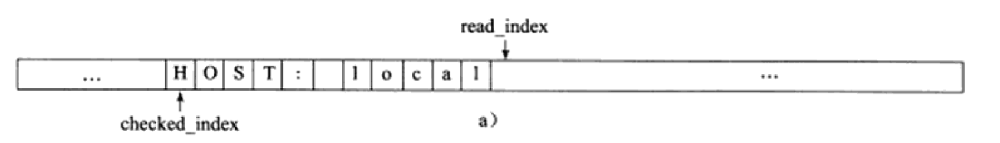

# 第六章、高级I/O函数

 ## pipe 函数

 用于创建一个管道，以实现进程间通信。定义如下

 ```c
 #include <unistd.h
 int pipe( int fd[2] );
 ```

 `pipe()` 函数的参数是一个包含两个 `int` 型整数的数组指针。该函数成功时返回 0 ，并将对弈打开的文件描述符值填入其参数所指向的数组。失败返回 -1 并设置 errno。

 `pipe()` 函数创建的两个文件描述符 `fd[0]` 和 `fd[1]` 分别构成管道的两端，往 `fd[1]` 写入的数据可以从 `fd[0]` 。并且， `fd[0]` 只能用于从管道读出数据， `fd[1]` 则只能用于往管道写入数据，而不能反过来使用。如果要实现双向的数据传输，就应该使用两个管道。

 `socket` 的基础 API 中有一个 `socketpair` 函数。能够方便地创建双向管道。其定义如下：

 ```c
 #include <sys/types.h
 #include <sys/socket.h
 int socketpair( int domain, int type, int protocol, int fd[2] );
 ```

 `socketpair` 钱三个参数地含义与 `socket` 系统调用地三个参数完全相同，但 `domain` 只能使用 `UNIX` 本地域协议族 `AF_UNIX`, 因为我们仅能再本地使用这个双向管道。最后一个参数和 `pipe` 系统调用的参数一样，只不过 `socketpair` 创建的这对文件描述符都是既可读又可写的。`socketpair` 成功时返回 0 ， 失败时返回 -1 并这是 errno。

readv 函数和 writev 函数

 `readv` 函数将数据从文件描述符读到分散的内存块中，即分散度；`writev` 函数则将多块分散的内存数据一并写入文件描述符中，即集中写。定义如下：

 ```c
 #include <sys/uio.h
 ssize_t readv( int fd, const struct iovec* vector, int count );
 ssize_t writev( int fd, const struct iovec* vector, int count );
 ```

 ## sendfile 函数

 `sendfile` 函数在两个文件描述符之间直接传递数据 ( 完全在内核中操作 )，从而避免了内核缓冲区和用户缓冲区之间的数据拷贝，效率很高，这被称为零拷贝。 `sendfile` 函数定义如下：

 ```Cpp
 #include <sys/sendfile.h
 ssize_t sendfile( int out_fd, int in_fd, off_t* offset, size_t count );
 ```

 - `in_fd` 是待读出内容的文件操作符
 - `out_fd` 是待写入内容的文件描述符
 - `offset` 指定从读入文件流的哪个位置开始读，如果为空，则使用读入文件流的默认起始位置。
 - `count` 指定文件描述符 `in_fd` 和 `out_fd` 之间传输的字节数

 `sendfile` 成功时返回传输的字节数，失败返回 -1 并设置 errno。

 注意：`in_fd` 必须是一个支持类似 `mmap` 函数的文件描述符，即它必须指向真实的文件，不能是 `socket` 和管道；而 `out_fd` 则必须是一个` socket`。

 **sendfile_function.c**

 使用方式：

 ```bash
 gcc -o sendfile_function sendfile_function.c
 ./sendfile_function (host_ip number) (port number) (file_name, 测试建议用.txt)
 ```

   在客户端机 `telnet (host_ip number) (port number)`并回车得到以下信息

   Trying 192.168.136.43...
   Connected to 192.168.136.43.
   Escape character is '^]'.
   testfile
   file tranfer (这两行是我的 .txt 文档里的内容)
   Connection closed by foreign host.

 ## mmap 函数和 munmap 函数

 `mmap` 函数用于申请一段内存空间。可以将这段内存作为进程间通信的共享内存，也可以将文件直接映射到其中。`munmap` 函数则释放由 `mmap` 创建的这段内存空间。定义如下：

 ```c
 #include <sys/mman.h
 void* map( void* start, size_t length, int prot, int flags, int fd, off_t offset );
 int munmap( void* start, size_t length )
 ```

 - `start` 允许用户使用某个特定的地址作为这段内存的起始地址。如果它被设置成 `NULL`, 则系统自动分配一个地址。
 - `length` 指定内存段的长度
 - `prot` 用来设置内存段的访问权限
   - `PROT_READ`	内存段可读
   - `PROT_WRITE`  内存段可写
   - `PROT_EXEC`    内存段可执行
   - `PROT_NONE`    内存段不能被访问
 - `flag` 控制内存段内容被修改后程序的行为
 - `fd` 参数是被映射文件对应的文件描述符。它一般通过 `open` 系统调用获得
 - `offset` 设置从文件何处开始映射( 对于不需要读入整个文件的情况 )

 `mmap` 函数成功时返回指向目标内存区域的指针， `munmap` 成功时返回 0，失败返回 -1 并设置 errno

 ## splice 函数

 `splice` 函数用于在两个文件描述符之间移动数据，也是零拷贝操作。定义如下

 ```C
 #include <fcntl.h
 ssize_t splice( int fd_in, loff_t* off_in, int fd_out, loff_t* off_out, size_t len, unsigned int flags );
 ```

 - `fd_in` 是代输入数据的文件描述符，如果 `fd_in` 是一个普通管道文件描述符，那么 `off_in` 必须被设置为 `NULL`。如果不是一个管道文件描述符，( 如 sockdet ), 那么 `off_in` 表示从输入数据流的何处开始读取数据。此时， 若 `off_in` 被设置为 `NULL`, 则表示从输入流的当前偏移位置读入；若不为 `NULL`, 则它将指出具体的便宜位置。
 - `fd_out/off_out` 含义与 `fd_in/off_in` 相同，不过用于输出数据流
 - `len` 指定移动数据的长度
 - `flag` 控制数据如何移动。

 使用 `splice` 函数， `fd_in`, `fd_out` 必须至少有一个是管道文件描述符。调用成功返回移动字节的数量，返回 0 ，表示没有数据需要移动。

 零拷贝回射服务实现：

 **splice.c**

 使用方式：

 ```bash
 gcc -o splice splice.c
 ./splice (host_ip number) (port number)
 ```

 我们通过 `splice` 函数将客户端的内容读入到 `pipefd[1]` 中，然后再使用 `splice` 函数从 `pipefd[0]` 中读出改内容到客户端，从而实现了简单高效的回射服务。整个过程未执行 `recv / send ` 操作，因此也未设计用户空间和内核空间之间的数据拷贝。

 ## tee 函数

 `tee` 函数在两个管道文件描述符之间复制数据，也是零拷贝操作。它不消耗数据，因此源文件描述符上的数据仍然可以用于后续的读操作。`tee` 函数原型如下：

 ```c
 #include <fcntl.h
 ssize_t tee( int fd_in, int fd_out, size_t len, unsigned int flags )
 ```

 含义与 `splice` 相同 ( 但 `fd_in` 和 `fd_out` 必须都是管道文件描述符) 。

 **tee.cpp** 代码实现了 `Linux` 下 `tee` 程序(同时输出数据到终端和文件的程序)的基本功能

 使用方式如下：

 ```bash
 g++ -o tee tee.cpp
 ./tee test.txt
 功能实现
 ```

## fcntl 函数

`fcntl` (file control), 提供了对文件描述符的各种控制操作。另一个常见的控制文件描述符和行为的系统调用是 `ioctl`, 而且 `ioctl` 比 `fcntl` 能够执行更多的控制。定义如下：

```C
#include <fcntl.h>
int fcntl( int fd, int cmd, ... );
```

- `fd` 被操作的文件描述符
- `cmd` 指定执行何种类型的操作。根据操作类型的不同，该函数可能还需要第三个可选参数 `arg`

在网络变成中， `fcntl` 函数通常用来将一个文件描述符设置为非阻塞的。

```C
int setnonblocking( int fd ){
    int old_option = fcntl( fd, F_GETFL );		/* 获取文件描述符旧的状态标志 */
    int new_option = old_option | O_NONBLOCK;	/* 设置为非阻塞状态 */
    fcntl( fd, F_SETFL, new_option );
    return old_option;						  /* 返回文件描述符旧的状态标志，以便日后回复该状态标志 */
}
```

## 第7章 Linux 服务器程序规范

本章综述了以下关于 linux 的进程，用户，组之类的概念。

下面的代码 **daemonize()** 表示了如何在代码中让一个进程以守护进程的方式运行。

```c
bool daemonize(){
    /* 创建子进程，关闭父进程， 这样可以使程序在后台运行 */
    pid_t pid = fork();
    if( pid < 0 ) return false;
    else if( pid > 0 ) exit();
    /* 设置文件权限掩码。当进程创建新文件 (使用 open( const char* pathname, int flags, mode_t mode ) 系统调用) 时，
    文件的权限将是 mode & 0777 */
    umask( 0 );
    /* 创建新的会话，设置本进程为进程组的首领 */
    pid_t sid = setsid();
    if ( sid < 0 ) return false;
    /* 切换工作目录 */
    if ( ( chdir( "/" ) ) > 0 ) return false;
    /* 关闭标准输入设备、标准输出设备和标准错误输出设备 */
    close( STDIN_FILENO );
    close( STDOUT_FILENO );
    close( STDERR_FILENO );
    /* 关闭其他已经打开的文件描述符，代码省略 */
    /* 将标准输入、标准输出和标准错误输出都定向到 /dev/null 文件 */
    open( "/dev/null", O_RDONLY );
    open( "/dev/null", O_RDWR );
    open( "/dev/null", O_RDWR );
    return true;
}
```

# 第八章、 高性能服务器程序框架

第八章为全书核心，本章将介绍如下三个主要模块：

- I/O 处理单元。将介绍 I/O 处理单元的四种 I/O 模型和两种高效时间处理模式
- 逻辑单元。将介绍逻辑单元的两种高效并发模式，以及高效的逻辑处理方式----有限状态机
- 存储单元。服务器程序的可选模块，内容与网络编程本身无关

## 服务器模型

### C/S 模型

C/S 模型的 TCP 服务器和 TCP 客户端工作流程如图


C/S 模型逻辑很简单。服务器启动后，收件创建一个 (或多个) 监听 `socket`, 并调用 `bind` 函数将其绑定到服务器感兴趣的端口上，然后调用 `listen` 函数等待客户连接。服务器稳定运行之后，客户端就可以调用 `connect` 函数向服务器发起连接了。由于客户连接请求是随机到达的 异步 时间，服务器需要使用某种 I/O 模型来监听这一事件。I/O 模型有多种，上图服务器使用的是 I/O 复用计数之一的 `select` 系统调用。当监听到连接请求后，服务器就调用 `accept` 函数接受它，并分配一个逻辑单元为新的连接服务。逻辑单元可以是新创建的子进程、子线程或者其他。上图中，服务器给客户端分配的逻辑单元是由 `fork` 系统调用创建的子进程。逻辑单元读取客户请求，处理该请求，然后将处理结果返回给客户端。客户端接收到服务器反馈的结果之后，可以继续向服务器发送请求，也可以立即主动关闭连接。如果客户端主动关闭连接，则服务器执行被动关闭。至此，双方的通信结束。需要注意的是，服务器在处理一个客户请求的同时还会继续监听其他客户请求，否则就变成效率低下的穿行服务器了(必须先处理完前一个客户的请求，才能继续处理下一个客户的请求)。途中服务器同时监听多个客户请求是通过 `select` 系统调用实现的。

### p2p模型

`Peer to Peer`点对点，比 C/S 模型更符合网络通信的实际情况。


P2P 使得每台服务器在小号服务的同时也在给别人提供服务，这样资源能够充分、自由地共享。云计算群可以看成 P2P 模型的一个典范，但缺点是：当用户之间的传输请求过多时，网络的负载将加重。

左(a)图存在一个显著的问题，即主机之间很难互相发现。所以实际使用的 P2P 模型通常带有一个专门的发现服务器，右(b)图。这个发现服务器通常还停工查找服务(甚至内容服务)，使每个客户都能尽快地找到自己需要的资源

P2P编程角度上可以是 C/S 模型的扩展：每台主机既是客户端，又是服务器。

## 服务器编程框架


该图既能用来描述一台服务器，也能用来描述一个服务器机群。

|     模块     |       单个服务器程序       |          服务器机群          |
| :----------: | :------------------------: | :--------------------------: |
| I/O处理单元  | 处理客户链接，读写网络数据 | 作为连接服务器，实现负载均衡 |
|   逻辑单元   |       业务进程或线程       |          逻辑服务器          |
| 网络存储单元 |   本地数据库、文件或缓存   |         数据库服务器         |
|   请求队列   |    各单元之间的通信方式    | 各服务器之间的永久 TCP 连接  |

- I/O 处理单元是服务器管理客户连接的模块。完成连接和接收客户连接，数据，发送数据等工作。但手法不一定在 I/O 处理单元中执行，也可能在逻辑单元中执行
- 一个逻辑单元通常是一个进程或者线程。一个逻辑单元本身就是一台逻辑服务器。服务器通常拥有多个逻辑单元，以实现对多个客户任务的并行处理
- 网络存储单元可以是数据库、缓存和文件，甚至是一台独立的服务器
- 请求队列是各单元之间通信方式的抽象。

## I /O 模型

`socket` 在创建的时候默认是阻塞的。可以通过 `socket` 系统调用的第 2 个参数传递 `SOCK_NONBLOCK` 标志，或者通过 `fcntl` 系统调用的 `F_SETFL` 命令，将其设置为非阻塞的。

针对阻塞 I/O 执行的系统调用可能因为无法立即完成而被操作系统挂起，知道等待的事件发生为止。比如，客户端通过 `connect` 向服务器发起连接时，`connect` 将首先发送同步报文段给服务器，然后等待服务器返回确认报文段。如果服务器的确认报文段没有立即到达客户端，则 `connect` 调用将被挂起，知道客户端收到确认报文段并唤醒 `connect` 调用。`socket` 的基础 API 中，可能被阻塞的系统调用包括 `accept、send、recv`和`connect`.

针对非阻塞 I/O 执行的系统调用则总时立即返回，而不管事件是否已经发生。如果事件没有立即发生，这些系统调用就返回 -1，和出错的情况一样。此时我们必须根据 `errno` 来区分这两种情况。对 `accept、send、recv`而言，事件未发生时 `errno` 通常被设置为`EAGAIN`(意为“再来一次”)或者 `EWOULDBLOCK` (意为“期望阻塞”)；对 `connect` 而言，`errno` 则被设置成 `EINPROGRESS` 意为“在处理中”。

因此，用非阻塞 I/O 来提高程序效率需要和其他 I/O 通知集制一起使用，比如 I/O 复用和 SIGIO 信号。

-  I/O复用 应用程序通过 I/O 复用函数向内核注册一组事件，内核通过 I/O 复用函数把其中就绪的事件通知给应用程序。`Linux` 上常用的 I/O 复用函数是 `select、poll` 和 `epoll_wait`。需要指出的是， `I/O` 复用函数本身是阻塞的，他们能提高程序效率的原因在于它们具有同时监听多个 I/O 事件的能力。
- SIGIO 为一个目标文件描述符指定宿主进程，那么宿主进程将捕获到 SIGIO 信号。当目标文件描述符上由事件发生时， SIGIO 信号的信号处理函数将被出发。

理论上，阻塞 I/O 、I/O 复用和信号驱动 I/O 都是同步 I/O 模型。对于异步 I/O 而言，用户可以直接对 I/O 执行读写操作，这些操作告诉内核用户读写缓冲区的位置，以及 I/O 操作完成之后内核通知应用程序的方式。异步 I/O 的读写操作总时立即返回，而不论 I/O 是否是阻塞的，因为真正的读写操作已经由内核接管。也就是说，同步 I/O 模型要求用户代码自行执行 I/O 操作(将数据从内核缓冲区读入用户缓冲区，或将数据从用户缓冲区写入内核缓冲区)，而异步 I/O 机制则是由内核来执行。

| I/O模型   | 读写操作和阻塞阶段                                           |
| --------- | ------------------------------------------------------------ |
| 阻塞 I/O  | 程序阻塞于读写函数                                           |
| I/O复用   | 程序阻塞于I/O复用系统调用，但可同时监听多个 I/O 事件。对 I/O 本身的读写操作是非阻塞的 |
| SIGIO信号 | 信号触发读写就绪事件，用户程序执行读写操作。程序没有阻塞阶段 |
| 异步I/O   | 内核执行读写操作并触发读写完成事件。程序没有阻塞阶段         |

查看资料后，上表三个都属于同步，其实都会阻塞到一个地方

blocking IO 会一直阻塞用户进程知道操作完成

non-blocking IO 在 `kernel`还准备数据的情况下立刻返回，执行别得操作，直到 `kernel` 给出得数据已准备好得信号，再执行这个操作。

同步IO和异步IO的区别在于：

同步IO在做IO操作的时候将 `process` 阻塞

异步不一样，当进程发起 I/O 操作后，就不管了，直到 `kernel` 发送一个信号，告诉进程说 I/O 完成。在这整个过程中，进程完全没有被阻塞

## 两种高效的事件处理模式

服务器程序通常需要处理三类事件： I/O 事件、信号及定时事件。这一节主要介绍：

- Reactor
- Proactor

同步用于实现 `Reactor` 模式，异步用于实现 `Proactor` 模式。

### Reactor模式

要求主线程 ( I/O 处理单元 ) 只负责监听文件描述上是否由事件发生，有的话就立即将该事件通知工作线程 ( 逻辑单元 )。除此之外，主线程不做任何其他实时性的工作。读写数据，接收新的连接，以及处理客户请求均在工作线程中完成。

使用同步 I/O 模型(以 epoll_wait 为例)实现的 Reactor 模式的工作流程是：

1. 主线程往 `epoll` 内核事件表中注册 socket 上的读就绪事件
2. 主线程调用 `epoll_wait` 等待 `socket` 上有数据可读
3. 当 `socket` 上有数据可读时，`epoll_wait` 通知主线程。主线程则将 `socket` 可读事件放入请求队列
4. 睡眠在请求队列上的某个工作线程被唤醒，它从 `socket` 读取数据，并处理客户请求，然后往 `epoll` 内核事件表中注册该 `socket` 写就绪事件。
5. 主线程调用`epoll_wait`等待`socket`可写
6. 当`socket`可写时，`epoll_wait`通知主线程。主线程将`socket` 可写事件放入请求队列
7. 睡眠在请求队列上的某个工作线程被唤醒，它往`socket`上写入服务器处理客户请求的结果


如上图，工作线程从请求队列中取出事件后，将根据事件的类型来决定如何处理它：对于可读事件，执行读数据和处理请求的操作；对于可写事件，执行写数据的操作。因此，如图所示的`Reactor`模式中，没必要区分所谓的“读工作线程”和“写工作线程”

### Proactor模式

​		与 Reactor 模式不同， Proactor 模式将所有的 I/O 操作都交给主线程和内核来处理，工作线程仅仅负责业务逻辑。因此， Proactor 模式更符合图 8-4 所描述的服务器编程框架。

​		使用异步 I/O 模型 ( 以 `aio_read`和`aio_write`为例 ) 实现的 Proactor 模式的工作流程是：

1. 主线程调用 `aio_read`函数向内核注册`socket`上的读完成事件，并告诉内核用户读缓冲区的位置，以及读操作完成时如何通知应用程序
2. 主线程继续处理其他的逻辑
3. 当`socket`上的数据被读入用户缓冲区后，内核将向引用程序发送一个信号，以通知应用程序数据已经可用
4. 应用程序预先定义好的信号处理函数选择一个工作线程来处理客户请求。工作线程处理完客户请求之后，调用`aio_write`函数向内核注册`socket`上的写完成事件，并告诉内核用户写缓冲区的位置，以及写操作完成时如何通知应用程序
5. 主线程继续处理其他逻辑
6. 当用户缓冲区被写入`socket`之后，内核将向应用程序发送一个信号，以通知应用程序的数据已经发送完毕
7. 应用程序预先定义好的信号处理函数选择一个工作线程来做善后处理，比如决定是否关闭`socket`


如图，连接`socket`上的读写事件是通过`aio_read/aio_write`向内核注册的，因此内核将通过信号来向应用程序报告连接`socket`上的读写事件。所以，主线程中的`epoll_wait`调用仅能用来检测监听`socket`上的连接请求时间，而不能用来检测连接`socket`上的读写事件

### 模拟 Proactor 模式

​		用同步 I/O 方式模拟出 Proactor 模式的一种方法的原理便是：主线程执行数据读写操作，读写完成后，主线程想工作线程通知这一”完成时间“。那么从工作线程的角度来看，它们就直接获得了数据读写的结果，接下来要做的只是对读写的结果进行逻辑处理。

​		使用同步 I/O 模型 ( 仍以 `epoll_wait`为例 ) 模拟出的 Proactor 模式的工作流程如下：

1. 主线程往`epoll`内核事件表中注册`socket`上的读就绪事件
2. 主线程调用`epoll_wait`等待`socket`上有数据可读
3. 当`socket`上有数据可读时，`epoll_wait`通知主线程。主线程从`socket`循环读取数据，知道没有更多数据可读，然后将读取到的数据封装成一个请求对象并插入请求队列
4. 睡眠在请求队列上的某个工作线程被唤醒。它获得请求对象并处理客户请求，然后往`epoll`内核时间表中注册`socket`上的写就绪事件
5. 主线程调用`epoll_wait`等待`socket`可写
6. 当`socket`可写时，`epoll_wait`通知主线程。主线程往`socket`上写入服务器处理客户请求的结果


粗浅的理解：这里的模拟差不多是让主线程在监听的同时要I/O把事件完成，让工作线程认为已经得到了数据读写结果，只需要对读写结果进行处理，让内核完成的事件找主线程完成。

## 两种高效的并发模式

​		如果程序是计算密集型(CPU密集)的，并发编程并没有优势，反而由于任务的切换使得效率降低。但如果程序是 I/O 密集的，比如经常读写文件，访问数据库等，则情况就不同了。如果程序有多个执行线程，则当前被 I/O操作所阻塞的执行线程可主动放弃 CPU ( 或由操作系统来调度 )，并将执行权转移到其他线程。

​		从实现上来说，并发编程主要由多进程和多进程两种模式。这一节先讨论并发模式

### 半同步/半异步模式

​		这里的”同步“和”异步“与之前讨论的 I/O 中同步异步的概念完全不同。在 I/O 模型中同步异步区分的是内核向应用程序通知的是就绪时间还是完成时间的 I/O 事件，以及该有谁来完成 I/O 读写（是应用程序还是内核）。在==并发模式==中，”同步“指的是程序==完全按照代码序列的顺序执行==；”异步“指的是程序的执行需要由系统时间来驱动。常见的系统时间包括中断、信号等。


​		按照同步方式运行的线程称为同步线程，按照异步方式运行的线程称为异步线程。

在服务器程序中，半同步/半异步模型存在多种变体，其中一种被称为半同步/半反应堆(half-sync/half-reactive)模式


​		上图中，异步线程只有一个，由主线程来当。它负责监听所有`socket`上的事件。如果监听`socket`上有可读事件发生，即有新的连接请求到来，主线程就接受得到新的连接`socket`，然后往`epoll`内核事件表中注册该`socket`上的读写事件。如果连接`socket`上有读写事件发生，主线程将该连接`socket`插入到请求队列中。所有工作线程都睡眠在请求队列上，当有任务到来时，它们将通过竞争获得任务管理权。该模式采用的事件处理模式是 Reactor 模式：要求工作线程自己从`socket`上读取客户请求和往`socket`写入服务器应答。

​		该模式存在如下缺点：

- 主线程和工作线程共享请求队列。主线程往请求队列中添加任务，或者工作线程从请求队列中取出任务，都需要对请求队列加锁保护，从而白白耗费CPU事件
- 每个工作线程在同一时间只能处理一个客户请求。如果客户数量较多，而工作线程较少，则请求队列中将堆积很多任务对象，客户端的相应速度将越来越慢。如果通过增加工作线程来解决这一问题，则工作线程的切换也将耗费大量的 CPU 时间


​		上图中是更高效的半同步/半异步模式，他的每个线程都能同时处理多个客户连接

​		主线程只管监听`socket`，连接`socekt`由工作线程来管理。当有新的连接到来时，主线程就接受并将新返回的连接`socket`派发给某个工作线程，此后该新`socket`上任何 I/O 操作都由被选中的工作线程来处理，直到客户关闭连接。

​		上图中，每个线程都维持自己的事件循环，它们各自独立地监听不同地时间。

### 领导者/追随者模式

多个工作线程轮流获得事件源集合，轮流监听，轮流称为领导者、分发并处理事件。

领导者/追随者模式包含如下几个组件：句柄集(HandleSet)、线程集(ThreadSet)、事件处理器(EventHandler)和具体地事件处理器(ConcreteEventHandler)。如下图


1. 句柄集

   句柄 ( Handle ) 用于表示 I/O 资源，在 Linux 下通常就是一个文件描述符。句柄集管理众多句柄，它使用 `wait_for_event`方法来监听这些句柄上的 I/O 事件，并将其中的就绪事件通知给领导者线程。领导者则调用绑定到 `Handle`上的事件处理器来处理事件。领导者将`Handle`和事件处理器绑定是通过调用句柄集中的`register_handle`方法实现的。

2. 线程集

   这个组件时所有工作线程（包括领导者线程和追随者线程）的管理者。它负责各线程之间的同步，以及新领导者线程的推选。线程集中的线程在任一时间必处于如下三种状态之一：

   - Leader 线程当前处理领导者身份，负责等待句柄集上的 I/O 事件
   - Processing 线程正在处理事件。领导者检测到事件后，可以转移到 Processing 状态来处理该事件，并调用 `promote_new_leader` 方法推选新的领导者；也可以指定其他追随者来处理事件( Event Handoff), 此时领导者的地位不变。
   - Follower 线程当前处于追随者身份，通过调用线程集的 `join` 方法等待成为新的领导者，也可能被当前的领导者指定来处理新的任务

   

3. 事件处理器和具体的事件处理器

   事件处理器通常包含一个或多个回调函数 `handle_event`，用来处理时间对应业务逻辑。

由于领导者线程自己监听 I/O 并处理客户请求，因而领导者/追随者模式不需要再线程之间传递任何额外的数据，也无须像半同步/版反应堆模式那样在线程之间同步对请求队列的访问。但该模式一个明显的缺点时仅支持一个事件源集合，因此无法让每个工作线程独立地管理多个客户连接。

## 有限状态机

本节将讨论逻辑单元内部的一种高效变成方法：有限状态机(finite state machine)

有的应用层协议头部包含数据包类型字段，每种类型可以映射位逻辑单元的一种执行状态，服务器可以根据它来编写相应的处理逻辑。

```c
STATE_MACHINE( Package _pack ){
    PackageType _type = _pack.GetType();
    switch( _type )
    {
        case type_A:
            process_package_A( _pack );
            break;
        case type_B:
            process_package_B( _pack );
            break;
    }
}
```

上诉代码的状态机每个状态都是相互独立的，状态之间没有相互转移。状态之间的转移是需要状态机内部驱动的。

```C
STATE_MACHINE( Package _pack ){
    State cur_State = type_A;
    switch( cur_State != type_C )
    {
        Package _pack = getNewPackage();
        case type_A:
            process_package_A( _pack );
            cur_State = type_B;
            break;
        case type_B:
            process_package_B( _pack );
            cur_State = type_C;
            break;
    }
}
```

应用实例:HTTP请求的读取和分析。很多网络协议，包括 TCP 协议和 IP 协议，都在其头部中提供头部长度字段。程序根据该字段的值就可以知道是否接收到一个完整的协议头部。但 HTTP 协议并未提供这样的头部长度字段，并且其头部长度变化也很大，可以只有十几字节，也可以有上百字节。

**http_read_anlysis.c**

该代码中的两个有限状态机分别为主状态机和次(从)状态机，这体现了它们之间的关系：主状态机在内部调用次状态机。

- parse_line 函数，从`buffer`中解析出一个行。如图

  

这个状态机的初始状态是 `LINE_OK`， 其原始驱动力来自于 `buffer` 中新到达的客户数据。在`mian`函数中，我们循环调用`recv`函数往`buffer`中读入客户数据。每次成功读取数据后，我们就调用`parse_content`函数来分析新读入的数据

- parse_content 函数首先要做的就是调用 `parse_line` 函数来获取一个行。现在假设服务器经过一次`recv`调用之后，`buffer`的内容以及部分变量的值如图所示

  

- `parse_line` 函数处理之后如图所示，它挨个检查上图所示的 `buffer` 中 `checked_index` 到（`read_index - 1`）之间的字节，判断是否存在行结束符，并更新`checked_index`的值。当前`buffer`中不存在行结束符，所以`parse_line`返回 `LINE_OPEN`。

  

- 接下来，程序继续调用`recv`以读取更多客户数据，这次读操作后`buffer`中的内容以及部分变量的值如下图所示

  

- 然后 `parse_line` 函数又开始处理这部分新到来的数据，如下图所示。这次它读到了一个完整的行，即`"HOST:localhost\r\n"`。此时。`parse_line`函数就可以将这行内容递交给`parse_content`函数中的主状态机来处理了

  

上面四张图分别代表

1. 调用 `recv` 后，`buffer` 里的初始内容和部分变量的值
2. `parse_line` 函数处理 `buffer` 后的结果
3. 再次调用`recv`后的记过
4. `parse_line`函数再次处理`buffer`后的结果

主状态机使用`checkstate`变量来记录当前的状态。如果当前的状态机是 `CHECK_STATE_REQUESTLINE`，则表示`parse_line`函数解析出的行是请求行，于是主状态机调用`parse_requestline`来分析请求行；如果当前的状态是`CHECK_STATE_HEADER`, 则表示 `parse_line`函数解析出的是头部字段，于是主状态机调用`parse_headers`来分析头部字段。`checkstate`变量的初始值是`CHECK_STATE_REQUESTLINE`,`parse_requestline`函数在成功地分析完请求行之后将其设置为`CHECK_STATE_HEADER`,从而实现状态转移。

## 提高服务器性能的其他建议

### 池

如果服务器硬件资源“充裕”，那么提高服务器性能的一个很直接的方法就是以空间换时间。即“池(poll)”的概念。当服务器处理完一个客户连接后，可以把相关的资源放回池中，无须执行系统调用来释放资源。从最终的效果来看，池相当于服务器管理系统资源的应用层设置，它避免了服务器堆内核的频繁访问。

根据不同资源类型，池可分为很多种，常见的有

- 内存池

  通常用于 `socket` 的连接缓存和发送缓存。对于某些长度有限得客户请求，比如 HTTP 请求，预先分配一个大小足够(比如 5000 字节) 的接收缓存区是很合理的。当客户请求的长度超过接收缓冲区的大小时，我们可以选择丢弃请求或者动态扩大接收缓冲区

- 线程池和进程池

  都是并发编程常用的方法。当需要一个工作进程或者工作线程来处理新到来的客户请求时，我们可以直接从进程池或者线程池中取一个执行实体，而无需动态地调用 `fork` 或 `pthread_create` 等函数来创建进程和线程

- 连接池

  长用于服务器或者服务器机群的内部永久连接。

### 上下文切换和锁

并发程序必须考虑上下文切换（context switch）的问题，即进程切换或者线程切换导致的系统开销。

并发程序需要考虑的另一个问题时共享资源的加锁保护。锁通常被认为是导致服务器效率低下的一个因素，因为由它引入的代码不仅不处理任何业务逻辑，而且需要访问内核资源。

如果服务器必须使用“锁”，则可以考虑减小锁的粒度，比如使用读写锁。当所有工作线程都制度一块共享内存的内容时，读写锁不会增加系统的额外考校。只有当其中某一个工作线程需要写这块内存时，系统才必须去锁住这块区域。

# 第九章 I/O 复用

I/O复用使程序能同时监听多个文件描述符，这对提高程序的性能至关重要。通常，网络程序在下列情况下需要使用 I/O 复用计数

- 客户端程序要同时处理多个 `socket`。 比如接下来将要讨论的非阻塞`connect`技术
- 客户端程序要同时处理用户输入和网络连接。比如聊天室程序
- TCP 服务器要同时处理监听 `socket` 和连接 `socket`。这是 I/O 复用使用最多的场合。
- 服务器要同时处理 TCP 和 UDP 请求。比如回射服务器
- 服务器要同时监听多个端口，或者处理多种服务，比如 `xinetd` 服务器

## 9.1 select 系统调用

`select` ：在一段指定时间内，监听用户感兴趣的文件描述符上的可读、可写和异常等时间。

### 9.1.1 select API

原型：

```c
#include <sys/select.h>
int select( int nfds, fd_set* readfds, fd_set* writefds, fd_set* exceptfds, struct timeval* timeout );
```

- `nfds` 指定被监听的文件描述符的总数。它通常被设置为 `select` 监听的所有文件描述符中的最大值加 1 ，因为文件描述符是从 0 开始计数的。

- `readfds, writefds` 和 `exceptfds` 分别指向可读、可写和异常等事件对应的文件描述符集合。这三个参数是 `fd_set` 结构指针类型。`fd_set` 结构体定义如下

  ```c
  #include <typesizes.h>
  #define __FD_SETSIZE 1024
  
  #include <sys/select.h>
  #define FD_SETSIZE __FD_SETSIZE
  typedef long int __fd_mask;
  #undef __NFDBITS
  #define __NFDBITS ( 8 * (int) sizeof (__fd_mask ) )
  typedef struct
  {
  #ifdef __USE_XOPEN
      __fd_mask fds_bits[ __FD_SETSIZE / __NFDBITS ];
  #define __FDS_BITS(set) ((set)->fds_bits)
  #else
      __fd_mask __fds_bits[ __FD_SETSIZE / __NFDBITS ];
  #define __FDS_BITS(set) ((set)->__fds_bits)
  #endif
  } fd_set;
  ```

  `fd_set`结构体仅包含一个整型数组，该数组的每个元素的每一位(bit)标记一个文件描述符。我们使用下面的一系列宏来访问 `fd_set` 结构体中的位：

  ```c
  #include <sys/select.h>
  FD_ZERT( fd_set* fdset); 				/* 清除 fdset 的所有位 */
  FD_SET( int fd, fd_set* fdset ); 		 /* 设置 fdset 的位 fd */
  FD_CLR( int fd, fd_set* fdset );		 /* 清除 fdset 的位 fd */
  int FD_ISSET( int fd, fd_set* fdset );	  /* 测试 fdset 的位 fd 是否被设置 */
  ```

- `timeout` 设置 `select` 的超时时间。是一个 `timeval` 结构类型的指针。`timeval` 结构体的定义如下：

  ```c
  struct timeval{
      long tv_sec;	/* 秒数 */
      long tv_usec;	/* 微秒数 */
  }
  ```

  如果给 `timeout` 变量的两个成员都传递 0， 则 `select` 将立即返回。如果给 `timeout` 传递 `NULL` ,则 `select` 将一直阻塞，直到某个文件描述符就绪。

  ### 9.1.3 处理带外数据

  `socket`上接收到普通数据和带外数据都将使`select`返回，但`socket`处于不同的就绪状态：前者处于可读状态，后者处于异常状态。
  
  **select.c**

## 9.2 poll 系统调用

`poll` 系统调用和 `select` 类似，也是在指定时间内轮询一定数量的文件描述符，以测试其中是否有就绪者。原型如下：

```c
#include <poll.h>
int poll ( struct pollfd* fds, nfds_t nfds, int timeout );
```

- `fds` 是一个 `pollfd` 结构类型的数组，它指定所有我们感兴趣的文件描述符上发生的可读、可写和异常事件。定义如下：

  ```c
  struct pollfd{
      int fd;				/* 文件描述符 */
      short events;		 /* 注册的事件 */
      short revents;		 /* 实际发生的事件，由内核填充 */
  }
  ```

  其中，`fd` 成员指定文件描述符：`events` 成员告诉 `poll` 监听 `fd` 上的哪些事件，它是一系列事件的按位或；`revents` 成员由内核修改，以通知应用程序 `fd` 上实际发生了哪些事件。`poll` 支持的事件类型如下表所示：

  | 事件       | 描述                                                        | 是否可作为输入 | 是否可作为输出 |
  | ---------- | ----------------------------------------------------------- | -------------- | -------------- |
  | POLLIN     | 数据(包括普通数据和优先数据)可读                            | 是             | 是             |
  | POLLRDNORM | 普通数据可读                                                | 是             | 是             |
  | POLLRDBAND | 优先级带数据可读(Linux不支持)                               | 是             | 是             |
  | POLLPRI    | 高优先级数据可读，比如 TCP 带外数据                         | 是             | 是             |
  | POLLOUT    | 数据(包括普通数据和优先数据)可写                            | 是             | 是             |
  | POLLWRNORM | 普通数据可写                                                | 是             | 是             |
  | POLLWRBAND | 优先级带数据可写                                            | 是             | 是             |
  | POLLRDHUP  | TCP连接被对方关闭，或者对方关闭了写操作，它由GNU引入        | 是             | 是             |
  | POLLERR    | 错误                                                        | 否             | 是             |
  | POLLHUP    | 挂起。比如管道的写端被关闭后，读端操作符上将收到POLLHUP事件 | 否             | 是             |
  | POLLNVAL   | 文件描述符没有打开                                          | 否             | 是             |

  上表中, `POLLRDNORM、POLLRDBAND、POLLWRNORM、POLLWRBAND` 由 `XOPEN` 规范定义。

- `nfds` 指定被监听事件集合 `fds` 的大小。类型定义如下

  ```c
  typedef unsigned long int nfds_t;
  ```

- `timeout` 指定 `poll` 的超时值，单位是毫秒。当 `timeout == -1` 时，`poll` 调用将永远阻塞，直到某个时间发生；当 `timeout == 0` 时，poll 调用将立即返回

  poll 系统调用的返回值的含义与 `select` 相同

## 9.3 epoll 系列系统调用

**注意：** `listen fd`, 有连接请求会触发 `EPOLLIN`。

### 9.3.1 内核事件表

`epoll` 是 `Linux` 特有的 I/O 复用函数。在实现上和 `select、poll` 有很大差异。`epoll` 是一组函数而不是单个函数来完成任务。其次，`epoll`把用户关心的文件描述符上的事件放在内核里的一个事件表中，从而无须像`select`和`poll`拿要每次调用都要重复传入文件描述符或事件集。但 `epoll` 需要使用一个额外的文件描述符，来唯一标识内核中的这个事件表。这个文件描述符使用如下 `epoll_create` 函数创建：

```c
#include <sys/epoll.h>
int epoll_create( int size )
```

`size` 现在并不起作用，只是给内核一个提示，告诉它事件表需要多大。该函数返回的文件描述符将用作其他所有 `epoll` 系统调用的第一个参数，以指定要访问的内核事件表，用以下函数来操作 `epoll` 的内核事件表

```c
#include <sys/epoll.h>
int epoll_ctl( int epfd, int op, int fd, struct epoll_event* event)
```

- `fd` 是要操作的文件文件描述符

- `op` 指定操作类型。操作类型有如下 3 种：

  - `EPOLL_CTL_ADD` 往事件表中注册 `fd` 上的事件
  - `EPOLL_CTL_MOD` 修改 `fd` 上的注册事件
  - `EPOLL_CTL_DEL` 删除 `fd` 上的注册事件

- `event` 指定事件，它是 `epoll_event` 结构指针类型。定义如下

  ```C
  struct epoll_event{
      __uint32_t events;	/* epoll事件 */
      epoll_data_t data;	/* 用户数据 */
  };
  ```

  其中 `events` 成员描述事件类型。`data` 成员用于存储用户数据，其类型 `epoll_data_t` 定义如下：

  ```c
  typedef union epoll_data{
      void* ptr;
      int fd;
      unit32_t u32;
      uint64_t u64;
  } epoll_data_t;
  ```

  `epoll_data_t` 是一个联合体，其 4 个成员中使用最多的是 `fd`, 它指定事件所从属的目标文件描述符。

  `ptr` 可用来指定与 `fd` 相关的用户数据。由于联合体的特性，`ptr` 和 `fd` 成员不能同时使用，解决办法之一是:放弃 `fd` 成员，而在 `ptr` 指向的用户数据中包含 `fd`。

### 9.3.2 epoll_wait 函数

`epoll` 系列系统调用的主要接口是 `epoll_wait` 函数。它在一段超时事件内等待一组文件描述符上的事件，原型如下：

```c
#include <sys/epoll.h>
int epoll_wait( int epfd, struct epoll_event* events, int maxevents, int timeout );
```

该函数成功时返回就绪的文件描述符的个数。`maxevents` 指定最多监听多少个事件，必须大于 0 。

`epoll_wait` 函数如果检测到事件，就将所有就绪的事件从内核事件表 ( 由 `epfd` 参数指定 ) 中复制到它的第二个参数 `events` 指向的数组中。这个数组只用于输出 `epoll_wait` 检测到的就绪事件，而不像 `select` 和 `poll` 的数组参数那样既用于传入用户注册的事件，又用于输出内核检测到的就绪事件。

`poll & epoll --- difference`

```cpp
/* 如何索引 epoll 返回的就绪文件描述符 */
int ret = poll( fds, MAX_EVENT_NUMBER, -1 );
/* 必须遍历所有已注册文件描述符并找到其中的就绪者(可以利用 ret 稍作优化) */
for( int i = 0; i < MAX_EVENT_NUMBER; ++i){
    if( fds[i].revents & POLLIN )	/* 判断第 i 个文件描述符是否就绪 */
    {
        int sockfd = fds[i].fd;
        /* 处理 sockfd */
    }
}

/* 如何索引 epoll 返回的就绪文件描述符 */
int ret = epoll_wait( epollfd, events, MAX_EVENT_NUMBER, -1 );
/* 仅遍历就绪的 ret 个文件描述符 */
for( int i = 0; i < ret; i++ ){
    int sockfd = events[i].data.fd;
    /* sockfd 肯定就绪，直接处理 */
}
```

### 9.3.3  LT 和 ET 模式

`epoll` 对文件描述符的操作有两种模式： `LT (Level Trigger, 电平触发)` 模式和 `ET( Edge Trigger, 边沿触发)` 模式。`LT` 是默认的工作模式，这种模式下 `epoll` 相当于一个效率较高的 `poll`。当往 `epoll` 内核事件表中注册一个文件描述符上的 `EPOLLET` 事件时，`epoll` 将以 `ET` 模式来操作该文件描述符。

对于 `LT` ，当 `epoll_wait` 检测到有事件发生并将此事件通知应用程序后，应用程序可以不立即处理该事件。而对于 `ET` , 当 `epoll_wait` 检测到有事件发生并通知后，应用程序必须理解处理该事件，因为后续的 `epoll_wait` 调用不再向应用程序通知这一事件。由此可见 `ET` 比 `LT` 效率要高

**注意:** 每个 `ET` 模式的文件描述符都应该是非阻塞的。如果文件描述符时阻塞的，那么读或写操作将会因为没有后续的事件而一直处于阻塞状态(饥渴状态)

**LTandET.cpp**

```
g++ -o LTandET LTandET.cpp
./LTandET 192.***.***.*** 8088
```

`addfd( epollfd, listenfd, true) //将 listenfd 这个监听文件符也加进了事件表，所以当新的连接要求加入时，也在触发 EPOLLIN 事件`

### 9.3.4 EPOLLONESHOT 事件

在使用 `ET` 时，一个线程或进程在读取完某个 `socket` 上的数据后开始处理数据，而在这个过程中该 `socket` 上又有新数据可读(EPOLLIN再次触发)，此时另外一个线程被唤醒来读取这些新的数据。于是就出现了两个线程同时操作一个 `socket` 的局面。所以，可以通过  `epoll` 的 `EPOLLONESHOT` 事件来实现

对于注册了 `EPOLLONESHOT` 事件的文件描述符，操作系统最多触发其上注册的一个可读、可写或者异常事件，且支出法一次，除非我们使用 `epoll_ctl` 函数重置该文件描述符上注册的 `EPOLLONESHOT` 事件。所以，当该 `socket` 被某个线程处理完毕，就应该立即重置 `EPOLLONESHOT` 事件。

**EPOLLONESHOT.cpp**

```
g++ -o EPOLLONESHOT EPOLLONESHOT.cpp
./EPOLLONESHOT 192.***.***.*** 8088
```

## 9.4 三组 I/O 复用函数的比较

`select、poll、epoll` 3 组函数都通过某种结构体变量来告诉内核监听哪些文件描述符上的哪些事件，并使用该结构体类型的参数来获取内核处理的结果。`select` 的函数类型 `fd_set` 没有将文件描述符和事件绑定，它仅仅是一个文件描述符集合，因此 `select` 需要提供 3 个这种类型的参数来分别传入和输出可读、可写及集合的在线修改，应用程序下次调用 `select` 前不得不重置这 3 个 `fd_set` 集合。`poll` 参数类型 `pollfd` 把文件描述符和事件都定义其中，任何时间都被统一处理，从而使得编程结构简介得多。并且内核每次修改的时 `epollfd` 结构体的 `revents` 成员，而 `event` 成员保持不变，因此下次调用 `poll` 时应用程序无须重置 `pollfd` 类型的事件集参数。每次 `select` 和 `poll` 调用都返回整个用户注册的事件集和，复杂度高。`epoll` 则采用与 `select` 和 `poll` 完全不同的方式来管理用户注册的事件。在内核中维护一个事件表，并提供一个独立的系统调用 `epoll_ctl` 来控制往其中添加、删除、修改事件。这样，无须反复从用户空间读入这些事件。`epoll_wait` 系统调用的 `events` 参数仅用来返回就绪的事件，这使得应用程序所以就绪文件描述符的时间复杂度达到 O(1)。

`select` 和 `poll` 都只能工作在相对低效的 LT 模式，而 `epoll` 可以高效 ET 模式，并支持 EPOLLONESHOT 事件，进一步减少可读、可写和异常等事件被触发的次数。

和 `select、poll` 采用轮询方式的原理不同，`epoll_wait` 采用回调的方式。内核检测到就绪的文件描述符时，将触发回调函数，回调函数就将该文件描述符上对应的事件插入内核就绪事件队列。

但是，当活动连接比较多的时候， `epoll_wait` 的效率未必比 `select` 和 `poll` 高，因为此时回调函数被触发得过于频繁。所以 `poll_wait` 适用于连接数量多，但活动连接较少的情况。

|                系统调用                |                            select                            |                             poll                             |                            epoll                             |
| :------------------------------------: | :----------------------------------------------------------: | :----------------------------------------------------------: | :----------------------------------------------------------: |
|                事件集合                | 用户通过 3 个参数分别传入感兴趣的可读、可写及异常等事件，内核通过对这些参数的在线修改来反馈其中的就绪事件。这使得用户每次调用 select 都要重置这 3 个参数 | 同一处理所有事件类型，因此只需要一个事件集参数。用户通过 pollfd.events 传入感兴趣的事件，内核通过修改 pollfd.revents 反馈其中就绪的事件 | 内核通过一个事件表直接管理用户感兴趣的所有事件。因此每次调用 epoll_wait 时，无须反复传入用户感兴趣的事件。epoll_wait 系统调用的参数 events 仅用来反馈就绪的事件 |
| 应用程序索引就绪文件描述符的事件复杂度 |                             O(n)                             |                             O(n)                             |                             O(1)                             |
|          最大支持文件描述符数          |                       一般有最大值限制                       |                            65535                             |                            65535                             |
|                工作模式                |                              LT                              |                              LT                              |                       支持 ET 高效模式                       |
|           内核实现和工作效率           |      采用轮询方式来检测就绪事件，算法时间复杂度为 O(n)       |      采用轮询方式来检测就绪事件，算法时间复杂度为 O(n)       |      采用回调方式来检测就绪事件，算法时间复杂的为 O(1)       |

## 9.5 I/O复用的高级应用一：非阻塞 connect

`connect` 出错时有一种 errno 值：EINPROGRESS。这种错误发生在对非阻塞的 `socket` 调用 `connect` ，而连接又没有立即建立时。根据 `man` 文档的解释，在这种情况下，我们可以调用 `select、poll` 等函数来监听跟这个连接失败的 `socket` 上的可写事件。当 `select、poll` 等函数返回后，再利用 `getsockopt` 来读取错误码并清除该 `socket` 上的错误。

通过上面描述的非阻塞 `connect` 方式，就可以同时发起多个连接并一起等待。 

**connect.cpp**

然，这种方法存在几个移植性问题。首先，非阻塞的 `socket` 可能导致 `connect` 始终失败。其次， `select` 对处于 `EINPROGRESS` 状态下的 `socket` 可能不起作用。最后，对于出错的 `socket,getsockopt` 在有些系统( 比如 Linux ) 上返回 -1，而有些返回 0.

## 9.6  I/O复用的高级应用二：聊天室程序

### 9.6.1 客户端

客户端程序使用 `poll` 同时监听用户输入和网络连接，并利用 `splice` 函数将用户输入内容直接定向到网络连接上以发送之，从而实现数据零拷贝，提高了程序执行效率。

**client.cpp**

**server.cpp**

## 9.7 I/O 复用的高级应用三：同时处理 TCP 和 UDP 服务

在实际应用中，有不少服务器程序能同时监听多个端口，比如超级服务 `inetd` 和 `android` 的调试服务 `adbd`。

从 `bind` 系统调用的参数来看，一个 `socket` 只能与一个 `soscket` 地址绑定，即一个 `socket` 只能用来监听一个端口。因此，服务器如果要同时监听多个端口，就必须创建多个 `socket`, 并将他们分别绑定到各个端口上。这样一来，服务器程序就需要同时监听处理该端口上的 TCP 和 UDP 请求，则也需要创建两个不同的 `socket` ：一个是流 `socket` ，另一个是出举报 `socket` ，并将他们都绑定到该端口上。

**TCP_UDP.cpp**

##  9.8 超级服务 xinetd

`Linux` 因特网服务 `inetd` 是超级服务，它同时管理着多个子服务，即监听多个端口。现在 `Linux` 系统上使用 `inetd` 服务程序通常是其升级版本 `xinetd`。`xinetd` 程序的原理与 `inetd` 相同，但增加了一些控制选项，并提高了安全性。

### 9.8.1 xinetd 配置文件

`xinetd` 采用 `/etc/xinetd.conf` 主配置文件和 `etc/xinetd.d` 目录下的子配置文件来管理所有服务。主配置文件包含的是通用选项，这些选项将被所有子配置文件继承，并且可以被子配置文件覆盖。每个子配置文件用于设置一个自服务的参数。比如 `telnet` 子服务的配置文件 `/etc/xinetd.d/telnet` 的典型内容如下：

```cpp
# default: on
# description: The telnet server serves telnet sessions; it uses \
# unencrypted username/password pairs for oauthentication.
service telnet {
    flags                = REUSE
    socket_type          = stream
    wait                 = no
    user                 = root
    server               = /usr/sbin/in.telnetd
    log_on_failure       = USERID
    disable              = no
}
```

上面每一项的含义如下：

| 项目           | 含义                                                         |
| -------------- | ------------------------------------------------------------ |
| service        | 服务名                                                       |
| flags          | 设置连接的标志。REUSE 表示复用 telnet 连接的 socket 。该标志已经过时。每个连接都默认启用 REUSE 标志 |
| socket_types   | 服务类型                                                     |
| wait           | 服务采用单线程方式 ( wait = yes ) 还是多线程方式 ( wait = no )。单线程方式表示 xinetd 只 accept 第一次连接，此后将由子服务进程来 accept 新连接。多线程方式表示 xinetd 一直负责 accept 连接，而子服务进程仅处理连接 socket 上的数据读写 |
| user           | 子服务进程将以 user 指定的用户身份运行                       |
| server         | 子服务程序的完整路径                                         |
| log_on_failure | 定义当服务不能启动时输出日志的参数                           |
| disable        | 是否启动该子服务                                             |

### 9.8.3 xinetd 工作流程

`xinetd` 管理的子服务中有的是标准服务，比如时间日期服务 `daytime`, 回射服务 `echo` 和 丢弃服务 `discard`。`xinetd` 服务器在内部直接处理这些服务。还有的子服务则需要调用外部的服务器程序来处理。`xinetd` 通过调用 `fork` 和 `exec` 函数来加载运行这些服务器程序。比如 `telnet、ftp` 服务都是这种类型的子服务。

查看 `xinetd` 守护进程的 PID 

```bash
$ cat /var/run/xinetd.pid
4862
```


# 第 10 章 信号

信号是由用户、系统或者进程发送给目标进程的信息，以通知目标进程某个状态的改变或系统异常。`Linux` 信号可由如下条件产生：

- 对于前台进程，用户可以通过输入特殊的终端字符来给它发信号。比如输入 `Ctrl + C` 通常会给进程发送一个中断信号
- 系统异常。比如浮点异常和非法内存段访问
- 系统状态变化。比如 `alarm` 定时器到期将引起 `SIGALRM` 信号
- 运行 `kill` 命令或调用 `kill` 函数

服务器必须能处理(或至少忽略)一些常见的信号，以免异常终止

## 10.1 Linux 信号概述

### 10.1.1 发送信号

`Linux` 下，一个进程给其他进程发送信号的 `API` 是 `kill` 函数。其定义如下：

```cpp
#include <sys/types.h>
#include <signal.h>
int kill( pid_t pid, int sig );
```

该函数把信号 `sig` 发送给目标进程；目标进程由 `pid` 参数指定，其可能的取值及含义如下

| pid 参数 | 含义                                                         |
| -------- | ------------------------------------------------------------ |
| pid > 0  | 信号发送给 PID 为 pid 的进程                                 |
| pid = 0  | 信号发送给本地进程组内的其他进程                             |
| pid = -1 | 信号发送给除 init 进程外的所有进程，但发送者需要拥有对目标进程发送信号的权限 |
| pid < -1 | 信号发送给组 ID 为 -pid 的进程族中的所有成员                 |

`Linux` 定义的信号值都大于 0 .如果 `sig` 取值为 0， 则 `kill` 函数不发送任何信号。

### 10.1.2 信号处理方式

目标进程在收到信号时，需要定义一个接收函数来处理，原型如下：

```cpp
#include <bits/signum.h>
#define SIG_DEF ((__sighandler_t) 0)
#define SIG_IGN ((__sighandler_t) 1)
```

- SIG_IGN 表示忽略目标的信号

- SIG_DEF 表示使用信号的默认处理方式。

  信号的默认处理方式有如下几种：

  - 结束进程 ( Term )
  - 忽略信号 ( Ign )
  - 结束进程并生成核心转储文件 ( Core )
  - 暂停进程 ( Stop )
  - 继续进程 ( Cont )

### 10.1.3  Linux 信号

`Linux` 的可用信号都定义在 `bits/signum.h` 头文件中。

重点的几个信号

| 信号    | 起源    | 默认行为 | 含义                                         |
| ------- | ------- | -------- | -------------------------------------------- |
| SIGHUP  | POSIX   | Term     | 控制终端挂起                                 |
| SIGPIPE | POSIX   | Term     | 往读端被关闭的管道或者 socket 连接中写数据   |
| SIGURG  | 4.2 BSD | Ign      | socket 连接上接收到紧急数据                  |
| SIGALRM | POSIX   | Term     | 由 alarm 或 setitimer 设置的实时闹钟超时引起 |
| SIGCHLD | POSIX   | Ign      | 子进程状态发生变化 ( 退出或者暂停 )          |

### 10.1.4 中断系统调用

如果程序在执行处于阻塞状态的系统调用时接收到信号，并且我们为该信号设置了信号处理函数，则默认情况下系统调用将被中断，并且 `errno` 被色织为 `EINTR`。我们可以使用 `sigaction` 函数为信号设置 `SA_RESTART` 标志以自动重启被该信号中断的系统调用

对于默认欣慰时暂停进程的信号，如果我们没有为他们设置信号处理函数，则也可以中断某些系统调用( connect、epoll_wait )。

## 10.2 信号函数

### 10.2.1  signal 系统调用

要为一个信号设置处理函数，可以使用下面的 `signal` 系统调用：

```cpp
#include <signal.h>
_sighandler_t signal ( int sig, _sighandler_t _handler )
```

- `sig` 指出要捕获的信号类型。
- `_handler` `_sighandler_t` 类型的函数指针，用于指定信号 `sig` 的处理函数

`signal` 函数成功时返回一个函数指针，和第二个参数类型一样。这个返回值是前一次调用 `signal` 函数时传入的函数指针，或者时信号 `sig` 对应的默认处理函数指针 `SIG_DEF` ( 如果时第一次调用 `signal` 的话 )

`signal` 系统调用出错时返回 `SIG_ERR`

### 10.2.2 sigaction 系统调用

设置信号处理函数的更见状的接口是如下的系统调用：

```cpp
#inclide <signal.h>
int sigaction( int sig, const struct sigaction* act, struct sigaction* oact );
```

- `sig` 指出要捕获的信号类型
- `act` 指定新的信号处理防守
- `oact` 输出信号先前的处理方式 ( 如果不为 NULL )

`sigaction` 结构体描述了信号处理的细节，定义如下：

```cpp
struct sigaction
{
#ifdef __USE_POSIX199309
    union
    {
        _sighandler_t sa_handler;
        void (*sa_sigaction) ( int, siginfo_t*,  void* );
    }
    __sigaction_handler;
#define sa_handler        __sigaction_handler.sa_handler
#define sa_sigaction      __sigaction_handler.sa_sigaction
#else
    _sighandler_t sa_handler;
#endif
    _sigset_t sa_mask;
    int sa_flags;
    void (*sa_restorer) (void);
};
```

- `sa_hander` 成员指定信号处理函数

- `sa_mask` 成员设置进程的信号掩码，以指定哪些喜好不能发送给本进程

  `sa_mask` 是信号集 `sigset_t` 类型，该类型指定一组信号。

## 10.3 信号集

### 10.3.1 信号集函数

数据结构 `sigset_t` 定义如下：

```cpp
#include <bits/sigset.h>
#define _SIGSET_NWORDS (1024 / (8 * sizeof (unsigned long int)))
typedef struct{
    unsigned long int __val[_SIGSET_NWORDS];
} __sigset_t;
```

`Linux` 提供了如下一组函数来设置、修改、删除和查询信号集

```cpp
#include <signal.h>
int sigemptyset (sigset_t* _set)                                   /* 清空信号集 */
int sigfillset (sigset_t* _set)                                    /* 在信号集中设置所有信号 */
int sigaddset (sigset_t* _set, int _signo)                         /* 将信号 _signo 添加至信号集中*/
int sigdelset (sigset_t* _set, int _signo)                         /* 将信号 _signo 从信号集中删除 */
int sigismember (_const sigset_t* _set, int _signo)                /* 测试 _signo 是否在信号集中 */
```

### 10.3.2 进程信号掩码

我们可以利用 `sigaction` 结构体的 `sa_mask` 成员来设置进程的信号掩码。此外，如下函数也可以用于设置或查看进程的信号掩码

```cpp
#include <signal.h>
int sigprocmask( int _how, _const sigset_t* _set, sigset_t* _oset )
```

- `_set` 指定新的信号掩码
- `_oset` 输出原来的信号掩码

如果 `set` 不为 `NULL`, 则 `_how` 指定进程信号的掩码方式，可选值如表

| _how 参数   | 含义                                                         |
| ----------- | ------------------------------------------------------------ |
| SIG_BLOCK   | 新的进程信号掩码是其当前值和 _set 指定信号集的并集           |
| SIG_UNBLOCK | 新的进程信号掩码是其当前值和 ~_set 信号集的交集，因此 _set 指定的信号集将不屏蔽 |
| SIG_SETMASK | 直接将进程信号掩码设置为 _set                                |

如果 `set` 为 `NULL`, 则进程信号掩码不变，此时我们仍然可以利用 `_oset` 参数来获得进程当前的信号掩码

### 10.3.3 被挂起的信号

设置进程信号掩码后，被屏蔽的信号将不能被进程接收。否则操作系统将该信号设置为进程的一个被挂起的信号。如果取消对被挂起信号的屏蔽，则能立即被进程接收到。如下函数可以获得进程当前被挂起的信号集

```cpp
#include <signal.h>
int sigpending( sigset_t* set );
```

- `set` 保存被挂起的信号集。

在多进程、多线程环境中，要以进程、线程为单位来处理信号和信号掩码。不能设想新创建的进程、线程具有和父进程、主线程完全相同的信号特征。比如 `fork` 调用产生的子进程能继承父进程的信号掩码，但具有一个空的挂起信号集。

## 10.4 同一事件源

